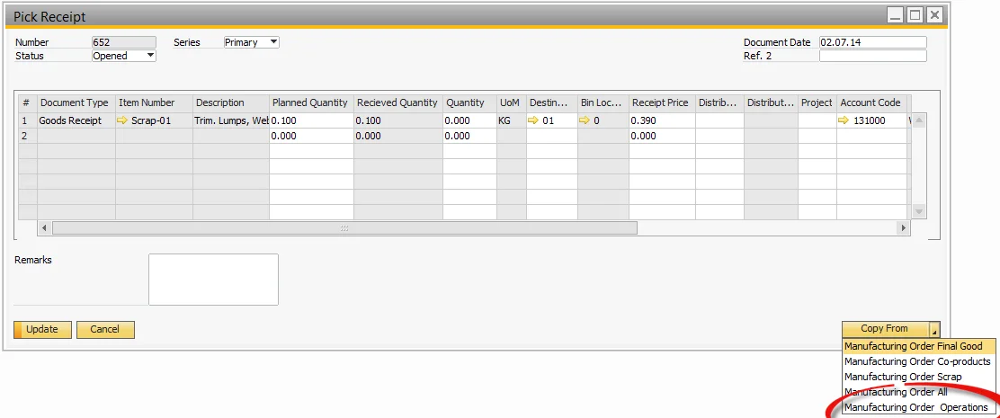

# Receipt from Operation alternative Processes

You can find information on Receipts from Operation Alternative Processes on this page.

---

## Receipt form Operation from the Operations Tab (on Manufacturing Order form)

- Select the Operations Tab,
- Select the Operation,
- Select Receipt for selected Operation.

## Copying Receipt to Operation from the Pick Receipt Process

- Select the Pick Receipt from within the Manufacturing Order from the Menu,
- Select Copy From,
- Select Manufacturing Order Operations,
- Perform the Pick Receipt process as normal.

