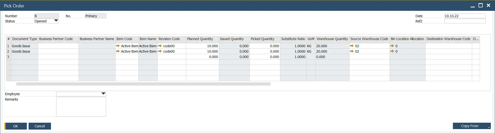

# Pick Order

## Key Features

The Pick Order function is used to manage the activity of picking inventory Items and contains multiple options:

- Created automatically from a Manufacturing Order,
- Created manually, and single or multiple Manufacturing orders copied to the Pick Order,
- An existing Pick Order can be used with multiple Manufacturing Orders.

When creating a Pick Order from a Manufacturing Order, the Items, Planned Quantity, and Source Warehouse are copied from the Manufacturing Order.

If Distribution Rules or Cost Dimensions and Projects are defined at an Item line level, these are also copied.

If blank, they can be manually added.

## Employee field

An Employee filed is available for assigning an employee to a specific Pick Order.

## Manual Creation of Pick Orders

A Pick Order may be created manually, and using the Copy From button function, the user can select from a list of Manufacturing Orders to be picked simultaneously.

This Copy From function can also be used when a Pick Order has been created for a specific Manufacturing Order.

You can then generate a consolidated Pick List.

Note: If multiple requirements exist for the same item across several Manufacturing orders, the Pick Order will display a separate row for each condition.

To perform the rest of the Pick Order to Production Goods Issue cycle, visit this page: Pick Order Bin Locations and Allocations.
