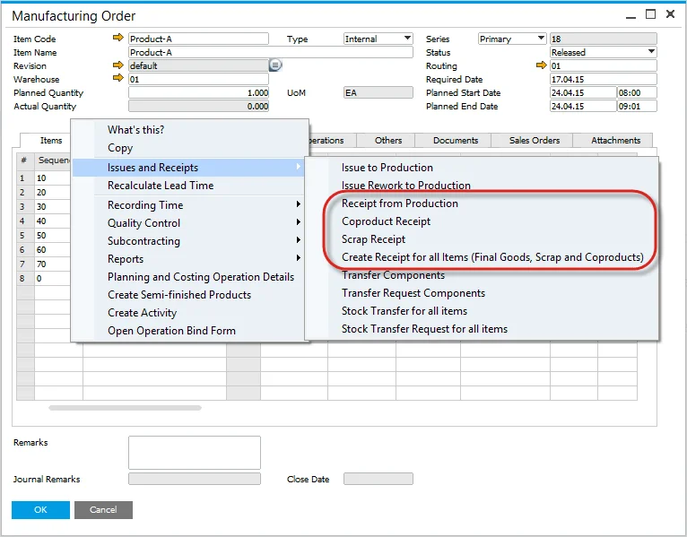

# Pick Receipt

## Key Features

The Pick Receipt function is used to manage the activity of receiving produced items from manufacturing into stock and contains multiple options:

- Receipt from Production,
- CoProduct,
- Scrap,
- Create Receipt for all Items.

## Creation of Pick Receipt

The Pick Receipt can be created in multiple ways:

- Created automatically from a Manufacturing Order,
- Created manually, and single or multiple Manufacturing orders copied to the Pick Receipt,
- An existing Pick Receipt can be used with multiple Manufacturing Orders.

When creating a Pick Receipt, the Items, Planned Quantity, Destination Warehouse, and Receipt Price (depending on the costing method) are copied from the Manufacturing Order.

These are copied if Distribution Rule and Project are defined at a Manufacturing Order header level.

If blank, they can be manually added.

To perform the rest of the Pick Receipt to Production Goods Receipt cycle, visit this page<!-- TODO: Add Link --> Pick Receipt Bin Locations and Allocations.

You can check how to create Pick Receipt for and Production Goods Receipt for Items managed by Batches here.

## Multiple Manufacturing Orders on Pick Receipt Warning

Currently, you can create a Pick Receipt that contains 5 Manufacturing Orders.

You can extend this number to 2 or 3 more by changing the translation in ProcessForce for the message **Based on Manufacturing Order** to **Based on MOR**.

We do not recommend using this function with a larger amount of Manufacturing Orders than five because:

- all documents and entries for Journal Entries are done in one significant transaction; in this time production system can be locked for other users until the trade ends (processing big amount of data with the transaction),
- if the quantity of Manufacturing Orders lines is larger, the time of execution grows logarithmically; many operations in one transaction cause this, and SAP DI API speed, in this case, is low (SAP DI API speed limitation).

## Suggestion

By the above, it is suggested to perform Goods Receipt individually from every Manufacturing Order level.
