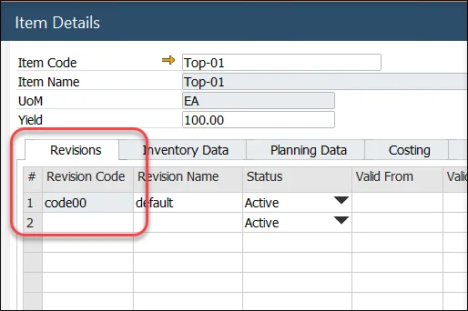
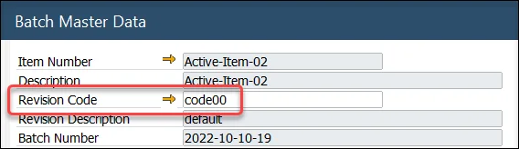
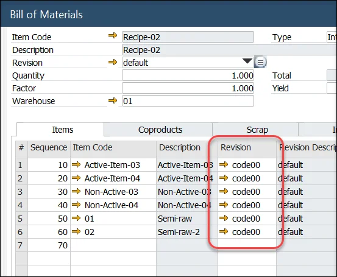

# Revision Based Picking and Backflushing

You can find the Revision Based Picking and Backflushing function information on this page.

---

## General Settings

:::info Path
    General Setting → ProcessForce → Inventory → Revision based picking (manual and backflushing)
:::

## Item Details

Revision code for the Item and Batch record:

## Batch Master Data

Revision Code is recorded on the batch record.

## Bill of Material

Revision Code for the Item is displayed in the bill of material form.

## Pick Issue

When the Revision based picking (Manual) checkbox is checked when creating a document of one of the following types:

- Inventory Transfer,
- Delivery,
- Return,
- Return PO,
- Pick Order,

Batches will be filtered based on Revision Code from the base document.
The filtering rules are as follows:

- If the revision code is empty or set to default, display Batches with empty and default revision code.
- If the revision code differs from the default, display Batches with that revision code only.
