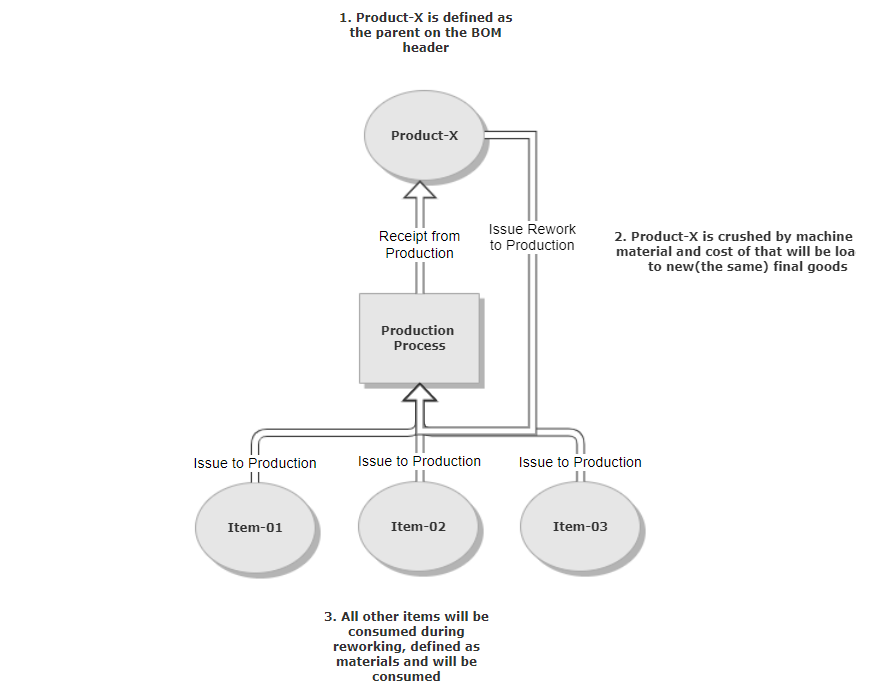
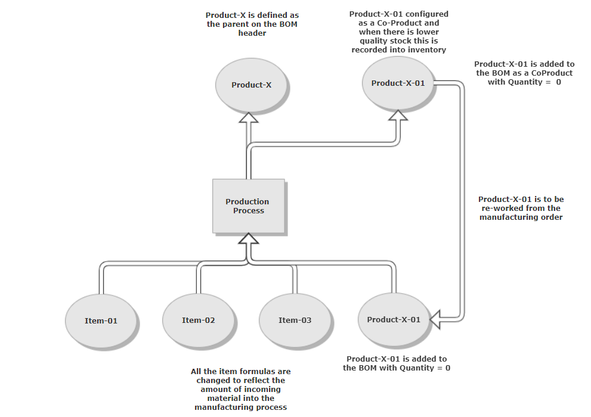

# Rework

There are various ways to handle rework in ProcessForce. Usage of one of the ways depends on what kind of rework it is, at what point in time, what type of document is required, etc.
In ProcessForce, we have the following functionalities that can be useful:

## Rollback

This method creates an opposite document to the one selected. It is easy and useful if the rework is done within the same Manufacturing Order.
To roll back the document, go to the Documents tab, select the line with the document you want to reverse, and from right-click menu, select 'Issue and Receipts' \ 'Rollback document.'

## Issue Rework to Production

This method allows the creation of Goods Issue documents using the same ItemCode as the related produced Item. It is used most often with a new Manufacturing Order when the finished product needs to be returned to the production line and repacked or mixed with fresh raw materials to create the same product.
To use this method, right-click the empty place in Manufacturing Order and select 'Issue and Receipts' \ 'Issue Rework to Production.' ProcessForce will create Pick Order with Finished Good ItemCode where you need to update quantity and Batch numbers (if required).

## Bill of Materials Revision with special ItemCode (different from Finished Good Item) selected as Coproduct and Raw Material in the Items list

Use this setup if you know your produced Item needs to be reworked at some point with the current or new Manufacturing Order.
With this, you get better visibility of stock in the Warehouse with the quantity of good product ready to ship and the quantity that needs to come back to the production line.
An example of this method is presented here:

