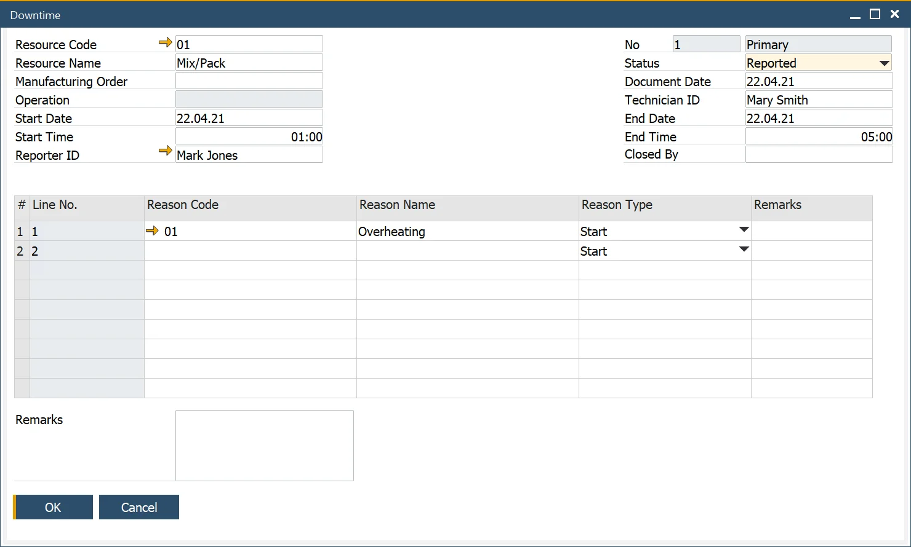
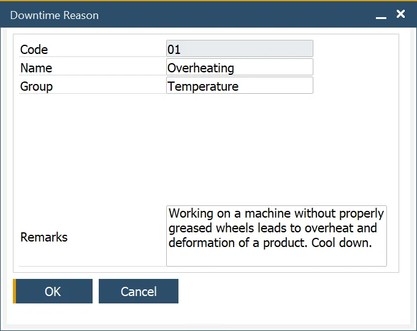
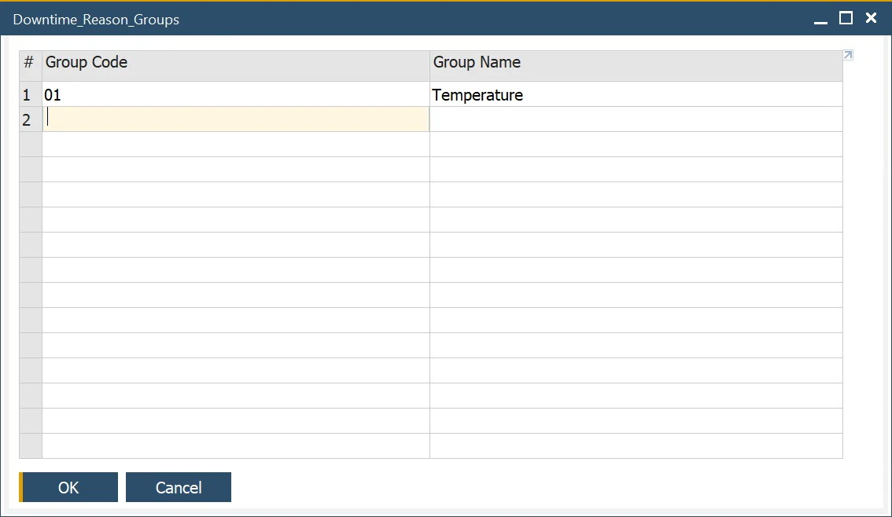

# Downtime

The downtime function allows recording downtime for a specific resource with additional data, e.g., time constraints, status, downtime reason, employees connected to the particular resource downtime: a reporter, a technician, or a person responsible for closing downtime.

:::info Path
    Production → Time Booking → Downtime
:::

---

## Downtime creation

In the Downtime form header, you can define the following:

- Resource data: Code and Name
- Manufacturing Order and Operation to which a specific Resource is assigned
- Start and end date and time
- Employees connected to the downtime:
  - Reporter
  - Technician – the person responsible for the defect removal. Click here to find out more.
  - Employee who can check and end downtime
- Document Series
- Status:
  - Reported,
  - In Progress,
  - Waiting,
  - Fixed.

In the form's main table, Downtime Reason can be chosen.

## Downtime Reason

:::info Path
    Administration → Setup → Production → Downtime Reason
:::

You can define Code, Name, and Remarks for a Down Time Reason. A predefined group can be chosen from a list.

## Downtime Reason Group

:::info Path
    Administration → Setup → Service → Down Time Groups
:::

You can define Group Code and Name. Downtime Group can be chosen on Downtime Reason.
