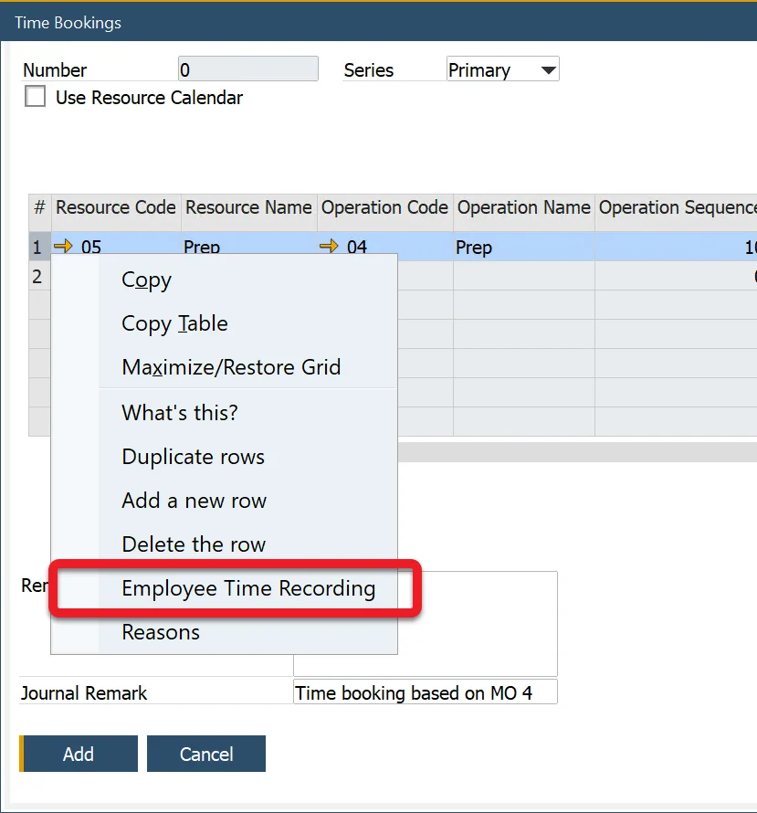
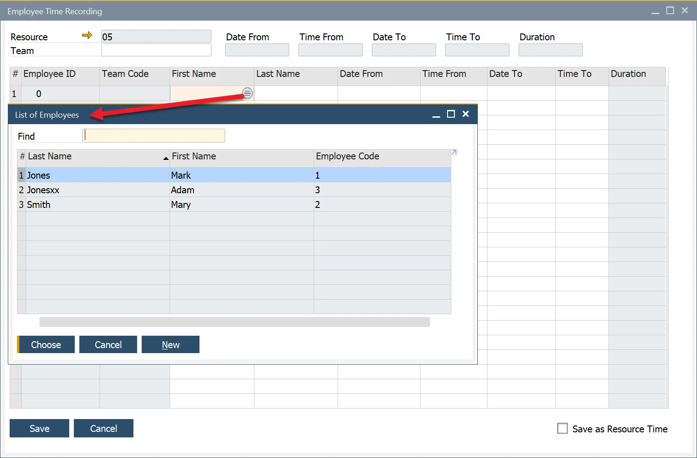
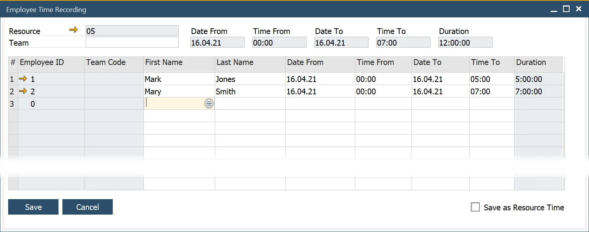

# Employee Time Recording

This option allows recording additional Employee Time to a specific Task on a <!-- TODO: Add Link --> Time Booking document:

:::note
    It is possible to add Employee Time only when a related Time Bookings document is not yet added. Once added, the option allows only displaying previously set values (it is not editable). Creating a Time Corrections document can add Employee Time to the already posted Time BookingsTime Corrections document.
:::

Select the row to record Employee time and choose the Employee Time Recording option from the context menu:

Add an Employee by choosing from a list in the First Name or Last Name field (you can also add a whole Team at once by selecting a Team from the list in the Team field).

Set the required values in the dates and times columns. Value in the Duration column will be counted automatically. The total duration will be added from all the rows and displayed in the Duration field in the header.

:::note
    Employee cost is included in Resource cost. The time recorded in this form serves informational purposes (e.g., recording the time of an extra Employee needed to help with the Resource once). However, you can add the time duration defined here to the Resource time by checking the Save as Resource Time checkbox. This will add the header Duration field value to the UE Duration field value on the related Time Bookings document.
:::

