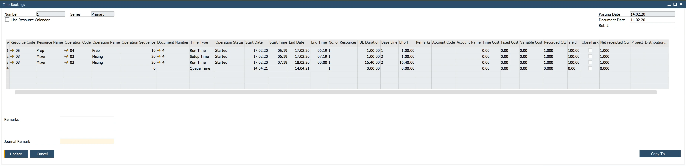

# Overview

The Time Booking function allows registering time and cost of a specific resource work connected to a specific Manufacturing Order. A number of other functions are available, e.g. defining a work team and assigning it to the specific work, defining downtime or time corrections for a resource.

:::info Path
    Production → Time Booking
:::

