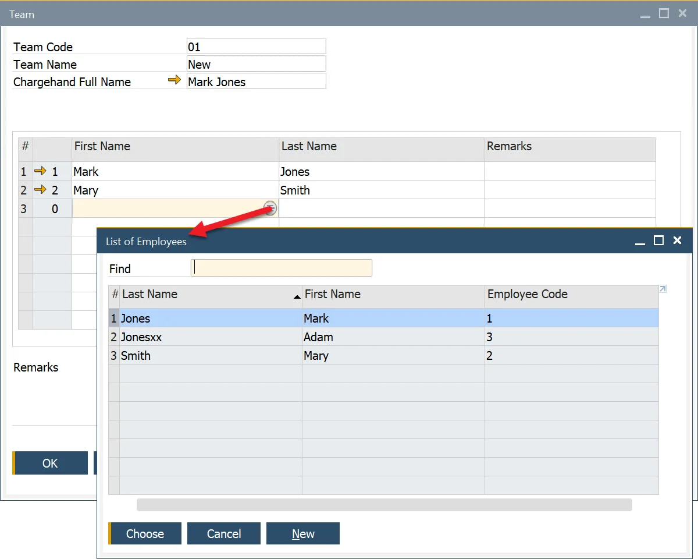

# Teams

This option allows defining Teams – groups of employees.

---

:::info Path
    Production → Time Booking → Teams
:::

You can define a Team of Employees (along with its Team Leader) by choosing them from the List of Employees.

You can define records for new employees by the SAP B1 Employee Master Data function, which is available in Main Menu → Human Resources → Employee Master Data.
