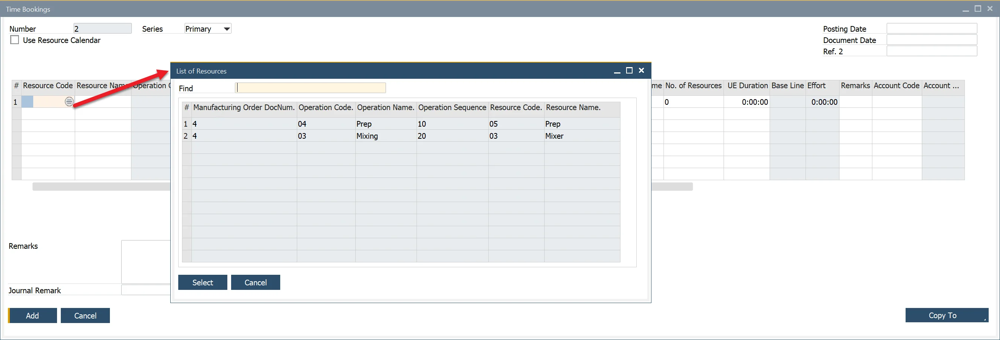
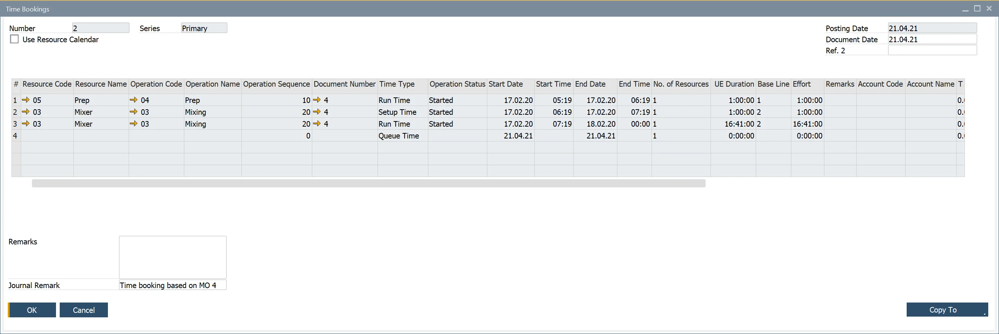
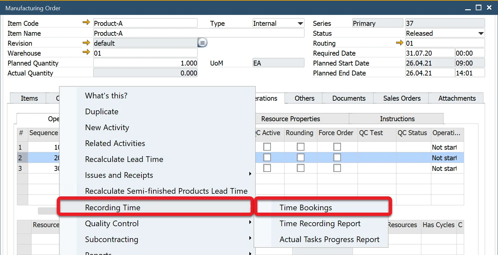
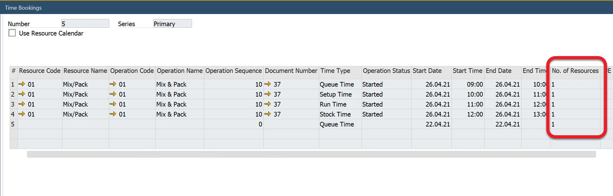

# Time Bookings

The time Booking function allows registering the time and cost of a specific Resource work connected to a particular Manufacturing Order.

:::info Path
    Production → Time Bookings → Time Bookings
:::

## Creating Time Booking

To create a Time Booking, click a circle in Resource Code or Resource Name on the Time Bookings form. Data Selection form will be displayed: Resources connected to Manufacturing Orders in Scheduled, Released, or Finished status. You can choose more than one element. Choose records you want to add Time Bookings for by clicking the first field in the desired row.

Set document dates in the form header and then details of Time Booking in the table.

The time to be recorded is calculated from left to right, meaning that setting times and dates result in calculating value in the UE Duration column and the Cost columns (Time Cost, Fixed Cost, Variable Cost). Changing the value in the UE Duration column changes values in the Cost columns accordingly (but does not change times and dates). You can also change Costs values manually (it will not change time and date, nor UE Duration, but it will affect related Journal Entries).

Click the Add button after setting up all the details.

Time Booking function is also available from the context menu on Manufacturing Order, the Recording Time submenu, Time Bookings option. When a context menu is called from the header, the open Time Booking document will have all the Resources and their times copied. Choosing the option from a context menu from a specific Resource line copies only this Resource times (Time Bookings for Operation).

## Working with multiple resources

It is possible to set multiple resources of the same kind, e.g., two machines. You can do that in the No of Resources column on the Time Bookings form.

Number Of Resources allows defining the default number of resource units to work on. Note that setting a Number Of Resources affects run time. E.g., if Run Time is ten h and the Number of Resources 1, Planned Run Time is ten h. If the Number of Resources changes to 2, the planned time automatically changes to 5 h. Changing a Number of Resources affects the production process; however, during cost calculation, only added-up time will be considered - by example: 10 of h work is done after five h using two resources, the cost is calculated as a cost of work of 2 resources for five h each (10 h).

## The Use Resource Calendar checkbox

By default Time Booking calculates time-based on Start Time / End Time and Start Date / End Date: a result is the number of hours between these values. It subtracts defined non-working hours, Exceptions, and Holidays during the work period. When the Use Resource Calendar checkbox is checked, the calculation considers the related <!-- TODO: Add Link --> Resource Calendar. It subtracts defined non-working hours, Exceptions, and Holidays during the work period.

## Time Recording Report

Recorded data and its later changes can be checked in <!-- TODO: Add Link --> Time Recording Report.
