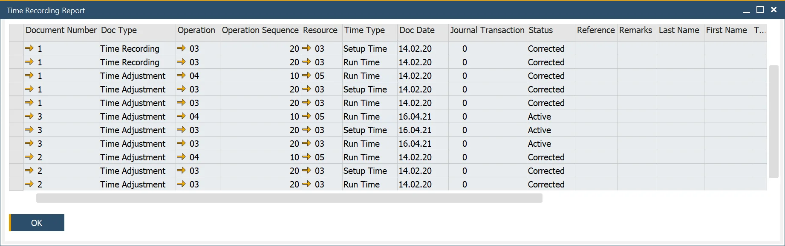
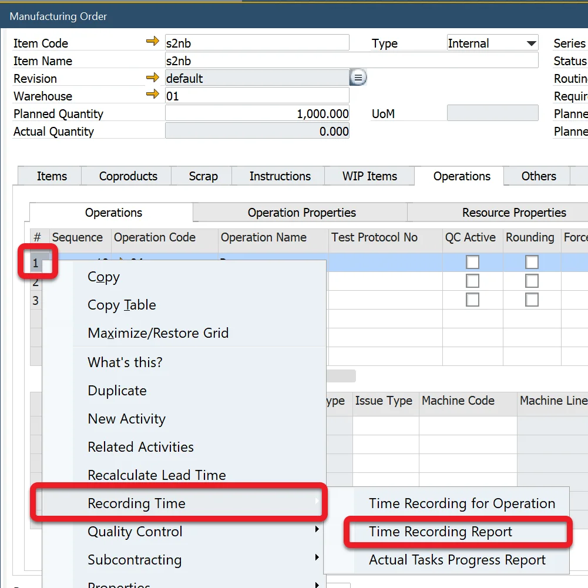

# Time Corrections

The Time Corrections document allows correcting already posted Time Bookings document (or a previous Time Corrections).

---

:::info Path
    Production → Time Bookings → Time Corrections
:::

[Time Corrections](./media/time-corrections/time-corrections.webp)

## Usage

The Time Corrections table is similar to the Time Bookings one (Time Corrections one additionally has columns identifying the base document).

To create a Time Corrections document, click the 'Copy From' button on the Time Corrections form (and then choose a base Time Bookings or Time Corrections) or use the 'Copy to' on a Time Bookings document. Now that data from a based document is copied, it can be modified. Correct data by putting new values were needed (not by adding or reducing the base document values), e.g., if the base document hold '9.000' in the Time Cost column and 12 is needed, set the Time Cost column value on the Time Corrections document to '12.000' (not '3.000').

Click the Add button after setting all the required values. If there are changes in cost between a base document and a Time Correction, a related Journal Entry is created. It can be reached by clicking the orange arrow next to the Journal Remark field (the field itself holds a document number of a base document). A Journal Entry is created only for a difference in cost between the base and the current record (therefore, the arrow will not be present for a Time Corrections document without cost changes).

When a document is added correctly, it is now a current (active) document, and the base one becomes inactive (if you want to reach the base document, click the 'Base Document' option from the context menu). If you're going to correct it further, choose the active document and create Time Corrections based on it. You can create a string of Time Corrections this way. The last (active) reflects the current state (reproduced on the financial side by a string of related Journal Entries documenting changes between documents).

## Time Recording Report

You can reach this form from a Resource row on a Manufacturing Order:

This form presents all the lines from the Time Booking and related Time Corrections documents. The Status columns show which document is the final one (Active). All the others are previous versions.
