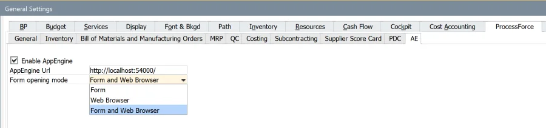
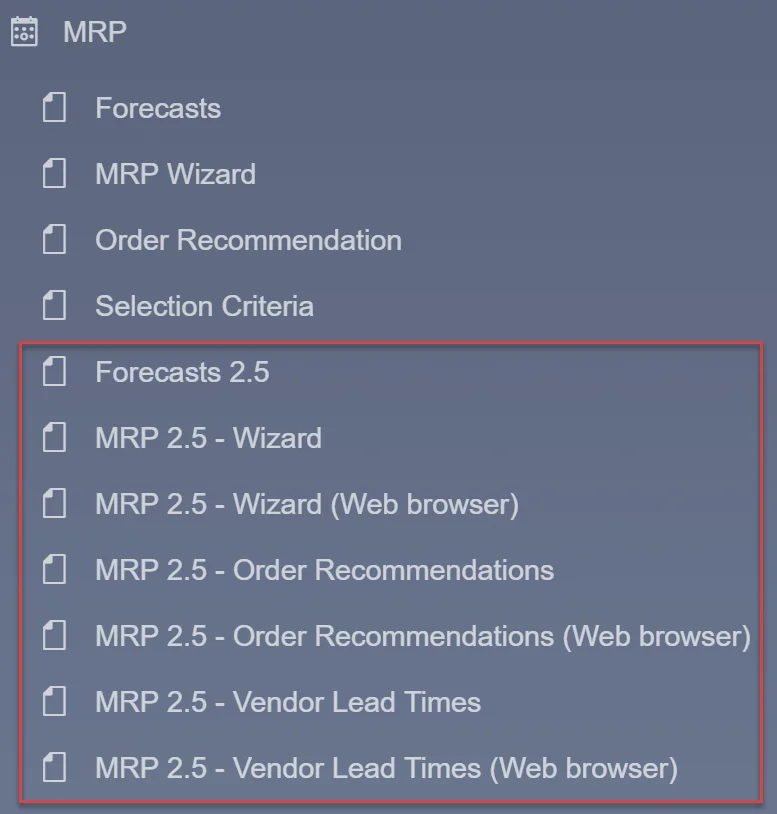
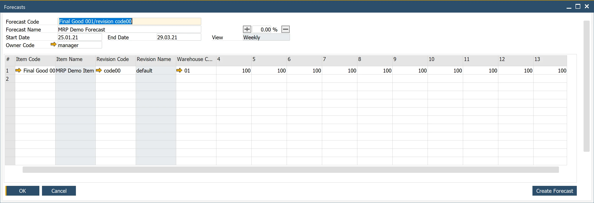
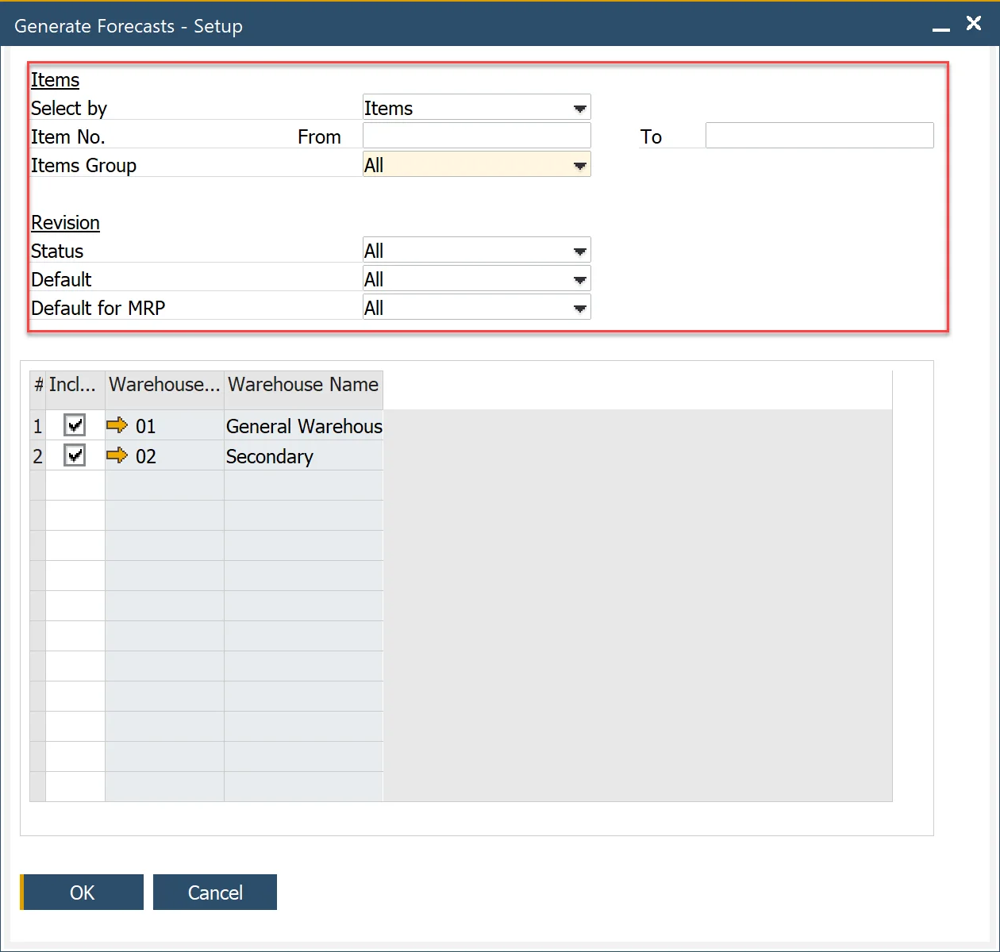
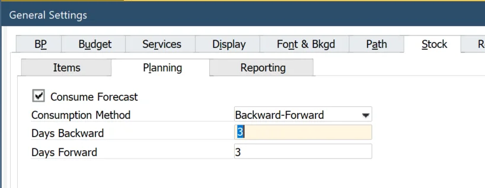
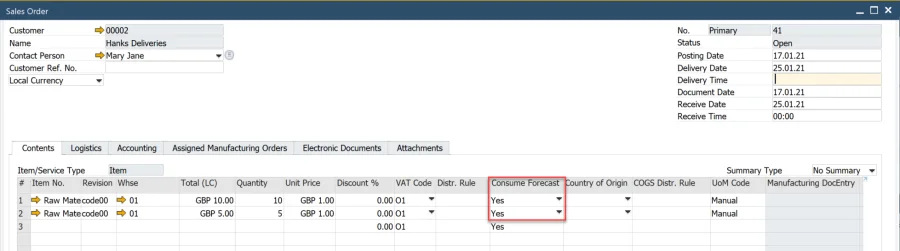
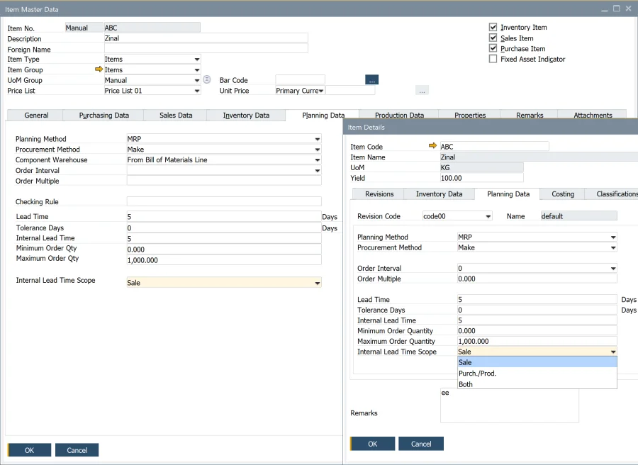
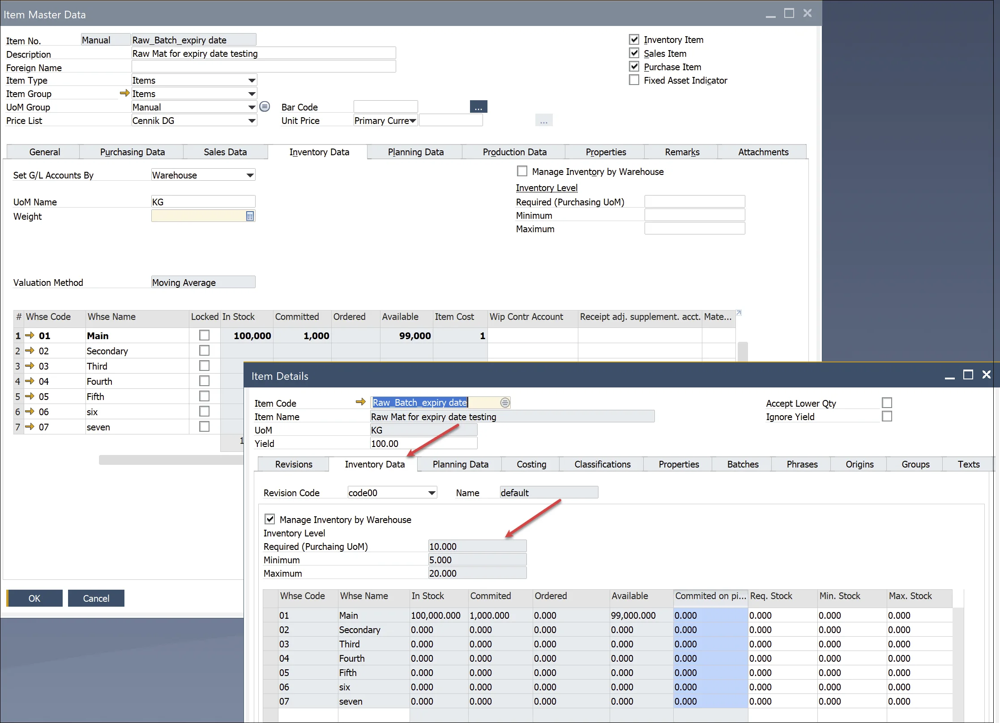

# Basic Settings

To enable the MRP 2.5 function in the SAP Business One menu, you have to allow AppEngine. It enables integration between the SAP Business One client and AppEngine to see AppEngine plugins inside SAP Business One. The Form and Web Browser option will allow you to work with MRP inside SAP Business One (Form) and in Web Browser. Web browser means the application will open in a separate browser window outside SAP Business One.
Note: in the Web browser mode, yellow arrows do not work.

Then, you will see the following option in the MRP menu.

## Forecasts 2.5

To prepare forecasts for MRP 2.5, use Forecast 2.5. This form is like the old Forecast but with the possibility to define a forecast per Item/Revision.

You can use the Create Forecast button to add many forecast lines according to the selection criteria.

## Forecast Consumption in General Settings

In MRP 2.5, these settings are used as default. Consumption Method Days Backward/Forward can be modified per scenario. Consume Forecast is a global parameter determined by default settings in sales documents lines, column Consume Forecast.

## Item/Revision planning data

Planning data are defined in Item Master Data and separately for Item Revision in Item Details.

**Planning Method** – MRP works like the standard SAP Business One.

**Procurement Method** – Make, Buy works like the standard SAP Business One.

**Component Warehouse** – From the Bill of Materials Line, From the Parent Item Document Line, it works like in the standard version.

**Order Interval** – Select one of the defined intervals or select Define New to open the Order Interval - Setup window. In MRP calculations, the application automatically groups the recommended orders into interval periods and arranges orders within the same period into the first working day of that period.

**Checking Rule** – not ready for tests.

**Tolerance Days** – not ready for tests

**Lead Time (LT)** – Enter the number of days from when the item is ordered to when the item is received or produced.

### Example

If the lead time is for three days, the MRP will issue the purchase or production order for the child items with a due date three days before the parent item's due date. In other words, we need three days to produce (Procurement Method = Make) or send the item by the supplier (Procurement Method = Buy).

[Example: Holidays, Lead Time, and Order Interval in MRP Calculations](https://help.sap.com/docs/SAP_BUSINESS_ONE/68a2e87fb29941b5bf959a184d9c6727/6593f6fb14cb4f188859a2b0e6ba1e70.html?q=lead%20time)

**Internal Lead Time (ILT)** – additional time calculated for documents/recommendations. The calculation depends on the Procurement Method and ILT Scope. For example, internal testing time.

**Internal Lead Time Scope** – determine how ILT is added to documents/recommendations.

- For Item with Procurement Method = Buy, ILT can be calculated for Sale document, Purchase document/recommendation, Purchase document/recommendation & Sale documents
- For Item with Procurement Method = Make, ILT can be calculated for Sale document, Production document/recommendation, Production document/recommendation & Sale documents.

Procurement MethodILT ScopeOutcome1aMakeSaleILT added to Sales document1bMakePurch. / Prod.ILT added to MOR document/recommendation (Supply)1cMakeBothILT added to Sales document and MOR document/recommendation (Secondary Demand)2aBuySaleILT added to Sales document2bBuyPurch. / Prod.ILT added to Purchase document/recommendation2cBuyBothILT added to Sales document and Purchase document/recommendation.

|     | Procurement Method | ILT Scope      | Outcome                                                                        |
| --- | ------------------ | -------------- | ------------------------------------------------------------------------------ |
| 1a  | Make               | Sale           | ILT added to Sales document                                                    |
| 1b  | Make               | Purch. / Prod. | ILT added to MOR document/recommendation (Supply)                              |
| 1c  | Make               | Both           | ILT added to Sales document and MOR document/recommendation (Secondary Demand) |
| 2a  | Buy                | Sale           | ILT added to Sales document                                                    |
| 2b  | Buy                | Purch. / Prod. | ILT added to Purchase document/recommendation                                  |
| 2c  | Buy                | Both           | ILT added to Sales document and Purchase document/recommendation               |

### Example {#example-2}

1. Item with Procurement Method = Make, Lead Time = 3, Internal Lead Time = 1,
    1. ILT Scope = Sale
      If it is an Item ordered by the customer, ILT will be added to the Sales Order. After three days of MOR’s Release Date, the Item will be available in stock (Lead Time=3), and one day of Internal Lead Time will be added before the Item will be ready to send to the Customer (for example, packing time, quality control before packing, etc.). ILT will not be added to the finished MOR.
    2. ILT Scope = Purch. / Prod.
      ILT will be added only to the finished MOR. After three days of MOR’s Release Date, the Item will be available in stock (Lead Time=3), and one day of Internal Lead Time will be added after finishing MOR (for example, quality control activities).
      ILT will not be added to the Sales Order if it is an Item ordered by a customer.
    3. ILT Scope = Both
      After three days of MOR’s Release Date, the Item will be available in stock (Lead Time=3), and one day of Internal Lead Time will be added:
        - to Sales Order if it is an Item ordered by the customer, like in 1.1. In such a case, ILT will not be added to MOR.
        - to MOR if it is not an Item ordered by the Customer. For example, it is planned based on demand from the higher BOM level (secondary demand), Like in 1.2.
2. Item with Procurement Method = Buy, Lead Time = 10, Internal Lead Time = 1
    1. ILT Scope = Sale
      If it is an Item ordered by the customer, ILT will be added to the Sales Order. After ten days of the Purchase Order Release Date, the Item will be available in stock (Lead Time=10), and one day of Internal Lead Time will be added before the Item will be ready to send to the Customer (for example, packing time, final quality control, etc.). ILT will not be added to the PO.
    2. ILT Scope = Purch. / Prod.
      ILT will be added to the Purchase Order. After ten days from the Purchase Order’s Release Date, the item will be available in stock (Lead Time=10). One day of Internal Lead Time will be added before the item is available for production or sale (for example, quality control activities for the purchased item). ILT will not be added to the Sales Order if it is an Item ordered by a customer.
    3. ILT Scope = Both.
      After ten days of the Purchase Order’s Release Date, the Item will be available in stock (Lead Time=10), and one day of Internal Lead Time will be added:
        - only to Purchase Order If it is an Item not ordered by a customer.
        - Purchase Order and Sales Order If it is an Item ordered by a customer. Thus, Internal Lead Time will be doubled.

**Note**: The sum of Lead Time and Internal Lead Time determines when the Item is available for the following activities, such as production or sale.

**Order Multiple** – recommendation quantity is rounded up to the multiplication of Order Multiply.

**Minimum Order Qty** – Upgrade the recommendation quantity to the defined quantity. Suppose Minimum Order Qty < Order Quantity Order Multiple is used.

**Maximum Order Qty** – Demand quantity is divided by the defined Maximum Order Qty to calculate a number of recommendations with quantity equal to Maximum Order Qty. The rest of the division is upgraded to the Minimum Order Quantity. If the rest > Minimum Order Quantity Order Multiple is used.

**Note**: Maximum Order Should be used with Minimum Order Quantity.
Examples of order Qty calculations:

**Example 1**

Parameters:
Order Quantity = 103
Order Multiple = 3
Minimum Order Qty = 5
Maximum Order Qty = 10
Outcome:
The first ten recommendations with quantity 10
Rest of division = 3 (Order Quantity/Maximum Order Qty)
Last (11) recommendation with quantity 5 (effect of Minimum Oder Quantity, Rest of division < Minimum Order Qty)

**Example 2**

Parameters:
Minimum Order Qty = 2 (other parameters unchanged)
Outcome:
The first ten recommendations with quantity 10
Rest of division = 3 (Order Quantity/Maximum Order Qty)
Last (11) recommendation with quantity 6 (effect of Order Multiply, Rest of division < Minimum Order Qty)

## Item/Revision stock data

For Items managed by Batches, Serial Numbers in Item Details are visible stock information with accuracy to revision.

In MRP 2.5, you can work with Inventory Level parameters per revision and per Item.

