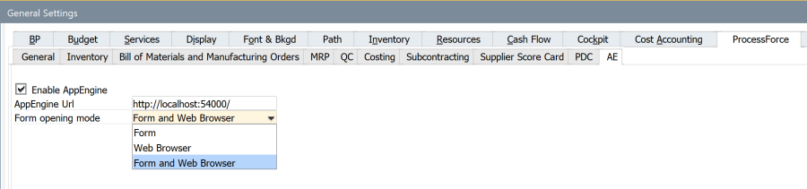
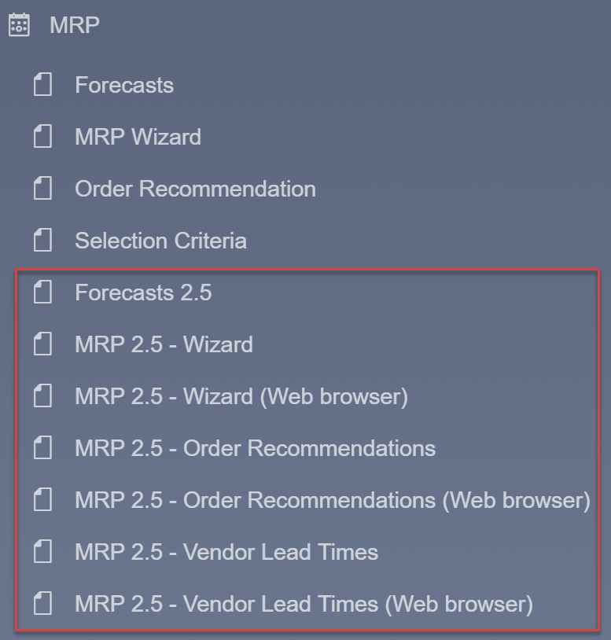
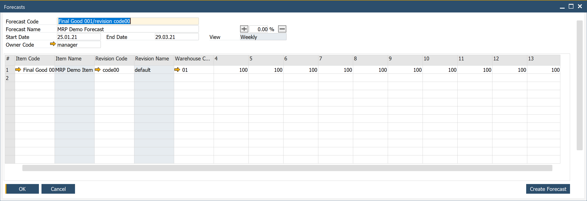
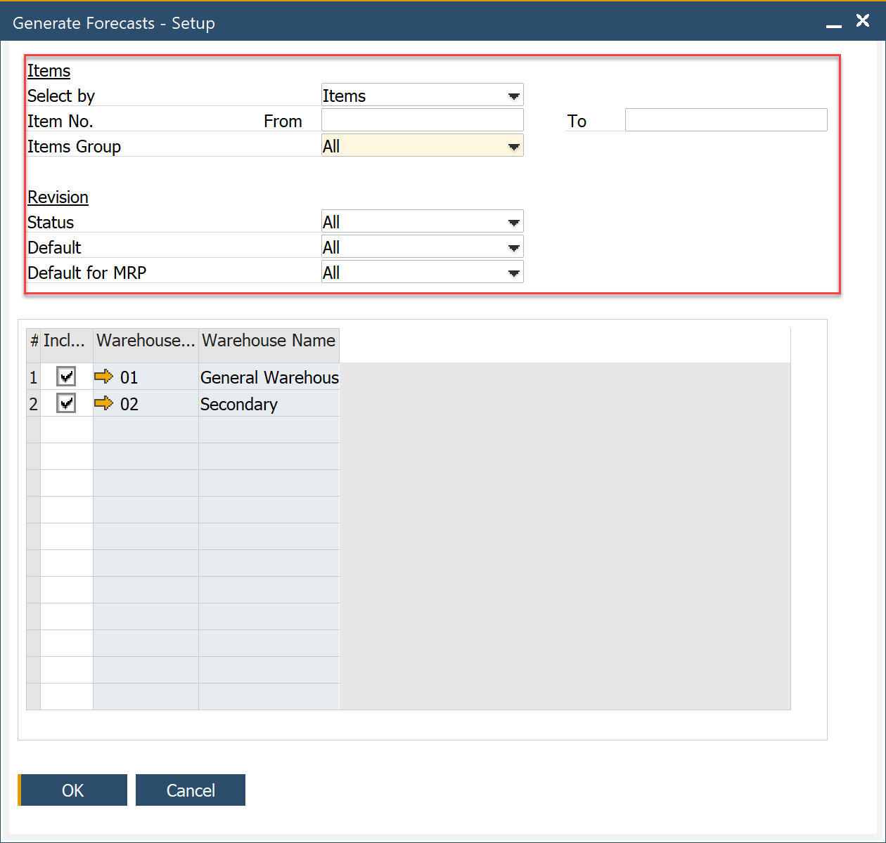
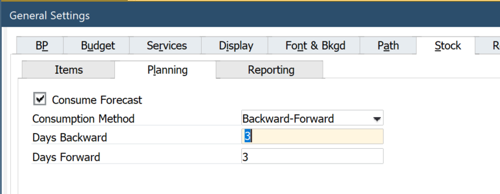

# Basic Settings

To enable the MRP 2.5 function in the SAP Business One menu, you have to allow AppEngine. It enables integration between the SAP Business One client and AppEngine to see AppEngine plugins inside SAP Business One. The Form and Web Browser option will allow you to work with MRP inside SAP Business One (Form) and in Web Browser. Web browser means the application will open in a separate browser window outside SAP Business One. 
Note: in the Web browser mode, yellow arrows do not work.

Then, you will see the following option in the MRP menu.

## Forecasts 2.5

To prepare forecasts for MRP 2.5, use Forecast 2.5. This form is like the old Forecast but with the possibility to define a forecast per Item/Revision.

You can use the Create Forecast button to add many forecast lines according to the selection criteria.

## Forecast Consumption in General Settings

In MRP 2.5, these settings are used as default. Consumption Method Days Backward/Forward can be modified per scenario. Consume Forecast is a global parameter determined by default settings in sales documents lines, column Consume Forecast.

## Item/Revision planning data

Planning data are defined in Item Master Data and separately for Item Revision in Item Details.

**Planning Method** – MRP works like the standard SAP Business One.

**Procurement Method** – Make, Buy works like the standard SAP Business One.

**Component Warehouse** – From the Bill of Materials Line, From the Parent Item Document Line, it works like in the standard version. 

**Order Interval** – Select one of the defined intervals or select Define New to open the Order Interval - Setup window. In MRP calculations, the application automatically groups the recommended orders into interval periods and arranges orders within the same period into the first working day of that period.

**Checking Rule** – not ready for tests. 

**Tolerance Days** – not ready for tests

**Lead Time (LT)** – Enter the number of days from when the item is ordered to when the item is received or produced.

Example:

If the lead time is for three days, the MRP will issue the purchase or production order for the child items with a due date three days before the parent item's due date. In other words, we need three days to produce (Procurement Method = Make) or send the item by the supplier (Procurement Method = Buy).

