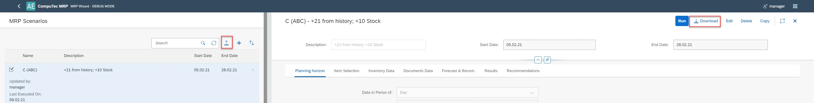
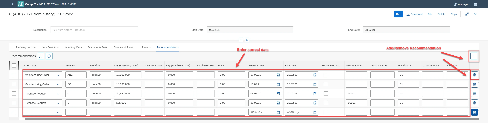

# Debug mode

When you have doubts that the scenario results are correct, please report the problem in a ticket on Computer Support. To document tickets, please use debug mode.

To turn on debug mode, please add the address line:
`http://localhost:54000/webcontent/launchpad/webapp/Index.html?aedebug=true` and Enter.

You can recognize that you are in debug mode by:
Load icon over the list of scenarios (designated for CompuTec) and Download icon above the scenario (designated for you):

How to use debug mode?

1. Switch the debug mode on.
2. Run scenario.
3. Open the Recommendation tab and enter correct data in place of wrong data:

    
  
4. Select the Download icon. JSON is downloaded to your disc.
5. Attach the file to a ticket on the Computec support website. Add necessary information and optionally, screenshots.
6. When you finish, exit from debug mode.

To turn off debug mode, replace "true" with "false" in the address line:

- Before: `http://localhost:54000/webcontent/launchpad/webapp/Index.html?aedebug=true#/plugin/computec.appengine.MRP&home`
- After: `http://localhost:54000/webcontent/launchpad/webapp/Index.html?aedebug=false#/plugin/computec.appengine.MRP&home`

and approve.
