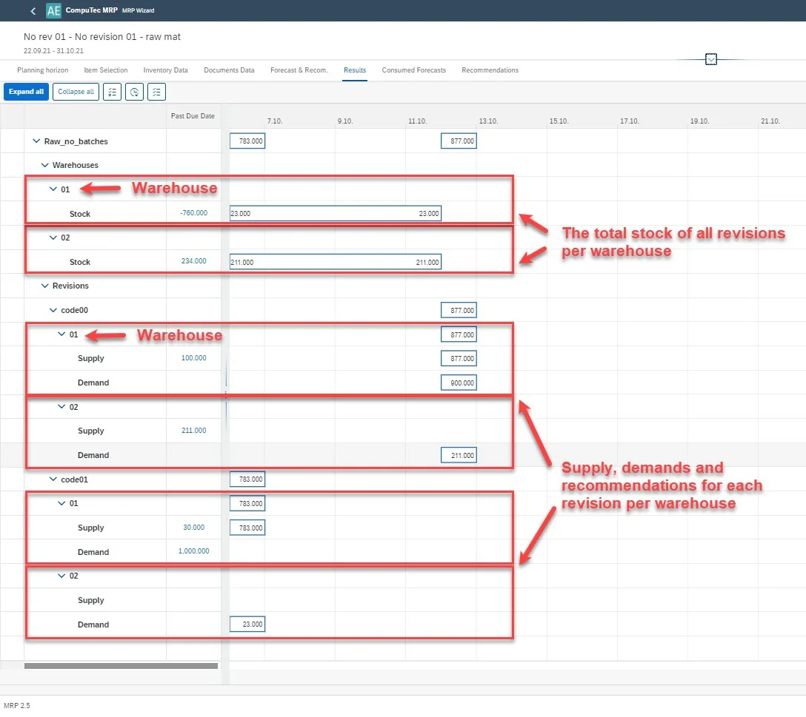
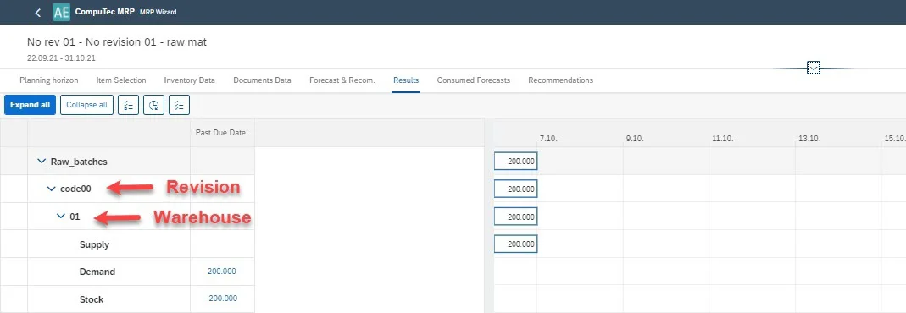

# Item not managed by batches versus stock per revision

For Items not managed by batches and serial numbers, counting inventory per revision is impossible. In such a case, the inventory level is a total from all revisions. In other words, in MRP 2.5, the differentiation of inventory per revision is not considered. It is the cause of different visualization of non-batch managed items on Results.

Representation of Items managed by batches and serial numbers on Results.

