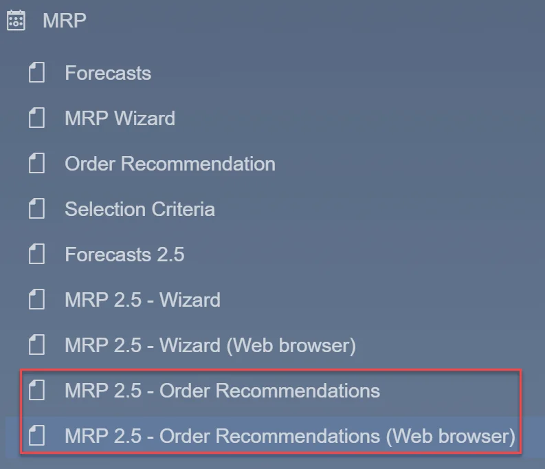
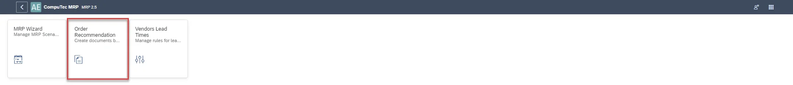
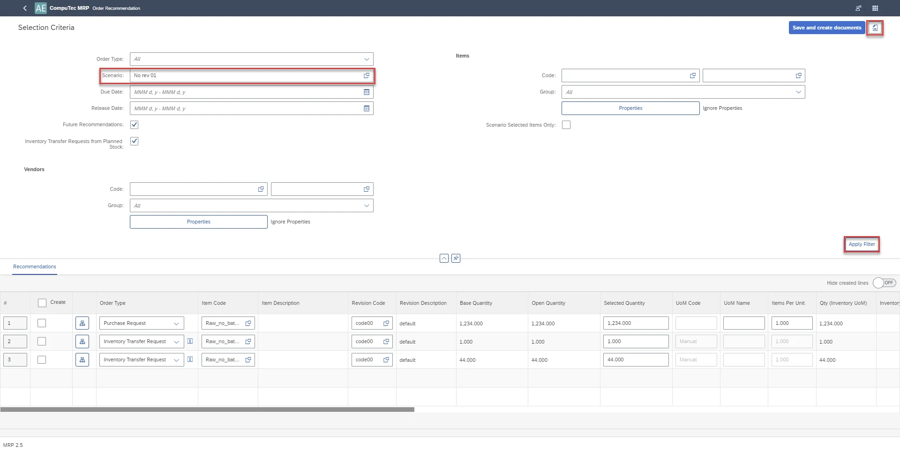
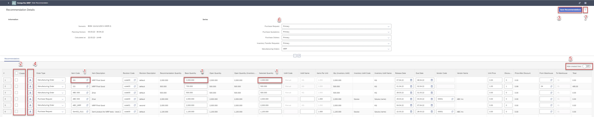

# Order Recommendation

You can select MRP 2.5 – Order Recommendation from the SAP B1 menu.

Or, after logging in directly to AE, you should select the Order Recommendation tile.

First, the view with selection criteria for filtering recommendations is visible.

First, you must determine a scenario to filter the recommendation with which you want to work. For selected scenario you can determine additional recommendation's parameters for example related to Vendors and Items to narrow filtering. Then, use the button Apply Filter. Recommendations that meet the criteria appear in the table.

In this view, you can:

- change editable parameters of recommendation in the table, for example, Item Code, Base Quantity, Selected Quantity (1),
- select recommendations for creating documents (2),
- save recommendations (3),
- view relationship map (4),
- hide created lines, with 0 in Open Quantity column (5),
- select series for documents (6).

When all is ready, you should select the button Save Recommendations (3). All recommendation will be saved. For recommendation, selected (2) documents will be created with quantity from the column Selected Quantity.
To return to the view with filtering criteria, select the icon Change filter (7).
