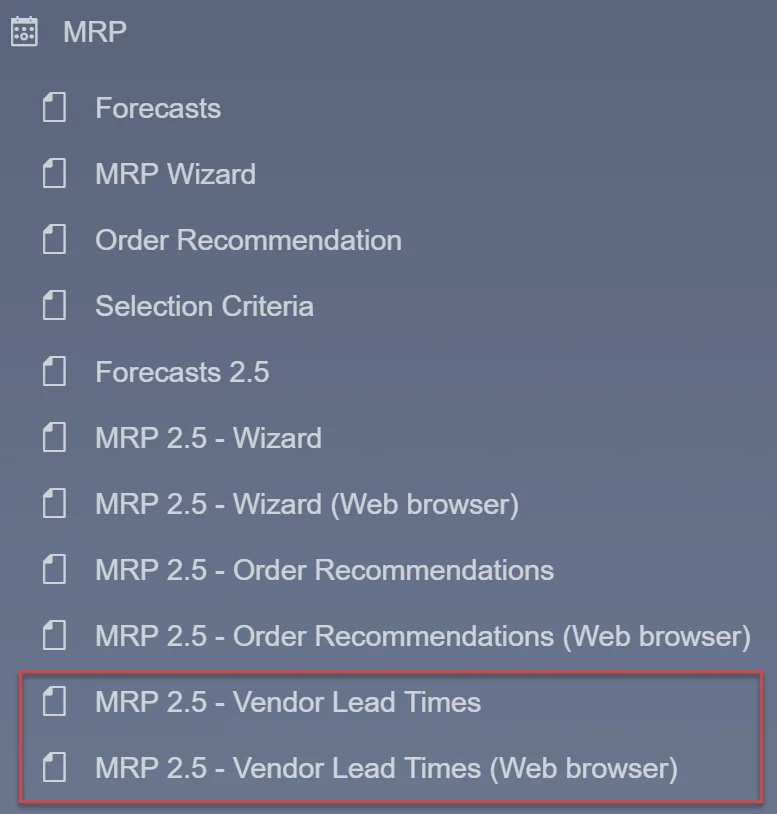
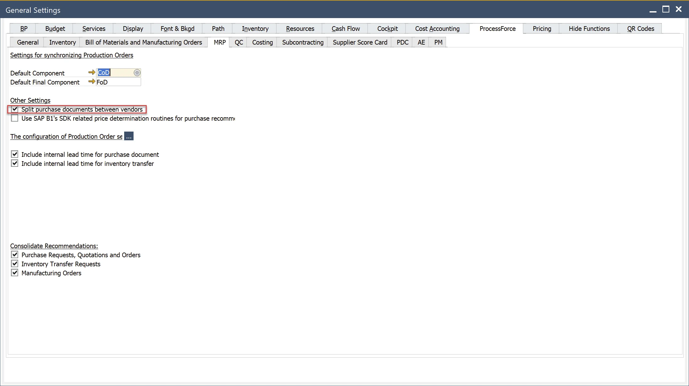
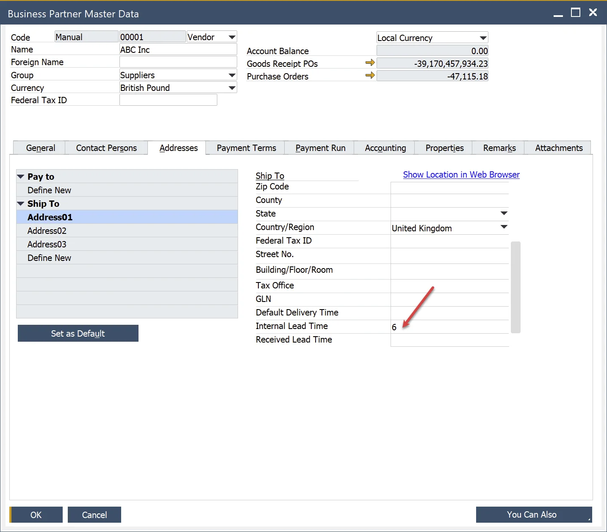

# Vendors Lead Times

Vendors Lead Times can be differentiating according to three levels of accuracy:

1. Vendor(default) & Shipping Type(default) & Shipping Address(default).
2. Vendor(default) & Shipping Type(default).
3. Vendor(default).

## Default Vendor

To apply Vendor Lead Time, Vendors must be assigned to Item as default Vendor in Item Master Data, Purchasing tab. Only one from Preferred Vendors can be selected as default.

**Note**

If the default Vendor is not defined in Item Master Data, then:

1. For recommendation, the first Vendor in the database is proposed.
2. Lead Time is taken from Item Master Data (Item Details for revisions). The rules for Vendor Lead Time are not considered in calculations.
  
3. To define Vendor as default, you must select Split purchase documents between vendors in General Settings/ProcessForce/MRP.
  

## Shipping Type

The Vendor can assign many Shipping Types, but only one can be declared default in BP Master Data.

## Shipping Address

In BP Master Data, the Vendor can have defined many Addresses (Ship To), but only one can be declared default.

## Rules

When the recommendation is prepared, MRP 2.5 will seek the most suited rule with the value of Lead Time > 0.

1. At first, we will try to find a rule with a match of all three components of the rule to these defined as default: Vendor(default) & Shipping Type(default) & Shipping Address(default).
2. If MRP 2.5 did not find Lead Time > 0 for the combination of Vendor(default) & Shipping Type(default) & Shipping Address(default), then we will try to find a match to Vendor(default) & Shipping Type(default).
3. If he did not find will use Lead Time > 0 defined for Vendor (default).
4. If he does not find it, he will use Lead Time from Item Master Data (Item Details for revision).

You can deactivate the rule by unselecting the checkbox Active. You can add Vendor Lead Time to Lead Time from Item Master Data by selecting Add.

In the MRP scenario in the Item Selection tab, these rules can be edited per Item.

It is possible to add Custom Rules. You can do this by adding a new one or by copying from Default Rules. The rule can be edited there.

Custom Rules are overwritten Default Rules for the current scenario if they are identical. Edited rules/values are obligatory for the present scenario.

**Note**

1. If the default Vendor is not defined in Item Master Data, then:
    1. For recommendation, the first Vendor in the database is proposed.
    2. Lead Time is taken from Item Master Data (Item Details for revisions). The rules for Vendor Lead Time are not considered in calculations.
2. Hierarchy of applying rules:
    1. Custom Rules
    2. Default Rules

## Internal Vendor Lead Time

Based on the data defined in BP Master Data, a set of rules for Internal Vendor Lead Time is composed.

Rules are available from the Item Selection tab column Custom Vendor Internal Lead Time. There, you can modify Internal Lead Time values. Edited values are obligatory for the current scenario.

When the recommendation is preparing MRP 2.5 will seek the most suited rule with the value of Internal Lead Time > 0.

1. At first, we will try to find a rule matching all two components of the rule to these defined as default: Vendor(default) & Shipping Address(default).
2. If MRP 2.5 did not find Internal Lead Time > 0 for the combination of Vendor(default) & Shipping Address(default), then we will try to find a match to Vendor (default).
3. If he does not find it, he will use Interna Lead Time from Item Master Data (Item Details for revision).
