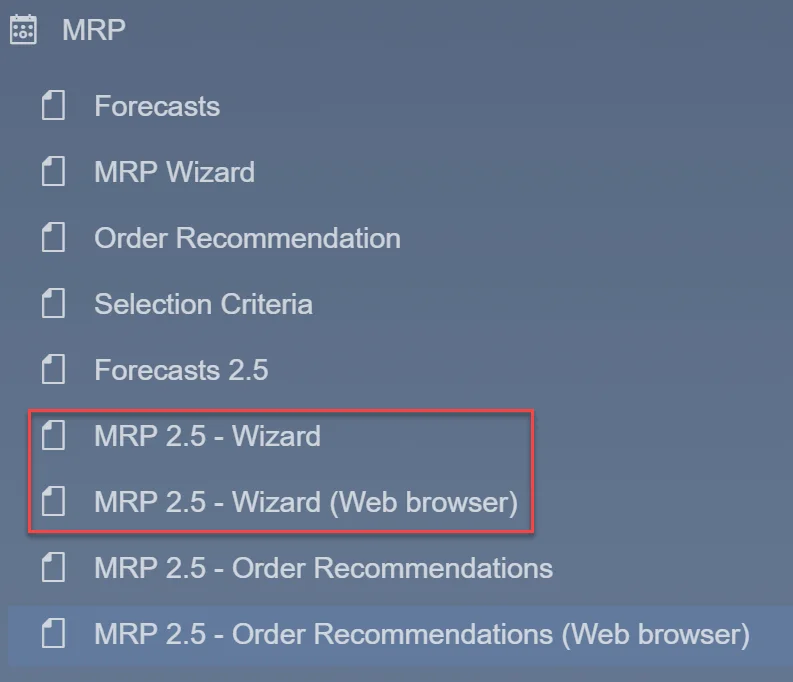
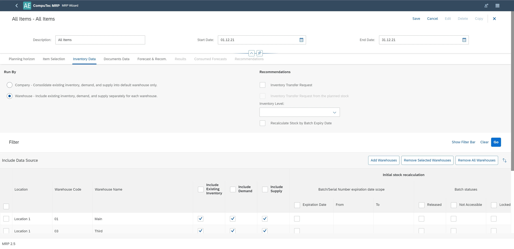
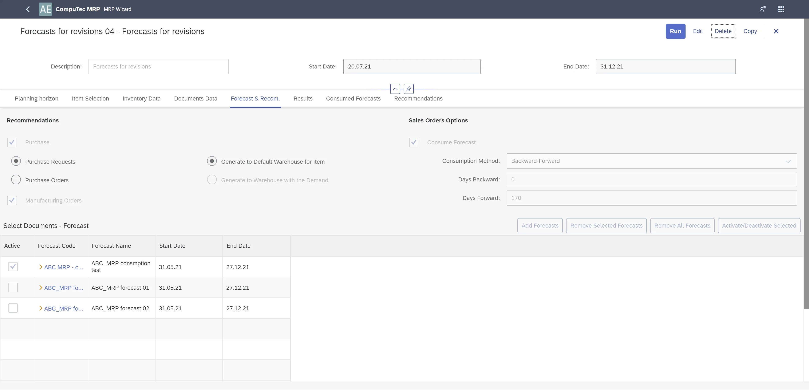
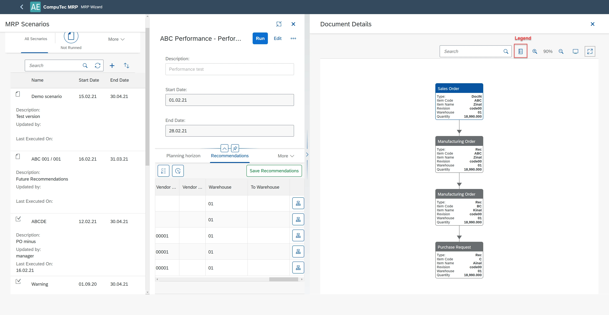

# MRP 2.5 Wizard

You can select MRP 2.5 - Wizard from the SAP B1 menu.

Or, if you log in directly to AppEngine, the following tiles are visible.

:::caution
    If you are logged in directly to AppEngine, the yellow arrows don't work.
:::

After the selection of MRP 2.5, three options are available.

After selecting the MRP 2.5 Wizard, you will see the MRP Scenarios list. From the MRP scenario list, you can:

- Filter scenario according to scenario statuses: Not Ran, Processing, Completed, Failure.
- Sort Scenarios.
- Search scenarios (by Name and Description).
- Add scenario.
- Select a scenario to work.

Scenario's data settings.

## Planning horizon tab

**Scenario Name** – obligatory.

**Description** - scenario description.

**Start Date** – obligatory. Must be >= Today

**End Date** – obligatory. Must be >= Start Date

**Data in Period of** - periods: Days, Weeks, Months, Hours. In the Results tab, quantities are summarized according to the selected period.

**Planning Horizon Length** – depends on the selected period.

**Consider Holidays** - Select the checkboxes to let MRP consider the holidays and weekends defined in the Holiday Dates Window. Application automatically adjusts demands and supplies that fall into specified holidays or weekends. For items that require a certain period of lead time, considering holidays and weekends increases the lead time interval for MRP calculations.

**Ignore Cumulative Lead Time**– CLT is not considered in calculations.

**Internal Lead Time** – ILT is added to documents/recommendations. Please see the description for the Item's Planning Data (Internal Lead Time and Internal Lead Time Scope).

<u>**Display Properties**</u>

**Sort By** - Select the sort criteria for the MRP report:

- Assembly Sequence: Sorts the results from the highest level to the lowest level of the production Bill of Materials.
- Item Number: Sorts the results by the item number.
- Item Description: Sorts the results by the item description.
- Item Group: Sorts the results by the item group.

**Display Items with No Requirements** - items without actual requirements after the MRP run are displayed in the tab Results. If you do not select this checkbox, MRP items without requirements or with incoming orders balancing the requirements are not displayed.

**Display Selected Items Only** – only items selected in the tab Item Selection are displayed in the tab Results. You can change this setting in the tab Results.

**Future Recommendation Summary** – in tab Results column with future recommendation summary is displayed. You can change this setting in the tab Results.

**Advanced Settings, Processing Method:**

- **Asynchronous** – several Bill of Materials trees can be processed simultaneously (making it faster). This option is recommended.
- **Synchronous** – Bill of Materials trees are processed one after another.

## Item Selection tab

This tab is designated to add items to the scenario. For added items, it is possible to edit planning parameters. Edited and saved parameters wouldn't modify values in master data. It is obligatory only for the current scenario. To edit parameters, please select the checkbox by the parameter value.

**All Items** – includes all items with the Planning Method of MRP in the MRP run. When you select this radio button, the application does not display items chosen in the table below.

**Selected Items** – Select items to be included in the MRP run. Choose Add Items to open the Items List — Selection Criteria window. You can filter items by item number, group, and properties. If required, select the Expanded Selection criteria checkbox; you can then further filter items by the Preferred Vendor and UDFs defined in the Item Master Data window.

**Include Revision** – if selected, MRP works accurately to Item's revisions. Planning data for revisions are read from Item Details. If not selected, Planning Data are read from Item Master Data.

**Remove Selected Items** - Removes all selected items.

**Remove All Items** - Removes all items.

**Active/Deactivate All** – Active or deactivate all the items displayed in the table.

  **Notes:**
    1. If you have added an item and then deactivated it in an MRP run, the next time you run this scenario, you can still see the deactivated item displayed in the table. You can include this item in the MRP run by activating it. If you removed this item from an MRP run, the next time you run this scenario, you cannot view it in the table of the selected items. If you want to include it in the MRP run, you must add it again.
    2. It is possible to edit planning parameters for the Item. To do this, please select the checkbox by the parameter. The edited value is valid only for the scenario.
    3. To plan primary demands for coproducts and scraps, they must have Procurement Method = Make (without BOM) and be listed and active on the item list. MOR recommendations for the produced item will be proposed to cover demands for coproducts and scraps. If there is more than one BOM with the coproduct or scrap, a more effective BOM will be chosen.

**Default Vendor** - click [here](/docs/processforce/user-guide/mrp/mrp-2-5/vendors-lead-times/) to find out more.

**Custom Vendor Lead Time** - click [here](/docs/processforce/user-guide/mrp/mrp-2-5/vendors-lead-times/) to find out more.

**Custom Vendor Internal Lead Time** - click [here](/docs/processforce/user-guide/mrp/mrp-2-5/vendors-lead-times/) to find out more.

**Vendor Selection Strategy** - now the Default Vendor strategy is implemented. When a recommendation is preparing all planned quantities are assigned to the default vendor. Also, seeking rules for Lead Time is performed according to the default Vendor selected in the Preferred Vendors list (Item Master Data/Purchasing Data tab).

## Inventory Data tab

This tab is designated to add a warehouse to the scenario. For added warehouses, you can define the following:

- Run By policies,
- Inventory level policies,
- using of batches and serial numbers parameters,
- Using of Inventory Transfer Request.

**Run by Company**: Consolidate existing inventory, demand, and supply into default warehouse only.
To run the MRP calculations on the company level, select this option. MRP calculates demands and supplies jointly for all the selected warehouses. To do so, the application sums up all the selected warehouses' initial inventory quantities, needs, and supplies. Then, it consolidates all the quantities into the default warehouse for requirements calculation.

**Run by Warehouse**: Include existing inventory, demand, and supply separately for each warehouse.
To run the MRP calculations on the warehouse level, select this option. MRP calculates requirements separately for each warehouse.
Your definition here may affect MRP calculations for inventory level and demands raised by inventory level requirements.

**Include Existing Inventory**: To consider the existing inventory quantities of this warehouse in MRP calculation, select this checkbox.

<u>**Include Demand**</u>: Select the checkbox to consider all sources of demand from this warehouse, including requirements from the inventory level in the MRP calculation.

**Note:**

- Supplies with negative quantities are regarded as demands. For example, a purchase order is typically a source of supply. However, if the purchase order has a line with a negative quantity, then this line is included as a demand.
- If you deselect the checkbox, the MRP does not consider inventory level requirements for this warehouse, regardless of your inventory level definition in MRP Wizard.

<u>**Include Supply**</u>: To consider all sources of supply in the MRP calculation, select the checkbox.

**Note**: Demands with negative quantities are regarded as supplies. For example, a sales order is typically a source of demand. However, if the sales order has a line with a negative quantity, then this line is included as supply.

**Location**: Shows the location of the warehouse.

**Recommendations**:

- **Inventory Transfer Request**: Works like in SAP B1. A recommendation for a transfer request will be proposed if physical (initial) inventory levels allow for that.
- **Inventory Transfer Request from the planned stock**: Additionally, the option above recommendations will be proposed from the planned stock created from planned supplies (documents and recommendations) that increase the scheduled level of inventory.

**Inventory Level**: Works like in SAP B1. Proper levels have to be defined in the Item Master Data/Inventory tab. The recommendation will be proposed to secure the declared inventory level.

**Recalculate Stock by Batch Expiry Date**: The stock is recalculated (will be reduced by the Batch quantity) on the Expiry Date.

**Expiration Date/From/To**: The initial stock is limited to the sum of batches or serial numbers with expiration dates from the declared time range.

**Statuses/Released/Not Accessible/Locked**: The initial stock is limited to batches with selected statuses. If all statuses are selected or unselected, the result will be the same; all statuses are included in the sum.

## Document Data tab

**Time Range**

**Within Planning Horizon**

Only sources of Supply and Demands within the Start Date and End Date range (as defined in MRP Wizard, Tab Planning Horizon) are considered in MRP calculations and displayed with recommendations.
Quantity for Supply and Demand documents before the current date are combined and displayed in the column Past Due Date column.

**Include Historical Data**

All Demands and Supplies before the Start Date are considered in MRP calculations. Quantity for Supply/Demand documents before the Start Date are combined and displayed in the column History.
The History column in the MRP result is visible only after you have selected the Include Historical Data option in this Tab.

Select corresponding checkboxes for the document type to include document sources in the MRP calculation.

**Purchase Requests**

When you select the checkbox in the MRP Results, MRP displays open purchase requests as supplies.

**Purchase Quotations**

When you select the checkbox in the MRP Results, MRP displays open purchase quotations as supplies.

**Purchase Orders**

When you select the checkbox in the MRP Results, MRP displays open purchase orders as supplies.

**Blanket Purchase Agreements**

When you select the checkbox in the MRP Results, MRP displays blanket purchase agreements with the status of Approved as supplies. The blanket agreements with a vendor code are considered blanket purchase agreements.

Note: MRP considers only the blanket agreements of type Specific.

**Sales Quotations**

When you select the checkbox in the MRP Results, MRP displays open sales quotations as demands.

**Sales Orders**

When you select the checkbox in the MRP Results, MRP displays open sales orders as demands.

**Blanket Sales Agreements**

When you select the checkbox in the MRP Results, MRP displays blanket sales agreements with the status of Approved as demands. The blanket agreements with a customer code are considered blanket sales agreements.

Note: MRP considers only the blanket agreements of type Specific.

**Manufacturing Orders**

In the MRP Results, the application displays the parent items as demands and the child items as supplies for production orders.

**Inventory Transfer Requests**

For the issuing warehouse, MRP displays the requested quantities as demands.

For the receiving warehouse, MRP displays the requested quantities as supplies.

Note: The MRP cannot recommend inventory transfer requests for scenarios where you choose to run by company. The MRP considers all the demands and supplies jointly for the whole company as one warehouse, and it does not make sense to transfer inventory within one warehouse.

**Reserve Invoices**

When you select this checkbox, the application considers open reserve invoices and open correction invoices for reserve invoices in the MRP calculation.

- For A/R reserve invoices and correction invoices, the application displays them as demands.
- For A/P reserve invoices and correction invoices, the application displays them as supplies.

**Restrict Documents**

When for a particular kind of document in the right panel documents are added, and all or some of them have checked the Selected checkbox and the Restrict Documents checkbox is selected in the left panel, then only these selected documents will be considered in the MRP scenario run.

**Distribution Settings**

Recommendations are extracted per marker combination down in the production tree - one offer per combination. Project from demand (Sales Order, Manufacturing Order) is propagated for all recommendations according to the BOM structure. The project defined in BOM (header or lines) is overwritten. This logic is used for demand documents selected in the Document Data tab.

## Forecast & Recommendations tab

**Select Documents - Forecast**

**Add Forecast** - Add forecasts to the scenario.

**Remove Selected Forecasts** - Remove selected forecasts from the scenario.

**Remove All Forecasts** - Remove all forecasts from the scenario.

**Activate/Deactivate Selected**

If you do not want to consider forecast data in MRP calculations, leave all Selected checkboxes blank.

If you want to consider forecast data in MRP calculations:

- To consider data of only one forecast in the MRP calculation, select the checkbox for one forecast.
- To consider data of multiple forecasts in the MRP calculation, select the checkbox for more than one Forecast.

**Sales Orders Options**

If you have defined sales orders in the MRP calculation, the forecasted amount, minus the amount consumed by sales orders, is regarded as demand.

**Consume Forecast**

To configure the default forecast consumption settings for open sales orders, you can do this there: General Settings/Inventory/Planning. Subtracts the sales order from the Forecast quantity. The checkbox defines the default value for the sales order lines. It cannot be changed in the scenario.

**Consumption Method**

Default settings are read from General Settings/Inventory/Planning. Choose how forecast consumption is performed:

- Backward-Forward
- Forward-Backward

**Days Backward**

Enter the number of days to search back for a forecast to consume.

**Days Forward**

Enter the number of days to search forward for a forecast to consume.

**Recommendations**

Defines the document types recommended after the MRP wizard calculates the results. Purchase documents and production orders are mandatory recommended document types.
You can define whether to recommend inventory transfer requests when you are running the MRP by warehouse (please see Tab Inventory Data).

**Purchase**

**Note**: This checkbox is read-only and, by default, selected.
Items with the Procurement Method of Buy are recommended with purchase documents. You can choose between Purchase Request and Purchase Order.

In Tab Inventory Data, if you have selected Run by Warehouse, you have the following warehouse options:

- To generate purchase orders to the default warehouse of the item, select **Generate to Default Warehouse**.
- To generate purchase orders to the warehouse that demands inventory supplies, select **Generate to Warehouse with the Demand**.

**Production Orders**

**Note**: This checkbox is read-only and, by default, selected.
Items with the Procurement Method of Make are recommended with production orders. The application recommends the production orders to the warehouse as defined in Component Warehouse: From Bill of Materials Line, From Parent Item Document Line (Planning data for Item/Revision).

**Note**: After the Run of the scenario, consumption of forecast is possible to check in the tab Consumed Forecast and in Pegging Information in the tab Results.

## MRP's outcome – Tabs: Results, Consumed Forecasts and Recommendation

To receive the MRP scenario's outcome, select the button Run. The outcome is presented in tab Results and Recommendation. If there are messages regarding the outcome, you can see the icon with an exclamation mark on the right of the button Run.

### Results tab

The main elements of this Tab are described in the screenshot below.

**Column History** – Demand/Supply before the scenario start date. Visible if the option Include Historical Data is selected in Tab Documents Data.

**Column Past Due Date** – Demand/Supply between scenario Start Date and Current Date. Visible if Start Date < Current Date.

**Expand all** – expand all rows for all Items.

**Collapse all** – collapse all rows for all Items.

**Warehouses without any recommendations** - if there are no planned actions for the warehouse, it is possible to hide him - the button has to be unchecked.

**Future recommendations** are recommendations beyond the horizon but are considered because action is needed (supply document release is required in the current scenario horizon) to provide supply for demand in the future. This is due to considering lead times, for example, Cumulative Lead Time beyond the horizon end.

**Note**:

1. To see the initial stock quantity, please place the cursor on the cell Stock in the column Past Due Date. The quantity will be displayed in the floating tooltip.
2. Future recommendations' bars on the Gantt are marked with color.
  
3. Initial stock information. Please select the cell in the column Past Due Date and row Stock.
  

  **Initial Quantity** - base quantity for MRP calculation.

  **Excluded Quantity** - excluded quantity according to Batches' parameters (Expiration Date, Batch Status) or Serial Numbers' parameters (Expiration Date).

**Pegging information** is available when you select supply, demand, or recommendation bar on Gantt.

**Due Date** – the date for which the quantity is required.

**Document Date** – Posting date for supply/demand documents. Creating dates for MORs. For recommendation, it is the date when the document should be released.

### Consumed Forecasts tab

This tab presents

You can call Consumed Forecast information from Pegging Information.

### Recommendations tab

The main elements of this Tab are described in the screenshot below.

**Display selected Items only** - if you select this icon, you will see recommendation only for Items selected in Tab Item Selection.

**Display future recommendation** - if you select this icon, you will see recommendation beyond the horizon. Future requests are marked by a checkbox in the column Future Recommendation.

**Display Inventory Transfer Requests from Planned Stock** - if checked, Inventory Transfer Requests, which are based on planned supplies (documents and recommendations), will be displayed. This kind of Inventory Transfer Request is marked with the "info" icon in the column Order Type. Otherwise, only inventory transfer requests based on physical stock (initial stock) are displayed. This corresponds to the option Inventory Transfer Request from the planned stock in the tab Inventory Data.

**Save Recommendation** – you should use this button to save recommendations and work on them in Order Recommendation.

**Display Relation Map** – if you select this icon, a new window, Document Details with relation map will be opened.

**Document Details**

In this window, relations between source documents, recommendations, and outcome documents are displayed starting from a given recommendation. Types of documents are marked with colors, the meaning of which is described in the legend.

