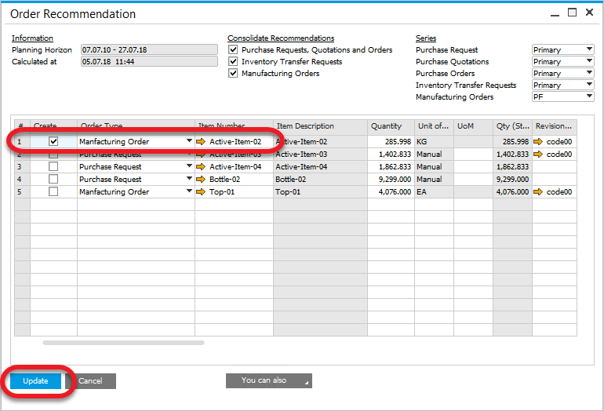

# Overview

ProcessForce provides an MRP (Material Requirements Planning) function using its SAP Business One features.

:::warning
    Please set up Direct Data Access mode if you experience a long response time on opening MRP Wizard when ProcessForce is enabled. The problem may occur when there are many Item Master Data records in the system.

    Click [here](../../administrator-guide/licensing/license-server/direct-access.md) to learn how to set up Direct Access mode for a specific database.
:::

## Introduction

ProcessForce uses the SAP Business One MRP Wizard and Order Recommendation forms.

When running MRP and using the Order Recommendation form, operate them like you would using just SAP Business One.

At the stage of Order Recommendation, when creating Production Orders, the function creates ProcessForce Manufacturing Orders.

Schedule Manufacturing Orders based on backward scheduling from the required due date calculated by MRP.

## Configuration

To see configuration details, visit the [Enable Synchronization](/docs/processforce/user-guide/system-initialzation/general-settings/bom-mor#enable-synchronization) and [MRP-related configuration](/docs/processforce/user-guide/system-initialzation/general-settings/mrp-tab/mrp-related-configuration/) within [General Settings](../../user-guide/system-initialzation/general-settings/general-tab.md).

## Operation

- Run the MRP Wizard in the regular manner

  
- Save Recommendations at the end of the MRP run
- Select Order Recommendation from the context menu

  
- Select which Production Order to create
- Press Update button

  
- System message displays the number of created orders

  
- A report listing all documents created using the Order Recommendation option is displayed at the end of the document creation

  
- Manufacturing Order is created:
  - its status is set to Scheduled
  - Scheduled Backwards from the Required Date
  
  
