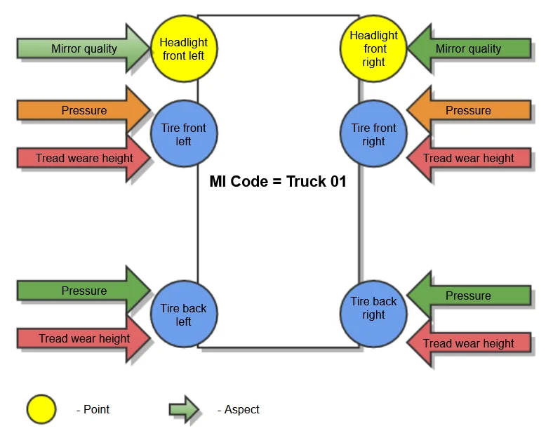

# Maintainable Item

## Maintainable Item (MI)

:::info
    Main Menu → Plant Maintenance → Maintainable Item
:::

*Fig. Maintainable Item – definition schema*

You can define MI as a stand-alone or associated object. In the second case, you have to link existing object in the system.

### Header

**MI Code** – a code of the object that will be serviced

**MI Name** – a maintainable Item name

**MI Type** – a hierarchical type of object

- **Location** – locations are physical locations of systems, positions, and assets. A location is a place. Hierarchy rules:

  - An asset CAN NOT be a parent for a location
  - A position CAN NOT be a parent for a location
  - A system CAN NOT be a parent for a location
  - A location can only have one location as a parent

- **System** – a collection of positions and/or assets that work together so that all parts are affected when one part goes down. Hierarchy rules:

  - An asset CAN NOT be a parent for a system
  - A position CAN NOT be a parent for a system
  - A system can have only one system as a parent
  - A system can have only one location as a parent

- **Position** – functional positions for assets. Used for tracking maintenance to specific positions within a structure. Hierarchy rules:

  - A position can have only one parent that is an asset
  - A position can have only one parent that is a position
  - A position can have only one parent that is a system
  - A position can have only one location as a parent

- **Asset** – equipment is entities where you store data and create work orders. An asset is a base unit of equipment. They are the smallest tracking unit. Hierarchy rules:

  - An asset can have only one parent that is an asset
  - An asset can have only one parent that is in a position
  - An asset can have only one parent that is a system
  - An asset can have only one location as a parent

**MI Class** – the system allows you to separate entities into groups. For example, you can assign classes to Maintainable Items and then give all air conditioning units a class of "HVAC." Please see here

**MI Category** – you can use categories to provide a way to organize pieces of equipment further. For example, if a class is defined for motors, create a category for motor types and sizes. Since an Object Class is a large group of similar things, think of Object Categories as sub-sets of Object Classes. Please see here

**Status** – select a code for the MI status: Awaiting purchase, Purchased/in-store, In-store, In repair, To be repaired, Withdrawn, Installed, In transit

**Commission Date** – date of installation

**Withdrawal Date** – enter the date on which the equipment is withdrawn from service

**Parent MI Code** – parent MI in hierarchy accordingly to rules. You can check the hierarchy of MIs by RMBM option - MIs Structure Report. Please see here

**Parent MI Name** – a name of parent MI

**Parent MI Type** – a hierarchical type of parent MI

**Dependent** – if select, the resource is dependent on the parent asset. If in the MO checkbox, MI Excluded is selected, MO's header MI is not available for production. MO's time is excluded from the scheduling, visible as a grey bar on Gantt Chart - resource view. The MO in status: scheduled, started, released. If the MI is a parent for another MI, and in the child MI definition Dependent = Yes, then excluded time is visible on Gantt for the child MI (Resource). It works this way down the MIs structure.

**Assigned Object** – if the checkbox is checked, then an object from the system can be 1 to 1 linked with MI

- **Resource link**

    

    **Resource Code** – a resource code and Type (Machine, Tool)

    **Resource Name** – description form the resource record

    

- **Item link** – Item managed by Serial numbers with defined Equipment Card (option)

    

    **Item Code/Revision** – when you select Item Code from the list system automatically populates Revision and Item Name.

    **Item Name** – Item name

    **Apparatus Type** – you can select one of the three types: Meter, Tool, Part

    **Equipment Card** – equipment card associated with a serial number (Main Menu/Service/Equipment Card)

    

- **Item defined as Fixed Asset**

    **Fixed Asset** – ProcessForce Fixed Asset Code

    **Description** – description from Fixed Asset record

    

#### Classification – Classes and Categories

##### Classes

:::info
    Main Menu/Administration/Setup/Plant Maintenance/Classes
:::

You can define classes for different entities type, for example: Maintainable Item, Maintenance Order Template, Material List, etc.

**Code** – class code

**Description** – class name

**Entity** – the entity for which the class is defined

**Out of Service** – select to prevent the class from being displayed in lookups

##### Categories

Main Menu/Administration/Setup/Plant Maintenance/Categories

For a specified class, you can define categories.

Code – category code

Description – category name

**Entity** – the entity for which the category is defined

**Class Code** – a class for which the category is defined

**Out of Service** – select to prevent the category from being displayed in lookups

## Tab MI Details

**Branch** – you can select a Branch from those defined in the system

**Department** – the organizational unit to which the MI is assigned

**Assigned By** – a name of supervisor

**Assigned To** – a name of an employee responsible for it

**Fixed Asset No.** – ProcessForce Fixed Asset Code to which the MI is assigned, select from the list

**Plant Maintenance Inactive** (only for information purposes)

**Inactive** – you can mark MI as inactive

**Inactive Start** – enter the date on which the inactive period starts

**Inactive End** – enter the date on which the inactive period ends

**Occurrence** – select repetition period

**Example**: MI is inactive (Inactive=Yes) – reserved for maintenance each month (Occurrence) from 10th (Inactive Start) to 12th (Inactive End)

**Meter Characteristics** – fields active if MI is defined as Apparatus Type = Meter. Please see <!-- TODO: Add Link --> here.

**Meter Unit** – a meter unit of measure (Main Menu/Administration/Setup/Stock Management)

**Maximum Value** – the meter can reach maximum value before it exceeds its physical count limit and resets to zero. Enter 0 if the meter does not have a maximum limit.

**Input Current Value** – noneditable. You can enter values via the Meter Reading document (RMBM option Physical Meter Value Setting/Correction). The option is active if the meter is not assigned to any MI/EM.

**Numbers of Turns Over** – noneditable. You can enter values via the Meter Reading document (RMBM option Physical Meter Value Setting/Correction). Option active if the meter is not assigned to any MI/EM

**Frozen Parameters** – if the checkbox is checked, Meter Characteristics fields (Meter Unit and Maximum Value) are not editable

**Reading** – last reading value (from Meter Reading document)

**Current Usage** – usage from the last installation (calculated)

**Total Usage** – usage since first installation (calculated)

**Reading Document No.** – last Meter Reading document

**Assigned to MI** – MI, to which the meter is linked via Effective Meter

**Assigned to EM** – Effective Meter to which the meter is assigned

## TAB Effective Meters

Effective Meter is a relationship between a Meter Unit and an Object and is described by Effective Meter Type. This relationship is defined to record the cumulative usage of an object throughout its operational life, regardless of how many times a corresponding physical meter resets or is replaced. This cumulative usage or effective meter reading, updated from readings taken from a physical meter, always increases over time – it never resets (e.g., in physical physical meter, always increases over time – it never resets (e.g., like in a meter that counts up to 999 that resets to 000 after reaching one unit more than 999)). A physical meter can only be linked to one effective meter at a time.

**EM Type** – a type of effective meter here

**Type Name** – the name of EM Type

**Meter Unit** – the unit of measure for the Effective Meter

**Inherited** – if the checked readings are calculated and propagated based on readings from the parent Effective Meter with the same EM Type, it is impossible to enter direct meter readings. Linking of Physical Meter is not possible

**Physical Meter MI Code** – select the code of the physical meter, if any. MIs with Apparatus Type= Meter, Meter Unit (Physical Meter) = Meter Unit (EM Type) are available. Physical Meter can be linked to one of the MI's Effective Meter just by right-clicking on the Effective Meter a choose "Physical Meter Connection."

**Entry Type** – reading input mode:

**Reading** – user enters the current meter reading
Difference – user enters the difference between the last reading and the current reading

:::note
    After the first reading, it is impossible to change this type. If a physical meter is linked, only Reading mode is available.
:::

**Last Reading** – previous reading value

**Reading** – current reading value from the newest Meter Reading document

**Derived Reading** – calculated reading according to Entry Type

**Total Usage** – cumulative usage of an object throughout its operational life

**Usage Since Install** – cumulative use of an object throughout its operational life in the current installation

**Meter Reading No.** – the last meter reading document

**Maintenance Order No.** – maintenance order associated with meter reading document

**Last Reading Date** – date of the last meter reading

**Aspect Point** – user can choose Aspect Point defined for the MI

**Description** – description of the Aspect Point

### Definition of EM Type and Physical Meter

:::note Path
    Main Menu/Administration/Setup/Plant Maintenance/EM Types
:::

You can define the Effective Meter Type (EM Type), then assign this EM Type to the MI. The same EM Type you can use many times for different MIs.

**EM Type** – a type of Effective Meter

**Type Name** – the name of EM Type

**Entry Type** – reading input mode:

**Reading** – user enters the current meter reading

**Difference** – user enters the difference between the last reading and the current reading

**Meter Unit** – the unit of measure for the Effective Meter (Main Menu/Administration/Setup/Stock Management/Units of Measure)

### Meter Reading

You can enter Meter Reading directly for MI’s EM Type, or you can do this via Physical Meter. To do this, you must first define the Physical Meter as an MI with Apparatus Type = Meter. Please see here

You can open the Meter Reading document from MI Master Data (RMBM Option Meter Reading on the line with EM Type) or Maintenance Order (RMBM Option Meter Reading on the line with Checkpoint in Checklist)

In general, it is possible to open a Meter Reading document as an RMBM option from:

**MI Master Data** (for Physical Meter not assigned to any MI/EM)

- **Physical Meter** value Setting/Correction

**MI Master Data** (RMBM Option on the line in tab Effective Meters)

- Meter Reading
- Effective Meter Reading Correction (for EM without assigned PM)
- Physical Meter/Effective Meter Reading Correction (for EM with assigned PM)
- Physical Meter Disconnection
- Physical Meter Connection

**Maintenance Order** (RMBM Option in tab Task/Checklist on Checkpoint with Type=Meter Reading)

- Meter Reading

#### Header {#header-01}

**Series** – an assigned document series

**MI Code** – a MI Code for which readings are performed

**Entry Type** – choose one of the following entry types:

- **Reading** – enter the current meter value
- **Difference** – enter the difference between the last reading and the current reading value

**Reading** – enter the meter reading value or difference

**Last Value** – reading from the previous Meter Reading document

**Last Reading Document** – Meter Reading document for the Last Value

**Maintenance Order** – Maintenance Order for the current reading

**Number of Turns Over** – for a physical meter with a Maximum Value > 0

**Calculated Current Value** – calculated meter value after the current reading

**Date/Time** – the date and time of the meter reading

**Physical Meter MI Code** – MI Code defined for the Physical Meter

**Maximum Value** – PM maximum value from MI Master Data

**Meter** – effective or physical

**EM Type** – meter type to which the physical meter is linked

**Meter Unit** – meter unit for meter type

**Status** – Started, Calculated, Propagated, Closed

**Reading's Inheritance** (reading propagation according to MI structure)

**Level** – level in inheritance hierarchy by MI structure

**MI Code** – MI Code for which reading calculation is performed

**EM Type** – EM Type for which reading calculation is performed

**Meter Unit** – EM Type's meter unit

**Reading** – value calculated according to Entry Type

**Derived Reading** – calculated according to the Logic of Meter Reading Process

**Total Usage** – calculated according to the Logic of Meter Reading Process

**Usage Since Install** – calculated according to Logic of Meter Reading Process

**Calculated Total Usage** – calculated according to the Logic of the Meter Reading Process

**Calculated Usage Since Install** – calculated according to the Logic of Meter Reading Process

**Checkpoint Details**

Please check the Checkpoint Template definition <!-- TODO: Add Link --> here.

**Buttons**

**Calculate** – based on entered reading value in the header, the Calculated Total Usage and Calculated Usage Since Install is calculated.

**Propagate** – calculated values are propagated Total Usage and Usage Since Install (before that document has to be added)

**Close Document** – after that, it is impossible to redo Calculate & Propagate.

#### The logic of the Meter Reading Process

##### Meter Readings Process

1. Reading the value of the Meter for EM Type with Inherited=No:  
    Save in Meter Reading header reading value with other information about the Reading.

    1. If Physical Meter is not assigned to EM Type: Calculate: Derived Reading, Total Usage, and Usage Since Install for Effective Meter.  
        Save information about reading and calculated values to Effective Meter Reading History (Report)

        1. Save information about reading and calculated values in Meter Readings/tab Reading's Inheritance (0 Level).
        2. Update information in MI Master Data/tab Effective Meters for proper EM Type: Reading, Derived Reading, Total Usage, Usage Since Install, Last Reading Date
    2. If Physical Meter is assigned to MI-EM Type: Calculate: Derived Reading, Total Usage, and Current Usage for Physical Meter.  
        Save information about reading and calculated values to Physical Meter Reading History (Report)

        1. Calculate Derived Reading, Total Usage, and Usage Since Install for Effective Meter.  
            Save information about reading to Effective Meter Reading History (Report)
        2. Save Derived Reading, Total Usage, and Current Usage for Physical Meter in MI Master Data (Physical Meter/Meter Characteristics)
        3. Save information about reading and calculated values in Meter Readings/tab Reading's Inheritance (0 Level)
2. For each child EM with Inherited=Yes spread down in MI hierarchy Derived Reading  
    Calculate Total Usage and Usage Since Install for each EM Type. Save information about reading and calculated values to Effective Meter Reading History (Report)

    1. Save information about reading and calculated values to Meter Readings/tab Reading's Inheritance (other Levels than 0)
    2. Update information in MI Master Data/tab Effective Meters for proper EM Type: Reading, Derived Reading, Total Usage, Usage Since Install, Last Reading Date

A – Meter Readings header's lines with Reading's Inheritances

B – Maintainable Item Master Data header's (tab Effective Meters) lines with Effective Meters

#### Reading’s Calculation

#### Reading's Inheritance

## Inspection Points Tab

### Points tab

**Point** – the inspection point ID

**Description** – describe the inspection point.

**Point Type** – inspection point type (please check here) to associate with the MI. The system automatically populates the point type description, Class, and Class Description.

**Class, Description** – classification, please see here.

**MES IP Code, MES IP Description, MES IP Class, MES IP Category** – agreed on the ID of the Inspection Point between MES and ProcessForce (during the integration process). Please check here.

#### Point Type

:::info Path
    Main Menu/Administration/Plant Maintenance/Inspection Setup/Points
:::

Inspection Point Type is a group of similar inspection points. Example: for a vehicle, there are tires, brakes, headlights, etc.; for a pipe, the point type could be a tee or a weld.

**Code** – code for Inspection Point Type

**Description** – descriptive information about Inspection Point Type

**Class** – classification, check here.

#### MES Inspection Point

:::info Path
    Main Menu/Administration/Plant Maintenance/Inspection Setup/MES Inspection Points
:::

**MES Inspection Point Code** – agreed on the ID of the Inspection Point between MES and ProcessForce (during the integration process)

**Description** – descriptive information about MES IP

**Class** – allows grouping MES Inspection Points Codes

**Category** – allows grouping MES Inspection Points Codes

**Data Type**:

CHARACTER [(length)] or CHAR [(length)]

INTEGER or INT

NUMERIC [(p[,s])]

**In** – Inspection Point dedicated to reading monitored values from a device

**Out** – Inspection Point dedicated to sending control values to a device

**MI Assignment**

**MI Code** – MI to which the MES IP is assigned

**Point** – Inspection Point to which MES IP is assigned

**Aspect Point** – The aspect Point to which MES IP is assigned

**Database assignment** – the repository where the history of inspection points values is collected/stored

**Server, Data Base, Table** – specific data determined during the integration process

### Aspects tab

**Aspect** – the Inspection Aspect to associate the monitored data object with. The system automatically populates the aspect's parameters: Description, A. Class, A. Class Description, UoM. Please check here.

**Method** – the inspection method for the aspect, as necessary. The system automatically populates the method's parameters: M. Description, M. Class, M. Class Description. Please see here

**Nominal Value** – starting value or normal value and unit of measure for measurements on this aspect. For example, if a new pipe wall thickness is 3 mm, the nominal value is three, and the unit of measure is mm.

**Min. Extreme** – the minimum extreme value beyond the operating specifications for the aspect

**Min. Critical** – the lowest possible value for the aspect

**Min. Prev.** – the minimum percentage of critical value for the aspect

**Min. Std. MO** – standard maintenance order to restore normal operating conditions when the minimum critical value is reached

**Min. Prev. MO** – preventive Maintenance Order to restore normal operating conditions when the minimum critical value is reached

**Min Extr. MO** – Maintenance Order when the minimum extreme value is reached

**Min. Extreme (Min Extr. MO) < Min. Critical (Min. Std. MO) < Min. Prev. (Min. Prev. MO) < Nominal Value**

**Max. Extreme** – the maximum extreme value beyond the operating specifications for the aspect

**Max. Critical** – the highest possible value for the aspect

**Max. Prev.** – the maximum percentage of critical value for the aspect

**Max. Std. MO** – standard Maintenance Order to restore normal operating conditions when the maximum critical value is reached

**Max. Prev. MO** – preventive maintenance order to restore normal operating conditions when the maximum critical value is reached

**Max Extr. MO** – maintenance order when the maximum extreme value is reached

**Nominal Value < Max. Prev. (Max. Prev. MO) < Max. Critical (Max. Std. MO) < Max. Extr. (Max. Std. MO)**

#### Aspect

:::info Path
    Main Menu/Plant Maintenance/Inspection Setup/Aspects
:::

**Code** – inspection aspect's code

**Description** – descriptive information about the aspect

**Class** – classification of aspects, please see here

**Meter Unit** – a unit of measure for the aspect

**Out of Service** – select to indicate the aspect that should not display in lookups.

#### Method

:::info Path
    Main Menu/Plant Maintenance/Inspection Setup/Methods
:::

**Code** – code method

**Description** – descriptive information about the method

**Class** – classification of method

#### Aspect Points

**Aspect Point** – ID for Aspect Point

**Description** – descriptive information about Aspect-Point

**Aspect** – an inspection aspect for an inspection point. The system automatically populates the aspect definition from the Aspect tab (check here)

**Point** – an inspection point. The system automatically populates the point definition; please (check here)

**MES IP Code** – agreed on the ID of the Inspection Point between MES and PM (during the integration process). Please check MES Inspection Point here.

**Method\*** – enter the inspection method for the aspect as necessary; please see here

**Nominal Value** – enter the starting value or normal value and unit of measure for measurements on this aspect point. For example, if a new pipe’s wall thickness is 3 mm, the nominal value is three, and the unit of measure is mm.

**Min. Extreme** – enter the minimum extreme value beyond the operating specifications for the aspect point

**Min. Critical** – enter the lowest possible value for the aspect point.

**Min. Prev.** – a minimum percentage of critical value for the aspect

**Min. Std. MO** – standard Maintenance Order to restore normal operating conditions when the minimum critical value is reached

**Min. Prev. MO** – preventive Maintenance Order to restore normal operating conditions when the minimum critical value is reached

**Min Extr. MO** – a Maintenance Order when the minimum extreme value is reached

**Max. Extreme** – maximum extreme value beyond the operating specifications for the aspect

**Max. Critical** – enter the highest possible value for the aspect point.

**Max. Prev.** - the maximum percentage of critical value for the aspect

**Max. Std. MO** – standard maintenance order to restore normal operating conditions when the maximum critical value is reached

**Max. Prev. MO** – preventive maintenance order to restore normal operating conditions when the maximum critical value is reached

**Max Extr. MO** – Maintenance Order when the maximum extreme value is reached

When the inspection is performed, the following logic for Aspect Point's measured Value is used.

#### Condition

**Point** – the inspection point. The system automatically populates the point definition; please see here.

**Aspect** – the inspection aspect for condition. The system automatically populates the aspect definition from the Aspect tab here.

**Condition** – the inspection condition. The system automatically populates the condition definition; please see here.

**Note:** Do not enter an Aspect when the Condition applies to the Point, regardless of the measured aspect.

##### Condition {#01}

:::info Path
    Main Menu/Administration/Plant Maintenance/Inspection Setup/Conditions
:::

**Code** – Inspection Condition code

**Description** – descriptive information about Inspection Condition

**Class** – classification of Inspection Condition

**Here is an additional example of how to define Aspects and Points for Truck Tires:**

The physical place on the piece of equipment to inspect. The inspection points are the front left tire, the front right tire, the rear left tire, and the rear right tire. Example: examine tires on a van every three months for tread wear.

**Point** (the physical location of the piece of equipment to inspect):

Tire: Front left, Front right, back left, back right

Headlight: left, right

**Aspect** (what kind of parameter is checked):

Pressure

Tread wear height

Mirror quality

**Aspect-Point** (what kind of parameter is checked on which point):

Pressure – Tire front left

Pressure – Tire front right

Pressure – Tire back left

Pressure – Tire back right

Tread wear height – Tire front left

Tread wear height – Tire front right

Tread wear height – Tire back left

Tread wear height – Tire back right

Mirror quality – Headlight front left

Mirror quality – Headlight front right

**Note:** It is possible to choose a finding from the ones assigned to MI (modifying Point Type selection)

**Method:**

Assignment of inspection method to Aspect and Aspect-Point

**Condition:**

Assignment of inspection conditions to Point or Point Type - Aspect

