# Maintenance Order Template

:::note Path
        Main Menu → Plant Maintenance → Work Setup → Maintenance Order Template
:::

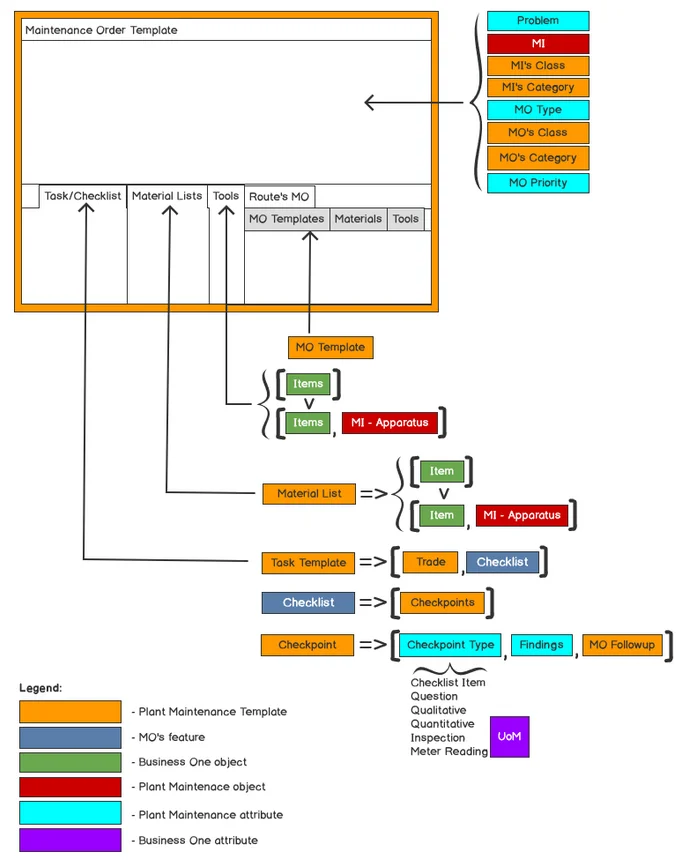

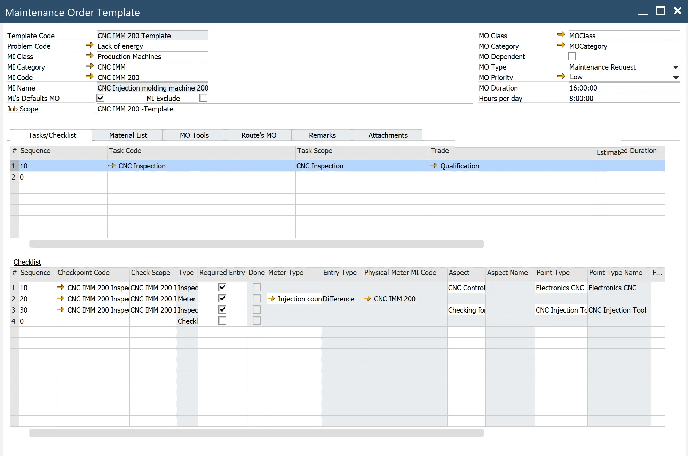

## Header

**Template Code** – a unique code identifying the Maintenance Order Template

**Job scope** – descriptive information of the Job scope (brief explanation)

**Problem Code** – a code identifying a problem from a list defined by the user (check here)

**MI Class** – a class of equipment for performing the work (check here)

**MI Category** – equipment category to which the standard work order applies, a category inside Class

**MI Code** – MI for which the MO is defined

**MI Name** – MI name

**MI's Defaults MO** – select if the MO template is planned to default for the MI.

**MI Excluded** - if checked, MI is excluded from scheduling in a planned MO period.

The MO in status: scheduled, started, released. MI Exclude – MO's header MI is unavailable for production if selected. MO's time is excluded from the scheduling, visible as a grey bar on the Gantt Chart - resource view. If the MI is a parent for another MI, and in the child MI definition Dependent = Yes, then excluded time is visible on Gantt for the child MI (Resource). It works this way down the MI structure.

**MO Class** – a Maintenance Order class of the template MO (check here)

**MO Category** – a Maintenance Order category in a class

**MO Dependent** – to keep the Maintenance Order open until all its children's work orders are completed

**MO Type** – select a Maintenance Order type of the Maintenance Order Template

**Maintenance Request** – request related to Manufacturing Order

**Setup Request** – request related to Manufacturing Order

**Change Over Request** – request related to Manufacturing Order

**Manual Request** – maintenance request by the end user

**Breakdown** – select to create a maintenance order in response to an equipment breakdown or failure

**PM request** – select to create a preventive maintenance work order

**MO Duration** – the duration of the template maintenance order (including Route’s MO)

**MO Priority** – the priority of the maintenance order, e.g., Low, Medium, High.

## Closing Codes

Main Menu/Administration/Setup/Plant Maintenance/Closing Codes

The PM contains four types of closing codes – action codes, cause codes, failure codes, and problem codes. Action codes describe the steps necessary to correct the problem (e.g., add lubricant to a pump). Cause codes identify what caused the component or type of component to fail, i.e., the root cause of the problem. Failure codes identify the reason the equipment failed. Finally, problem codes identify the observed equipment failure (e.g., a tap leak or pump overheating).

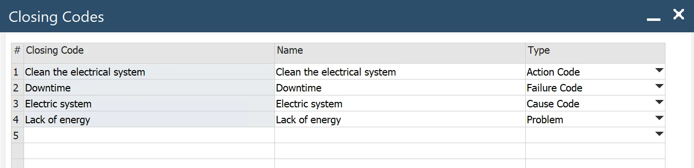

### Closing Codes Types

When an object needs work, you need to know a few things about that work. You can define four types of closing Codes for objects to help in the reporting and fixing of problems:

- Problem codes
- Failure Codes
- Cause Codes
- Action codes

#### Problem Codes

Problem Codes identify the observed problem that requires correction: a leak from a tap, an overheating pump, or a cracked pipe.

##### Failure Codes

Failure Codes identify the actual difficulty with an object that needs work; the Problem Code notes the reason for the problem. If a pump is overheating (Problem Code), the associated Failure Code could be that the pump was not receiving adequate lubrication.

#### Cause Codes

Our pump overheated (Problem) because it received inadequate lubrication (Failure). It received inadequate lubrication because there was a blockage in the lubrication pip (Cause Code). Cause Codes identify where work is required, the ultimate source of the problem noted in the Failure Code, and the root cause for concern.

#### Action Codes

Action Codes describe what measures are taken to fix a problem. In our continuing pump example, the most obvious Action Code is cleaning the lubrication piping.

Note: The use of "Downtime Reason" requires the assumption that the only problem and very general is "Downtime." Combining this with "Reason" forces the cause for "Downtime." It is better to use, e.g., Problem Code = "Power failure," Failure Code = "Downtime," and Cause Code = "Burning collateral." If the Problem Code is unclear, just give Problem Code = "Downtime" and specify the rest in the Closing Details at the end of MO.

### Priority

Main Menu/Administration/Setup/Plant Maintenance/Priority

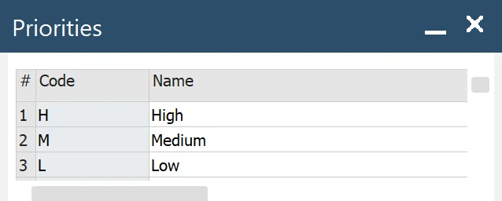

**Code** – a unique priority code

**Name** – a priority name

## Tab Task/Checklist

Based on Task Template.

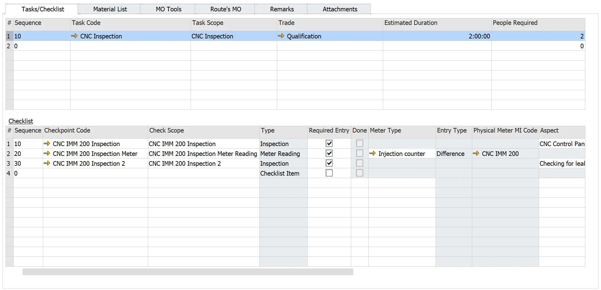

**Sequence** – order of tasks execution

**Task Code** – Task's code from Task Template. The system automatically populates the task definition from the Task Template.

### Task Template

Main Menu/Administration/Plant Maintenance/Work Setup/Task Template

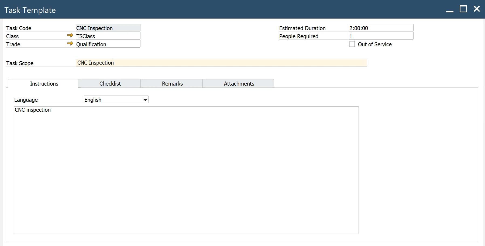

Header

- Task Code – a unique code identifying the task, and then enter a description of the task in the Task Scope field
- Task Scope – descriptive information of the Task Scope (brief explanation of the problem)
- Class – a class of the task here
- Trade – a trade with which to associate the task here
- Estimated Duration –the number of hours estimated to complete the task
- People Required – several people are required to complete the task
- Out of Service – select to indicate the task should not be displayed in lookups, e.g., on Template MO.

#### Trade

Main Menu/Administration/Setup/Plant Maintenance/Trade

Trades are codes for the types of employees performing maintenance work. A single trade can have multiple rates based on the cost trade type or the department associated with the trade for a specific Maintenance Order. Based on an hourly rate, the system will charge (not implemented in phase I) the trade cost back to the appropriate maintenance order, MI, or project, ensuring correct cost accounting. On the Qualifications tab, you may associate qualifications with trades to establish the minimum qualifications for an employee belonging to a trade to perform the work for which the trade is selected.

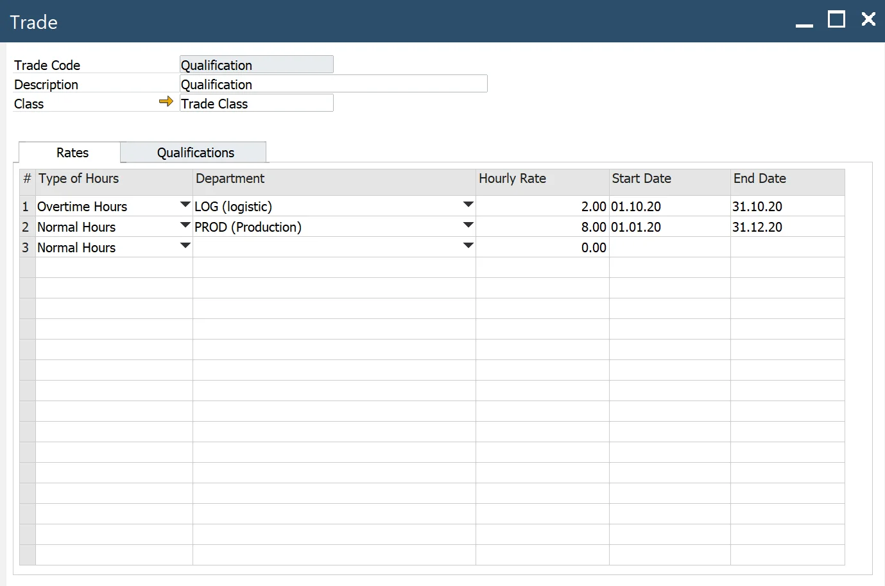

Trade – a unique code identifying the trade

Description – descriptive information about the Trade

Class – enter the class to further subdivide the trade as necessary, e.g., specify apprentice, journeyman, or master.

##### Rates tab

Rates are defined for Trades. When booking hours, the system checks to see if an Hourly Rate is determined for an Employee. If so, the hours are booked at that rate. However, if you have not defined trade rates for the employee, the system assigns the Hourly Rate defined for the Trade on the Trade Rates tab.

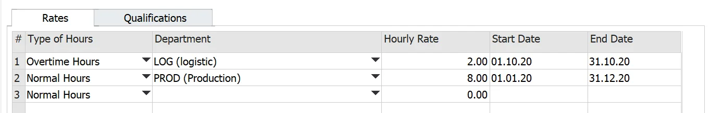

**Type of Hours** – hour occupation type for this work, e.g., select regular or overtime hours.

**Department** – the department associated with this rate. If the rate applies to all departments, leave empty (Main Menu/Administration/Setup/Stock Management/Departments)

**Hourly Rate** – the hourly rate for this trade

**Start Date and End Date** – beginning and ending dates to which the rate applies

Note: Dates for the same hours/department combination cannot overlap.

#### Qualification tab

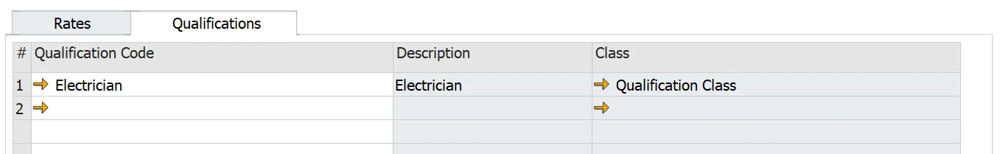

Qualification Code – the qualification code (based on the template here) to associate with the trade.

#### Qualification Template

Main Menu/Administration/Setup/Plant Maintenance/Qualification

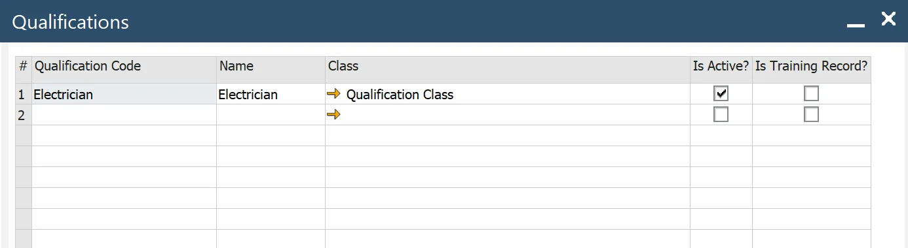

**Qualification Code** – a unique code identifying the qualification and then entering a description in the adjacent field.

**Class** – enter the class of the qualification here

**Active** – select to indicate whether the qualification is active. You can also select and unselect Active to temporarily activate and deactivate a qualification.

**Training Record** – by defining a qualification as a training record, the system does not track the qualification for qualification enforcement. The qualification cannot be associated with tasks, trades, and work order activities.

### Instruction tab

**Language** – select the language of the instruction

**Instructions** – enter the comments on the screen

### Checklist tab

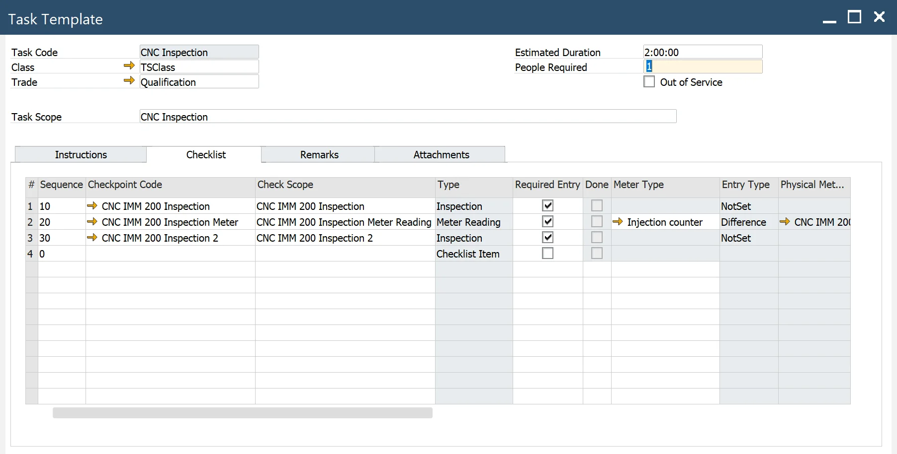

**Sequence** – order of the checkpoint execution

**Checkpoint Code** – step in a task defined in the Checkpoint Template

## Checkpoint Template

Main Menu/Administration/Plant Maintenance/Work Setup/Checkpoint Template

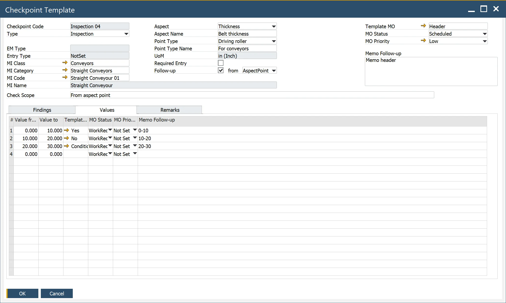

**Checkpoint Code** – a unique code for a checkpoint

**Check Scope** – descriptive information about checkpoint scope

**Type** – checklist Item type: Checklist Item, Question, Quantitative, Qualitative, Inspection, or Meter Reading.
Note: Checkpoint Type determines how the checkpoint will be reported in Maintenance Order

**MI Class** – MI Class for which the checkpoint is designated (check here)

**MI Category** – The MI Category for which the checkpoint is designated

Note: MI Class/MI Category determines what findings will be visible in the tab Findings (check here)

**MI Code** – The MI Code for which the checkpoint is designated

**EM Type** – MI's Effective Meter Type associated with UoM of measure for the meter reading (check here)

**Entry Type** – reading value input mode for meter reading: Reading or Difference

**Aspect** – a combination of Aspect/Point Type determines for which Inspection Points from MI inspection results will be recorded (check here)

**Aspect Name** – an aspect defined for MI, please see here

**Point Type** – the Point related to the Aspect from the MI definition (check here)

**Point Type Name** – point's name

**UoM** – a unit of measure for Aspect Point

**Required Entry** – select if checkpoint completion is needed to close the associated task in the Maintenance Order.

**Follow-up** – select to create follow-up MO from Template MO

A follow-up MO is generated if the checkbox "Follow-up" is selected. In the field "from," you can define the source of the Follow-up MO Template: Header, Findings, Values, Aspect Point

Sources Header and Findings are available for all checkpoint types. For Findings MO Template and its parameters (MO Status, Priority, and Memo Follow-up) are taken from the tab Findings

Source Values are available for checkpoint types: Meter Reading, Inspection, and Quantitative. For Values, the MO Template and its parameters (MO Status, Priority, and Memo Follow-up) are taken from tab Values from defined values intervals.

Source Aspect Point is available for checkpoint type Inspection. MO Template and its parameters (MO Status, Priority) are taken from Aspect Points defined for Maintainable Item in the Inspection Points/Aspect Points tab. Memo follow-up is taken from the checkpoint header.

A follow-up MO is not generated if the checkbox "Follow-up" is not selected. Memo Follow-up is taken from the header.

**Memo Follow-up** – some additional remarks to follow up on MO

**Template MO** – a follow-up Maintenance Order the system will create when checklist Items are selected for follow-up

**MO Status** – follow-up MO Status

**MO Priority** – follow-up MO Priority

### Findings tab

In the grid, automatically imported findings are defined and selected in the header MI Class and MI Category here.

    Select – if the checkbox is selected, the finding will be available when the checkpoint is reported in the Maintenance Order

#### Findings

Main Menu/Plant Maintenance/Inspection Setup/Findings

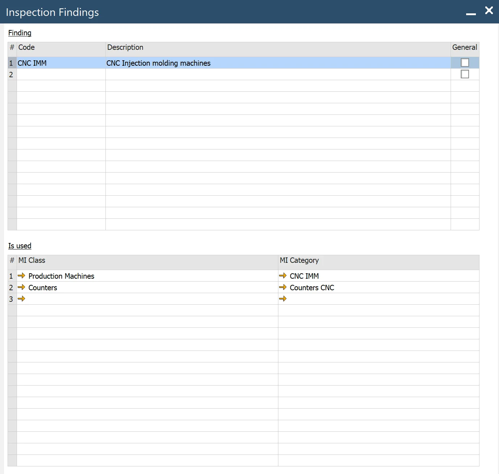

**Finding** (predefined descriptive findings that are used during checkpoint recording)

**Code** – a unique findings code

**Description** – descriptive information about finding

**General** – if checked, the finding can be used in all checkpoint template definition

Where used (list of MI Classes/MI Categories for which the result can be used)

**MI Class** – Maintainable Class

**MI Category** – Maintainable Category.

## Material List tab

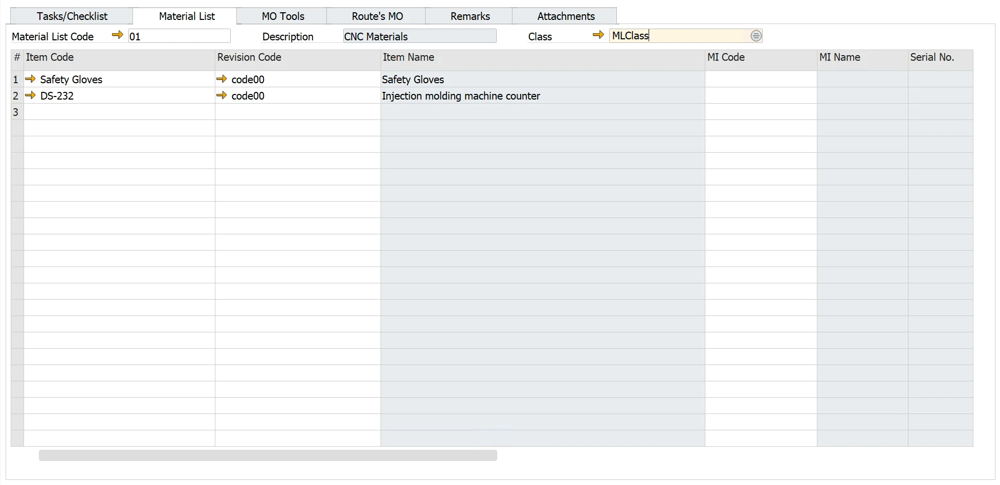

**Material List Code** – you can compose the Material List using a predefined Material List here or manually, item by item.

**Item Code** – the Item Code. The system automatically populates Item parameters.

**Revision Code** – Item's revision

**Item Name** – from Item Master Data

**MI Code** – you can select if there is any MI defined as Part (Item with Apparatus Type=Part)

**MI Name** – from MI Master Data

**Equipment Card** – EC No. assigned to the Item managed by serial numbers

**Quantity** – how many Items are needed

**UoM** – from Item Master Data

**Warehouse Code** – default Warehouse

**Issue Type** – Manual by default

**Hours** – the number of hours estimated to use the tool to complete the MO

**Total Hours** – equal to Quantity \* Hours

**Safety** – if checked, special safety conditions are required

### Material List Template

Main Menu/Administration/Plant Maintenance/Work Setup/Material List

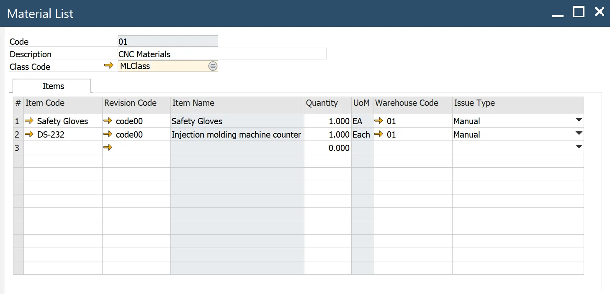

**Item Code** – the system automatically populates Item parameters.

**Revision Code** – Item's Revision

**Item Name** – from Item Master Data

**Quantity** – how many Items are needed

**UoM** – from Item Master Data

**Warehouse Code** – default Warehouse

**Issue Type** – default Manual

## Tab MO Tools

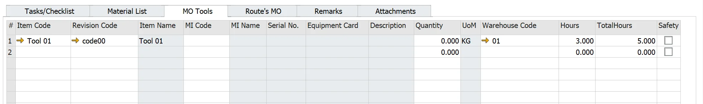

**Item Code** – enter the Item Code to add to the Material List. The system automatically populates Item parameters.

**Revision Code** – Item's Revision

**Item Name** – description from Item Master Data

**MI Code** – you can select MI with assigned EC No. as a tool

**MI Name** – from MI Master Data

**Equipment Card** – EC No. assigned to the Item managed by serial numbers

**Quantity** – how many Items are needed

**UoM** – from Item Master Data

**Warehouse Code** – default Warehouse

**Issue Type** – default Manual

**Hours** – enter the number of hours estimated to use the tool to complete the MO

**Total Hours** – equal to Quantity \* Hours

**Safety** – if checked, special conditions are required

## Route’s MO tab

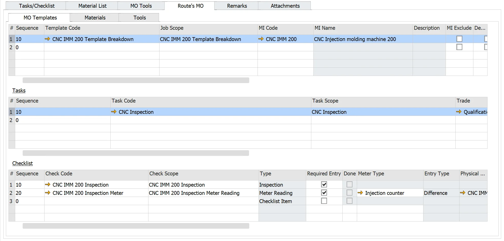

### MO Templates tab

You can assign child MOs using the MO template.

    Sequence – the sequence number in which to perform the route maintenance order,
    Template Code – select the route maintenance order template to assign to the maintenance work order template (check here). The system automatically populates the MO Template parameters.

Task Checklist

#### Materials tab

**Material List Code** – you can compose the Material List using a predefined Material List here or manually, item by item.

**Item Code** – the Item Code. The system automatically populates Item parameters.

**Revision Code** – Item's revision

**Item Name** – from Item Master Data

**MI Code** – you can select if there is any MI defined as Part (Item with Apparatus Type=Part)

**MI Name** – from MI Master Data

**Equipment Card** – EC No. assigned to the Item managed by serial numbers

**Quantity** – how many Items are needed

**UoM** – from Item Master Data

**Warehouse Code** – default Warehouse

**Issue Type** – Manual by default

**Hours** – the number of hours estimated to use the tool to complete the MO

**Total Hours** – equal to Quantity \* Hours

**Safety** – if checked, special safety conditions are required

#### Tools tab

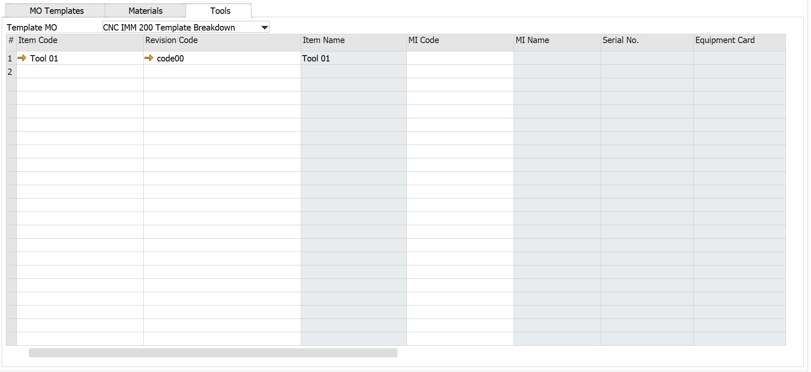

**Item Code** – enter the Item Code to add to the Material List. The system automatically populates Item parameters.

**Revision Code** – Item's Revision

**Item Name** – description from Item Master Data

**MI Code** – you can select MI with assigned EC No. as a tool

**MI Name** – from MI Master Data

**Equipment Card** – EC No. assigned to the Item managed by serial numbers

**Quantity** – how many Items are needed

**UoM** – from Item Master Data

**Warehouse Code** – default Warehouse

**Issue Type** – default Manual

**Hours** – enter the number of hours estimated to use the tool to complete the MO

**Total Hours** – equal to Quantity \* Hours

**Safety** – if checked, special conditions are required
