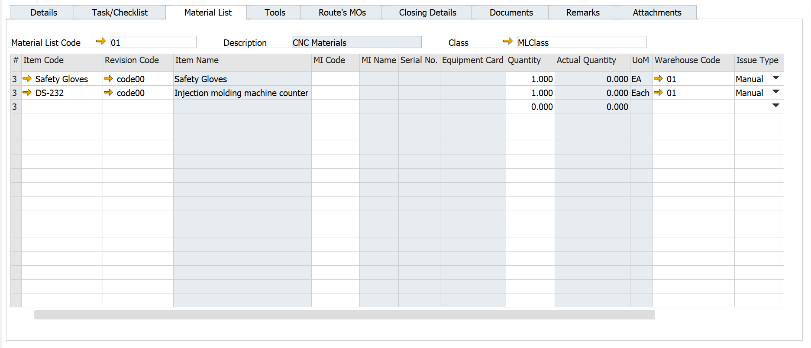
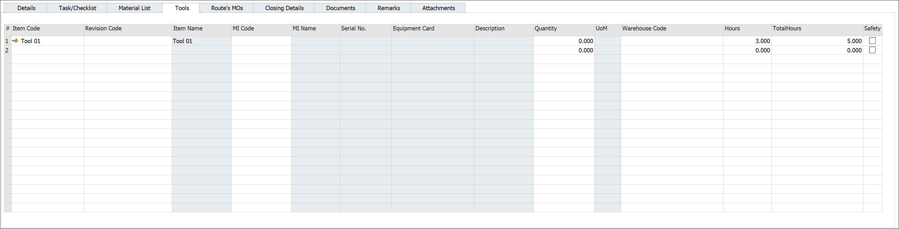
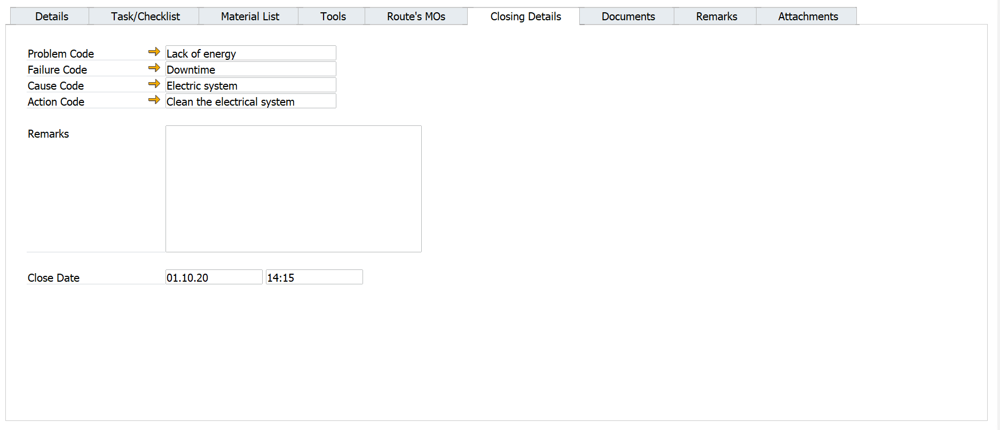
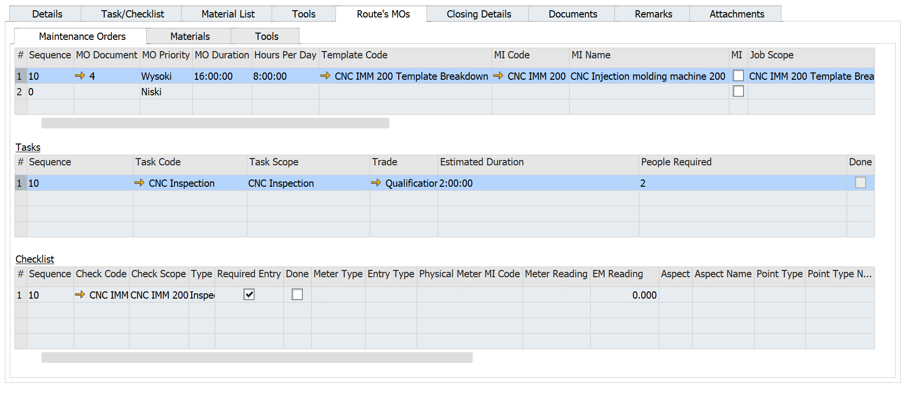
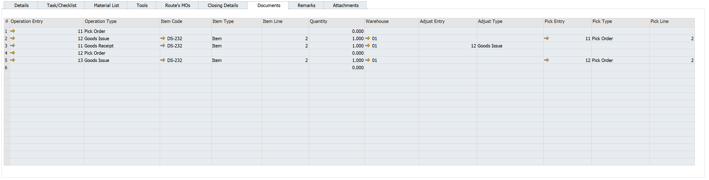
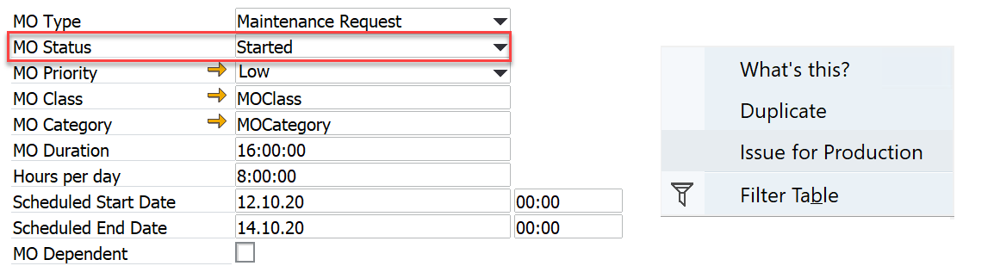
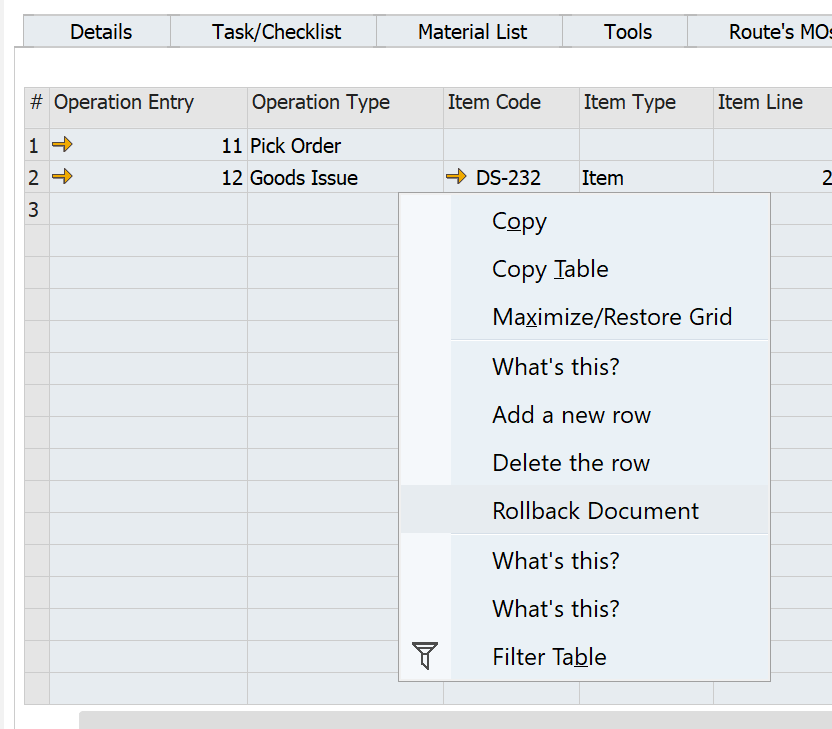

# Maintenance Order

:::info Path
Main Menu/Plant Maintenance/Work Management/Maintenance Order
:::

## Header

**Series** – set by the system

**MI Code** – from the MO Template, can be changed

**Template MO** – the name of MO Template

**Source MO** – here you can find the ID of the parent MO if the MO is run as Route’s MO or as a follow-up MO

**MO Status** – Work Request, Not Scheduled, Scheduled, Released, Started, ON Hold, Finished, Closed, Cancelled

**Scheduled Start, Scheduled End** – fields set by the user

## Details Tab

**Parent MI Code** – the parent MI in the hierarchy

**Parent MI Name** – the MI's name

**PM Schedule** – Preventive Maintenance schedule code – the second phase

**Source MOR** – the MOR which causes the MO – the second phase

**Downtime** – estimated downtime entered by the user. Important for production resources – integration with production scheduling – the second phase

**Warranty** – select if a MO has an associated warranty – for example, If the Item managed by Serial Number associated with the MI on the maintenance order is under warranty

**Created By** – employee, set up by the system when MO is created

**Created Date** – set up by the system when MO is created

**Reported By** – employee, set up by the system when MO is reported/recorded

**Reported Date** – set up by the system when MO is reported/recorded

**Assigned By** – set up by the user

**Assigned To** – set up by the user

**Memo Follow-up** – descriptive information entered when the follow-up MO is created

## Task/Checklist Tab

The user registers the execution of MO’s task in this tab in checkpoints’ lines. Depending on the checkpoint type user should (RMBM options: Meter Reading, Inspection Reading) record checkpoint execution. The task is reported as done (Done=Yes) if all checkpoints have Required=Yes (is set to Yes when the reading document is closed).

Notes:

- Checkpoints can be recorded when MO Status = Started. Users can change MO status by one or in groups (check here).

- User can verify inspection readings and trace Inspection Reading history (check here).

- User can trace meter readings history; please see here.

- It is possible to perform many inspections/meter readings for the same checkpoint.

### Meter Reading

RMBM options: Meter Reading – The meter Reading document is opened. Obligatory is that user enters Reading (value related to Effective Meter/Physical Meter, check here) and optional information in the Checkpoint Details tab.

### Inspection

RMBM options: Inspection Reading – Inspection Reading document is opened. Obligatory is that the user enters Value (related to Aspect-Point) and optional information in the Checkpoint Details tab.

### Quantitative

RMBM options: Inspection Reading – Inspection Reading document is opened. Obligatory is that user enters Value (quantitative rating as an answer for a question from Check Scope) and optional information in the tab Checkpoint Details.

### Qualitative

RMBM options: Inspection Reading – Inspection Reading document is opened. Obligatory is that user enters Finding (qualitative rating as an answer for a question from Check Scope) and optional information in the tab Checkpoint Details.

### Question

RMBM options: Inspection Reading – Inspection Reading document is opened. Obligatory is that user enters Finding (answer for a question from Check Scope) and optional information in the tab Checkpoint Details.

### Checklist Item

RMBM options: Inspection Reading – Inspection Reading document is opened. There are no obligatory fields. When the user selects the button Close Document checkpoint is marked as Done.

## Material List Tab

**Material List Code** – you can compose the Material List using a predefined Material List here or manually, item by item.

**Item Code** – the Item Code. The system automatically populates Item parameters.

**Revision Code** – Item's revision

**Item Name** – from Item Master Data

**MI Code** – you can select if there is any MI defined as Part (Item with Apparatus Type=Part)

**MI Name** – from MI Master Data

**Equipment Card** – EC No. assigned to the Item managed by serial numbers

**Quantity** – how many Items are needed

**UoM** – from Item Master Data

**Warehouse Code** – default Warehouse

**Issue Type** – Manual by default

**Hours** – the number of hours estimated to use the tool to complete the MO

**Total Hours** – equal to Quantity * Hours

**Safety** – if checked, special safety conditions are required

It is possible to Issue Items from the Material List. RMBM option in Header – Issue for Production (Pick Order), please see here. The functionality is similar to the Issue for Production in ProcessForce's Manufacturing Order.

## Tools Tab

**Item Code** – enter the Item Code to add to Material List. The system automatically populates Item parameters.

**Revision Code** – Item's Revision

**Item Name** – description from Item Master Data

**MI Code** – you can select MI with assigned EC No. as a tool

**MI Name** – from MI Master Data

**Equipment Card** – EC No. assigned to the Item managed by serial numbers

**Quantity** – how many Items are needed

**UoM** – from Item Master Data

**Warehouse Code** – default Warehouse

**Issue Type** – default Manual

**Hours** – enter the number of hours estimated to use the tool to complete the MO

**Total Hours** – equal to Quantity * Hours

**Safety** – if checked, special conditions are required

## Closing Details Tab

When an object needs work, you need to know a few things about that work.  You can define four types of closing Codes for objects to help in the reporting and fixing of problems:

- Problem codes

- Failure Codes

- Cause Codes

- action codes.

### Problem Codes

Problem Codes identify the observed problem that requires correction: a leak from a tap, an overheating pump, or a cracked pipe. 

### Failure Codes

Failure Codes identify the actual difficulty with an object that needs work; the Problem Code notes the reason for the problem.  If a pump is overheating (Problem Code), the associated Failure Code could be that the pump was not receiving adequate lubrication.

### Cause Codes

  Our pump overheated (Problem) because it received inadequate lubrication (Failure). It was receiving inadequate lubrication because there was a blockage in the lubrication piping received (Cause Code). Cause Codes identify why an object requires work, the ultimate source of the problem noted in the Failure Code, and the root cause for concern.

### Action Codes

Action Codreceivedhat measures are taken to fix a problem.  In our continuing pump example, the most obvious Action Code is cleaning the lubrication piping.

**Note**: The use of "Downtime Reason" requires the assumption that the only problem and very general is "Downtime." Combining this with "Reason" forces the cause for "Downtime." It is better to use, e.g., Problem Code = "Power failure," Failure Code = "Downtime," and Cause Code = "Burning collateral." If the Problem Code is unclear, just give Problem Code = "Downtime" and specify the rest in the Closing Details at the end of MO.

## Route’s MOs

You cannot edit or report MO from Route’s MO tab in Parent MO.

For each child MO, you can find a link to the child MO document in column MO Document.

## Documents

Like MOR uses use functionality of Pick Order. To issue materials for MO, an RMBM option is available on the white header: Issue for Production. The status of MO must be set to "Released" or "Started."Pick Order.

Rollback for the whole 567pxquantity (Goods Issue document) is possible by the RMBM option Rollback Document.

You can still use all the standard stock transactions, e.g., Goods Receipt.
