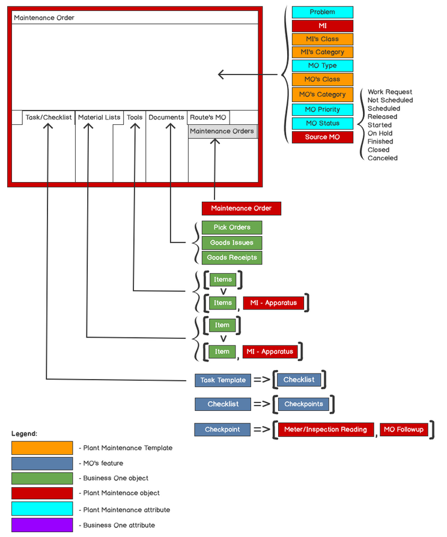
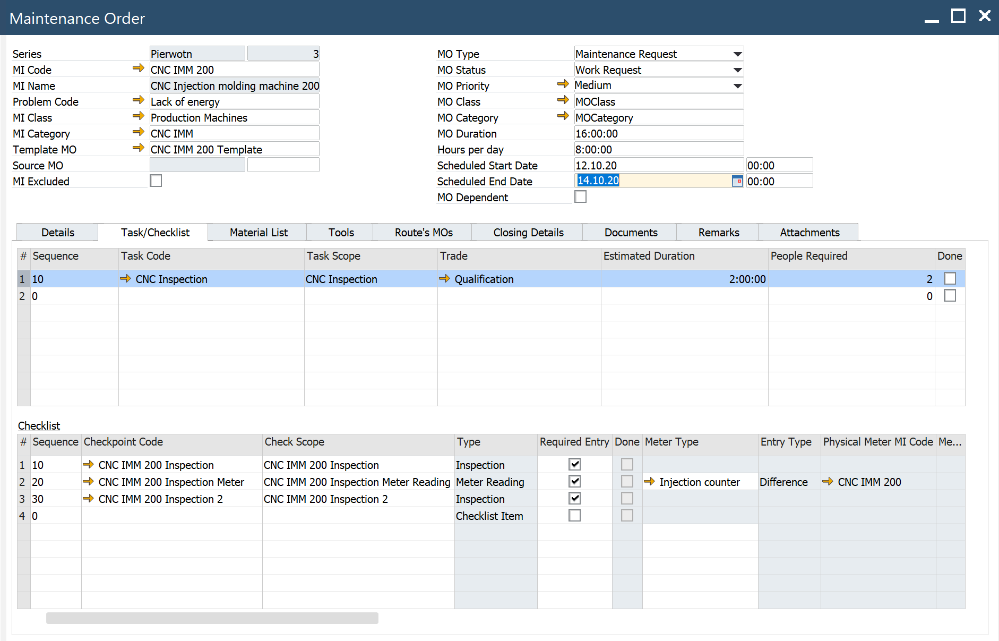
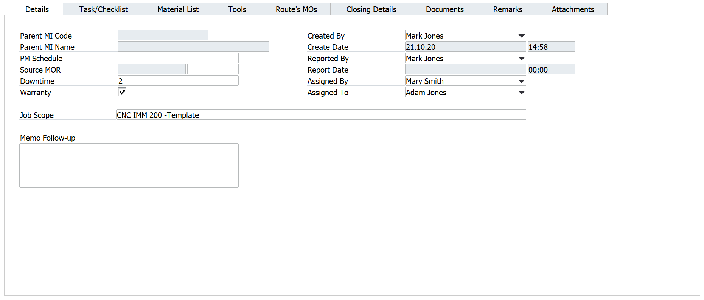
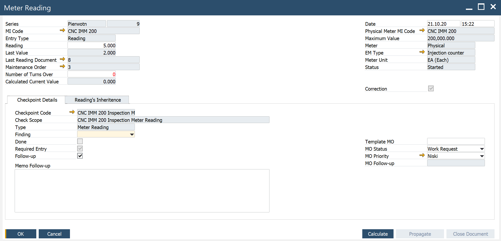
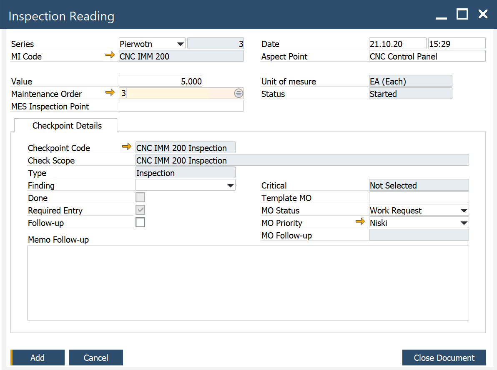
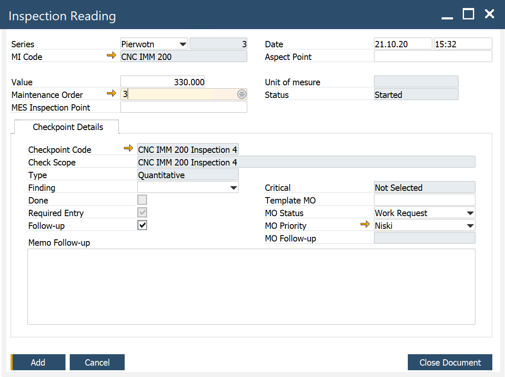
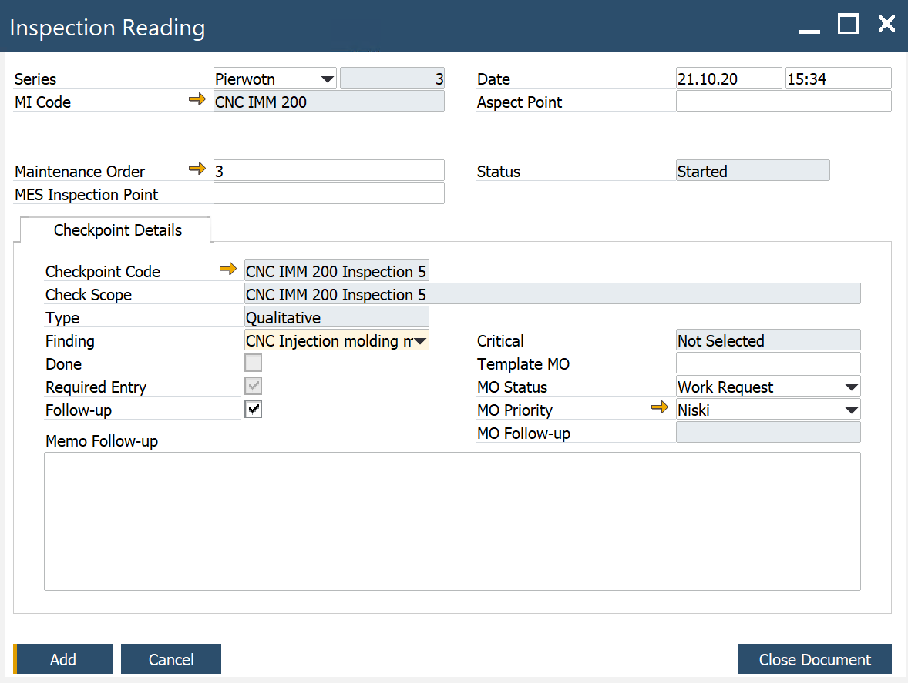
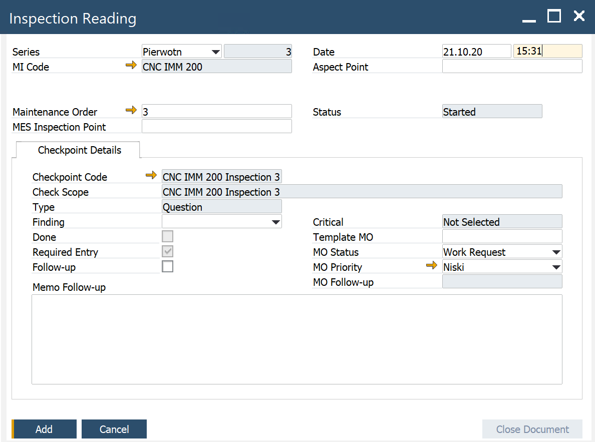
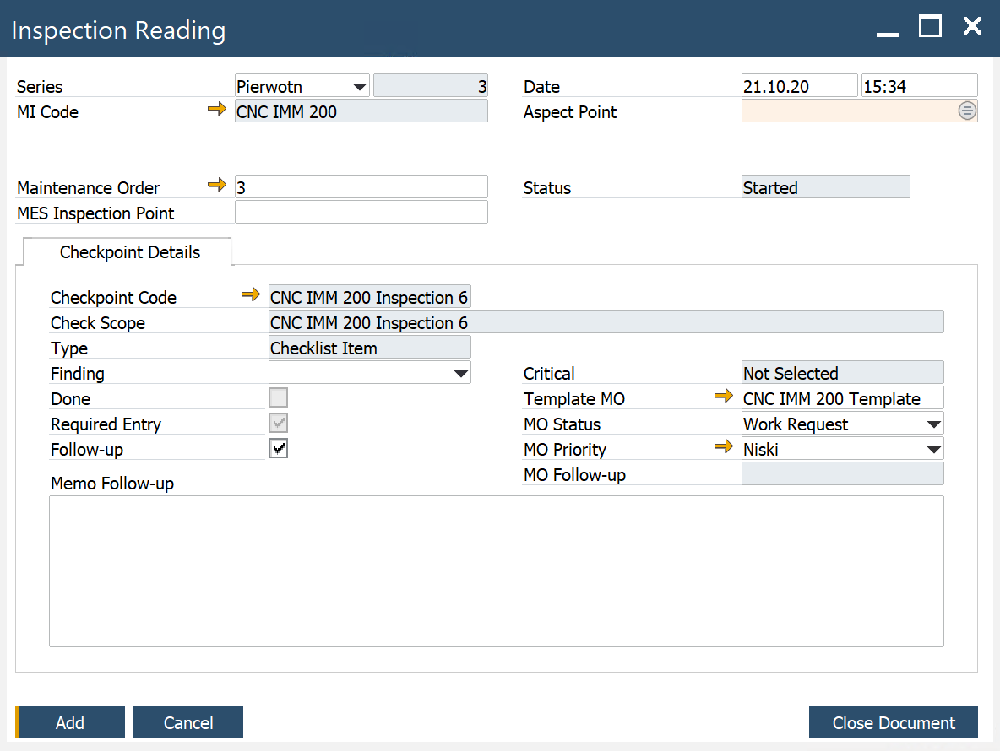

# Maintenance Order

:::info Path
Main Menu/Plant Maintenance/Work Management/Maintenance Order
:::

## Header

**Series** – set by the system

**MI Code** – from the MO Template, can be changed

**Template MO** – the name of MO Template

**Source MO** – here you can find the ID of the parent MO if the MO is run as Route’s MO or as a follow-up MO

**MO Status** – Work Request, Not Scheduled, Scheduled, Released, Started, ON Hold, Finished, Closed, Cancelled

**Scheduled Start, Scheduled End** – fields set by the user

## Details Tab

**Parent MI Code** – the parent MI in the hierarchy

**Parent MI Name** – the MI's name

**PM Schedule** – Preventive Maintenance schedule code – the second phase

**Source MOR** – the MOR which causes the MO – the second phase

**Downtime** – estimated downtime entered by the user. Important for production resources – integration with production scheduling – the second phase

**Warranty** – select if a MO has an associated warranty – for example, If the Item managed by Serial Number associated with the MI on the maintenance order is under warranty

**Created By** – employee, set up by the system when MO is created

**Created Date** – set up by the system when MO is created

**Reported By** – employee, set up by the system when MO is reported/recorded

**Reported Date** – set up by the system when MO is reported/recorded

**Assigned By** – set up by the user

**Assigned To** – set up by the user

**Memo Follow-up** – descriptive information entered when the follow-up MO is created

## Task/Checklist Tab

The user registers the execution of MO’s task in this tab in checkpoints’ lines. Depending on the checkpoint type user should (RMBM options: Meter Reading, Inspection Reading) record checkpoint execution. The task is reported as done (Done=Yes) if all checkpoints have Required=Yes (is set to Yes when the reading document is closed).

Notes:

- Checkpoints can be recorded when MO Status = Started. Users can change MO status by one or in groups (check here).

- User can verify inspection readings and trace Inspection Reading history (check here).

- User can trace meter readings history; please see here.

- It is possible to perform many inspections/meter readings for the same checkpoint.

### Meter Reading

RMBM options: Meter Reading – The meter Reading document is opened. Obligatory is that user enters Reading (value related to Effective Meter/Physical Meter, check here) and optional information in the Checkpoint Details tab.

### Inspection

RMBM options: Inspection Reading – Inspection Reading document is opened. Obligatory is that the user enters Value (related to Aspect-Point) and optional information in the Checkpoint Details tab.

### Quantitative

RMBM options: Inspection Reading – Inspection Reading document is opened. Obligatory is that user enters Value (quantitative rating as an answer for a question from Check Scope) and optional information in the tab Checkpoint Details.

### Qualitative

RMBM options: Inspection Reading – Inspection Reading document is opened. Obligatory is that user enters Finding (qualitative rating as an answer for a question from Check Scope) and optional information in the tab Checkpoint Details.

### Question

RMBM options: Inspection Reading – Inspection Reading document is opened. Obligatory is that user enters Finding (answer for a question from Check Scope) and optional information in the tab Checkpoint Details.

### Checklist Item

RMBM options: Inspection Reading – Inspection Reading document is opened. There are no obligatory fields. When the user selects the button Close Document checkpoint is marked as Done.

## Material List Tab
