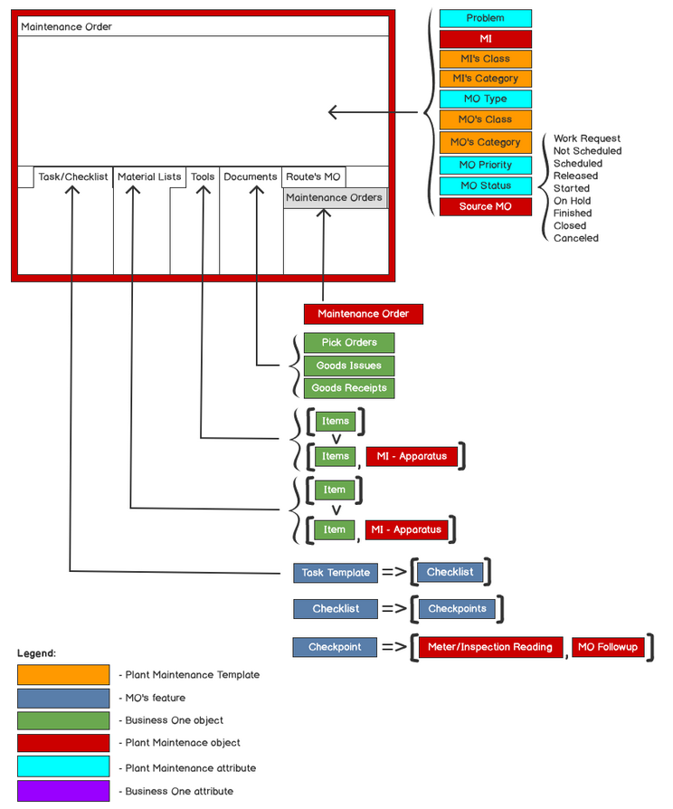
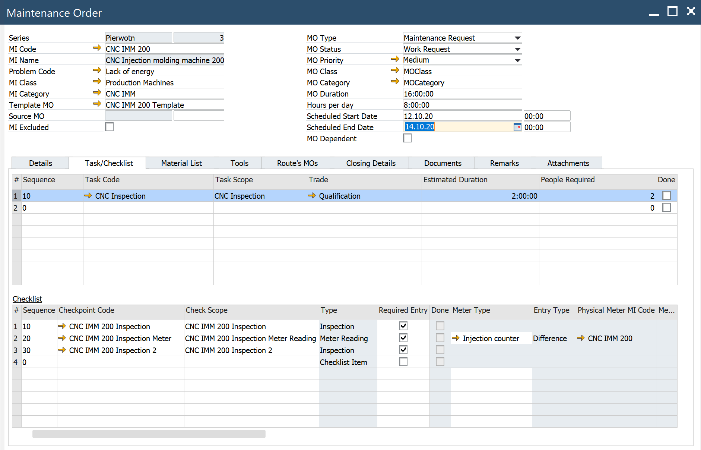

# Maintenance Order

:::info Path
Main Menu/Plant Maintenance/Work Management/Maintenance Order
:::

## Header

**Series** – set by the system

**MI Code** – from the MO Template, can be changed

**Template MO** – the name of MO Template

**Source MO** – here you can find the ID of the parent MO if the MO is run as Route’s MO or as a follow-up MO

**MO Status** – Work Request, Not Scheduled, Scheduled, Released, Started, ON Hold, Finished, Closed, Cancelled

**Scheduled Start, Scheduled End** – fields set by the user

