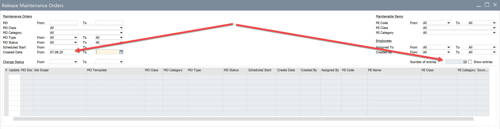
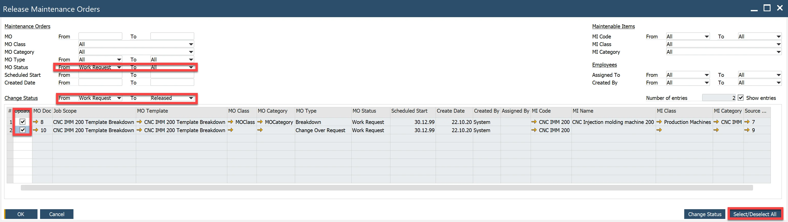
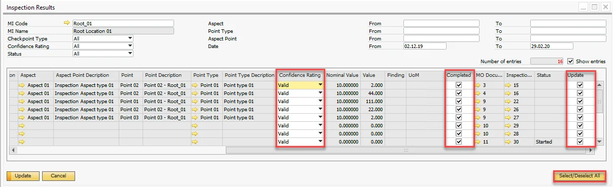

# Release Maintenance Orders, Inspection Results Verification

## Release Maintenance Orders

Main Menu → Plant Maintenance → Work Management → Release Maintenance Orders

From this window, it is possible to change the status for many Maintenance Orders (Change Status: From, To). Values for fields in the header work as filter parameters. For current field settings, you can observe the number of entries that fulfill conditions – Number of entries.

Checking of checkbox of the Show entries caused that MO's are visible in the grid.

Example: We want to change MOs with the status Work Request to Released:

- Set filters values as below
- Select the button Select/Deselect All

    
- Select the button Change Status

## Inspection Results

Main Menu/Plant Maintenance/Work Management/Inspection Results

This window is designated to manage inspection results by setting:

- Confidence Rating (Valid, Invalid, Discontinuity)
- Completed

The filter in the header works as for Release Maintenance Orders. Note: By default, the current month's date range is set up.

Example: We want to complete the selected inspection as valid.

- Select inspection result by setup filter values
- Select the checkbox Show entries
- Select the button Select/Deselect All (for all lines in the grid Confidence Rating=Valid, Completed=Yes, Update=Yes)

    
- Select the button Update
