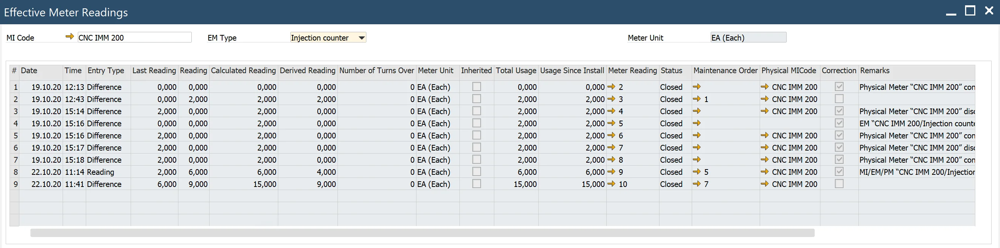
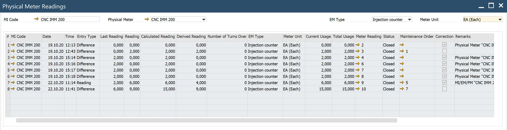
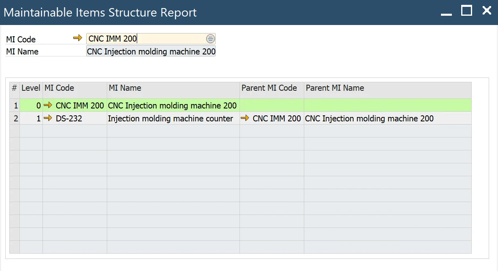

# Reports

## Effective Meter Reading History

Main Menu → Plant Maintenance → Reports → Effective Meter Reading History

---

Select values in the header: MI Code/EM Type. In the grid are visible readings values with links to source Meter Readings documents.

## Physical Meter Readings History

Main Menu → Plant Maintenance → Reports → Physical Meter Reading History

Select values in the header: MI Code/Physical Meter. In the grid are visible readings values with links to source Meter Readings documents.

## MIs Structure Report

Main Menu → Plant Maintenance → Reports → MIs Structure Report

Select MI Code in Header. In the grid are visible all MIs from MI's hierarchy structure. The line with Selected MI is marked.

