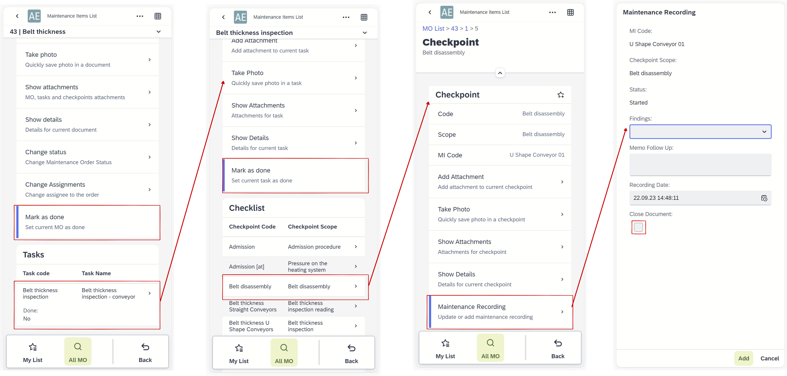

# Plant Maintenance Mobile

## Installation and launch of the PWA Application

### Prerequisites

    1. MI360 (an AE plugin) has to be installed and available on the AppEngine host.

    2. Mobile devices and servers have to be in the same Wi-Fi network.

### Installation

1. Enter the address in a browser on the mobile device:
[Launchpad](/docs/appengine/appengine-users-guide/launchpad)
2. Select Launchpad and log in.
3. Select the Install App option.

### Launching Application

## All MO / MO List → My List

Here, all MO are collected. You can narrow down the list by using the filters. Here, you can also compose My List. Select the object (Maintenance Orders, Tasks, Checkpoints) to do this. By selecting the icon, you can add or remove tasks from My List.

## MO – status change

It is possible to change the status of the MO. The "Mark as done" selection sets the MO status to Finished.

## Assignments

You can set/change the assigned employee for the MO.

:::info Caution
It is required that the employee is assigned to the SAP B1 user.
:::

## Attachments

You can browse and add attachments (different types of documents, captured images) on any level (MO, task, checkpoint). From the MO level, you can browse all attachments related to that MO.

## MO, Task, and Checkpoint Reporting

Recording and setting all Checkpoints as done (selected checkbox Close Document) sets the task as done. Setting all tasks as done sets the MO as done (status Finished).

You can set MO and task as done by selecting "Mark as done."

