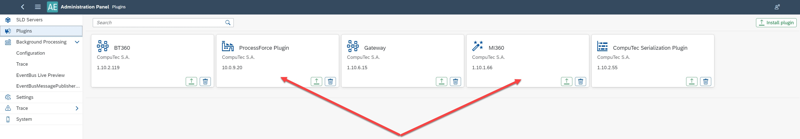

# How to set up App Engine for Preventive Maintenance Schedule

## SLD Servers Configuration

1. Switch the 'Background Processing Date' on SLD Servers for your company to **ON**.

    

2. When you do it for the first time, you can get an error saying that you must have the following statement in the Post-transaction procedure. After adding the code, you can turn the "Background Processing Date" to **ON**.

    

## Plugins Configuration

1. Install **ProcessForce** and the [MI360 plugin](/docs/appengine/releases/plugins/mi360/download).

    

2. Activate **ProcessForce** and **MI360** for your company.

    

## Background Processing configuration

Preventive Maintenance Schedule based on **Time** set up:

    1. Go to the **PMScheduleTimeBasedJob** background processing and activate it for your company.

    

    

Preventive Maintenance Schedule based on **Meter** values set up.

    1. Go in to the **PMScheduleMeterBasedJob**, **PMScheduleTimeBasedJob**, and **SEventJob** background processing and activate it for your company.

        

Preventive Maintenance Schedule based on **Time** and **Meter** values set up:

    1. Go in to the **PMScheduleMeterBasedJob**, **PMScheduleTimeBasedJob**, and **SEventJob** background processing and activate it for your company.

    
