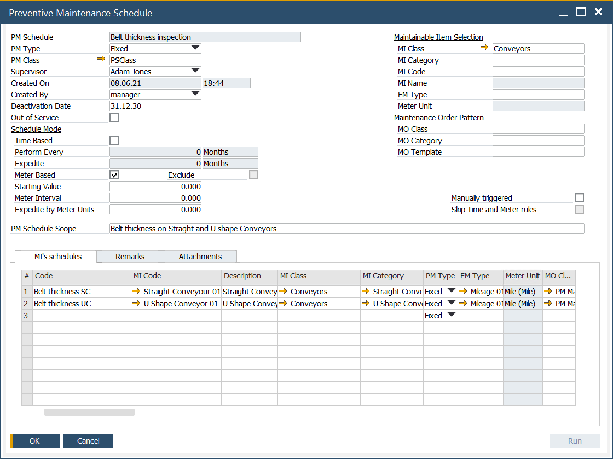
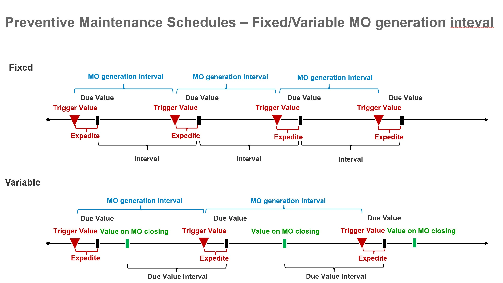

# Overview

PM Schedules are defined using the PM Schedule form. This form is a grouping of schedules defined for MI in the grid lines.

The form header is used to specify schedule parameters (left side) and selection filters that allow you to select serviced MI and template MO (right side).

Schedule parameters from the header are copied to the added grid lines, where they can be modified. The selections specified in the filters section for MI and MO templates determine the possible choices in the grid lines.

For clarity of the schedules you define, we recommend that you group your schedules according to the characteristics defined in the header.

## Header

**PM Schedule** – global code for PM Schedules grouped in the form

**PM Type** – Fixed, Variable, Fixed(Duplicate). The value defined in the header is then available in grid lines that can be changed.

For the first iteration starting value is used as a base for calculation of trigger.

**Fixed** - a calculation of the next trigger is incremented iteratively with fixed interval.

**Variable** - a calculation of the next trigger is based on value saved on the MO closing.

New MO can be generate if previous MO is finished. It is not valid for Fixed(Duplicated).

    
Fixed/Variable

    

**PM Class** – a class of PM Schedule.

**Supervisor** – a user responsible for the PM Schedule. The value defined in the header is then available in grid lines that can be changed.

**Created On** – date of creation.

**Created By** – a user who created the PM Schedule.

**Deactivation Date** – a date after which the schedule will not be performed. The value defined in the header is then available in grid lines that can be changed. The date specified in the grid line has higher priority. It works together with Starting Date in a grid line. Starting from this date, the PM Schedule is active.

**Out of Service** – if checked in the header, all PM Schedules from the form will not be active. If not checked in the header but in a grid line, only this PM schedule will not be active. The value defined in the header is then available in grid lines where it can be changed.

**Time Based** – mode based on the passage of time. The value defined in the header is then available in grid lines where it can be changed.

**Perform Every** – a time interval between the generation of successive MOs. The value defined in the header is then available in grid lines where it can be changed.

**Expedite** – an interval that is subtracted from Due Date to expedite MO generation. The value defined in the header is then available in grid lines where it can be changed.

**Meter Based** – mode based on meter readings for Effective Meter assigned to MI. The value defined in the header is then available in grid lines where it can be changed.

**Exclude** – active if both conditions (Time Based, Meter Based) are considered. If checked, when the first is fulfilled, the second is excluded for the current iteration, both are recalculated, and modes are synchronized. If not checked, when the first is fulfilled, the second is not excluded for the current iteration, and only the first is recalculated; modes are not synchronized. The value defined in the header is then available in grid lines where it can be changed.

**Starting Value** – the schedule is active for a Total Usage (measured by Effective Meter assigned to MI) greater than or equal to this value. The value defined in the header is then available in grid lines where it can be changed.

**Meter Interval** – the interval between the generation of successive MOs. The value defined in the header is then available in grid lines where it can be changed.

**Expedite by Meters Unit** – value in Meter Units is subtracted from Due by Meter Value to expedite MO generation. The value defined in the header is then available in grid lines where it can be changed.

**PM Schedule Scope** – descriptive scope of PM Schedules

**MI Class** – Maintainable Item class. The value defined in the header is then available in grid lines where it can be changed. Limits the choice in grid lines.

**MI Category** – Maintainable Item category. The value defined in the header is then available in grid lines where it can be changed. Limits the choice in grid lines.

**MI Code** – Maintainable Item code. The value defined in the header is then available in grid lines where it can be changed. Limits the choice in grid lines.

**MI Name** - Maintainable Item name.

**EM Type** – Effective Meter Type. The value defined in the header is then available in grid lines where it can be changed. Limits the choice in grid lines. Limits the choice in grid lines.

**Meter Unit** – a unit of measure related to the selected EM Type.

**MO Class** – Maintenance Order class. The value defined in the header is then available in grid lines where it can be changed. Limits the choice in grid lines.

**MO Category** – Maintenance Order category. The value defined in the header is then available in grid lines where it can be changed. Limits the choice in grid lines.

**MO Template** – Maintenance Order template. The value defined in the header is then available in grid lines where it can be changed. Limits the choice in grid lines.

**Manually triggered** – Selecting the checkbox "Manually triggered" means that schedules in this group are not automatically generated via JOB but are started manually by using the "Run" button.

**Skip Time and Meter rules** – If you select the "Skip Time and Meter rules" checkbox with "Manually triggered" selected, the Time Based and Meter Based conditions defined in the schedules in this group are not checked when you choose the "Run" button. Conditions based on Start Date, Out of Service, Deactivation Date, and MO-related restrictions that determine the operation of One active MO/Many active MO are checked.

## Grid Column (not described in the header)

**Code** – PM Schedule code. Unique in the PM Schedule form.

**MO Type** – Maintenance Order type. Value from MO Template. With this type, MO will be generated.

**MO Status** - Maintenance Order status. Value from MO Template. With this status, MO will be generated.

**Priority** - Maintenance Order priority. Value from MO Template. Whit this priority MO will be generated.

**MO Duration** - Maintenance Order duration. Value from MO Template. With this priority, MO will be generated.

**Hours Per Day** – definition from MO Template. With this value, MO will be generated.

**Starting Date** – a date that defines starting point for PM Schedule activation.

**Due Date/Time** – due date for the next maintenance

**Current Trigger Date/Time** – trigger date for next MO generation

**Expedite in** – a unit of measure for the expedition.

**Last Trigger Date/Time** – a trigger date for the last MO generation

**Last Service End Date/Time** – date of the end of the last MO

**Due by Meter Value** – Effective Meter total usage value for the next maintenance

**Current Trigger Value** – Effective Meter total usage value for MO generation

**Last Trigger Value** – Effective Meter total usage value for the last MO generation

**Meter Reading** – a number of a document for the last meter reading

**Last Service End Value** – the value of the Effective Meter total usage on MO closing/finishing/canceling

**Last Service End Meter Reading** - a number of a document for the youngest meter reading for MO closing/finishing/canceling

**Triggered By** – the cause of the MO generation from the PM Schedule: Time, Meter, Time, and Meter, Manually forced

**Assigned To** – a supervisor, user responsible for the PM Schedule

**Last MO No**. – a number of a document from the last Maintenance Order

**Last MO Status** – status of the last MO

**Last MO status Date/Time** – date/time for the previous MO status
