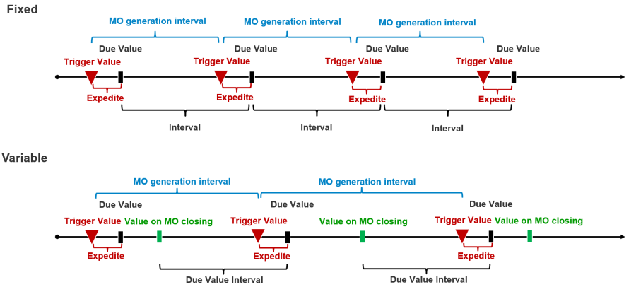

# PM Schedule Activation-Deactivation: General Conditions

    1. All PM Schedules from a given form can be disabled by selecting in the form's header the checkbox "Out of Service".
    2. A given PM Schedule in a line can be disabled by selecting the checkbox "Out of Service".
    3. The PM Schedule is active if

    ```text
                Starting Date < = Current Date < = Deactivated Date
    ```
The conditions for generating an order can be based on the passage of time or meter readings assigned to a given MI using EM Type. We have two modes: Time-Based and Meter Based, and two basic types: Fixed and Variable.

In the Fixed type, we have a constant interval in which MOs are generated. In the Variable type, the interval is variable.



In the Fixed type, we have a constant interval in which MOs are generated. In the Variable type, the interval is variable.
