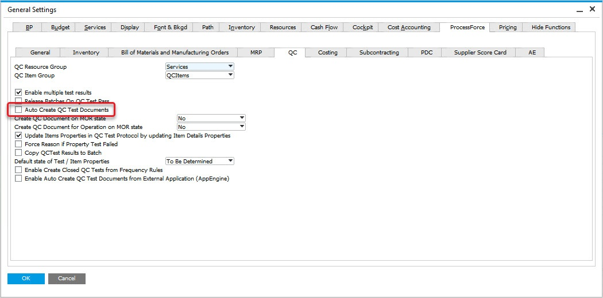
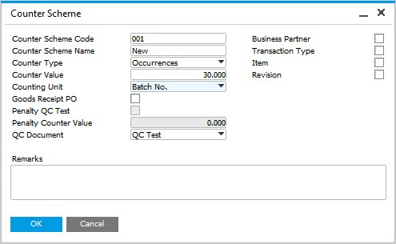
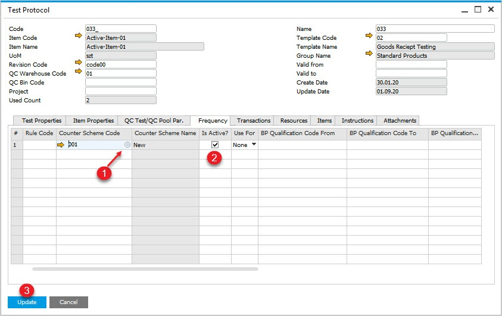
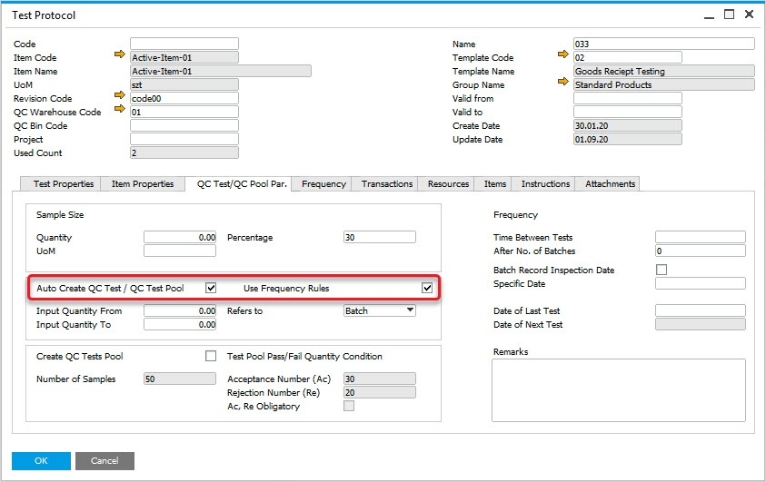
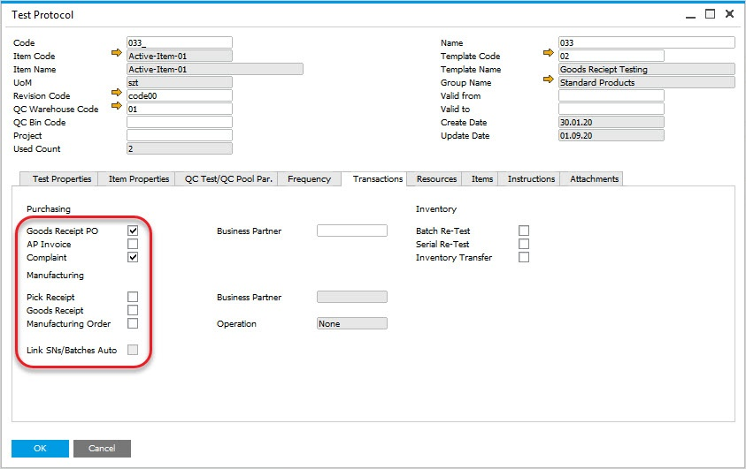
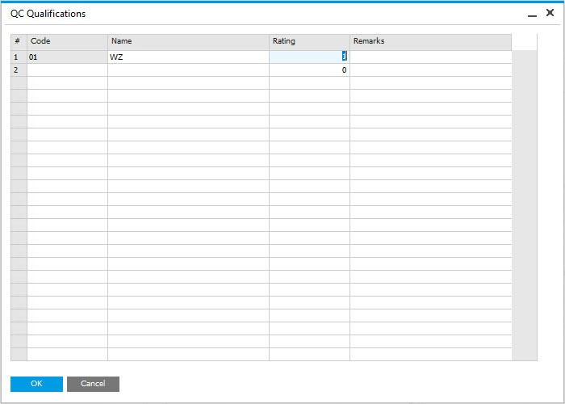
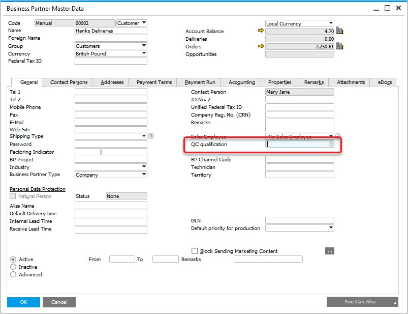
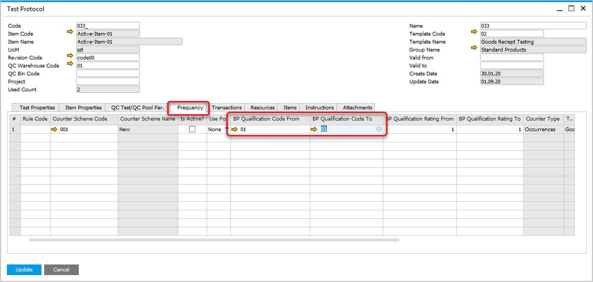

# Automatic Creation of Quality Control Documents

This option allows automatic creation of Quality Control documents based on predefined conditions.

---

## Prerequisites

Check the related checkbox in General Settings:

:::info Path
        Administration → System Initialization → General Settings → ProcessForce tab → QC tab → Auto Create QC Test Documents checkbox
:::

Create a Counter Scheme:

:::info Path
        Administration → Setup → Quality Control → Counter Schemes
:::

## Usage Example

The Counter Scheme has a Name and a Code defined. It is set to create a Quality Control document every 30 Batches:

    

Then, in Test Protocol, Frequency tab you can choose this scheme (1), set it to be active (2) and save the changes (3):

:::info Path
        Quality Control → Test Protocol
:::

In QC Test/QC Pool Pr. tab you can decide about auto create Test using defined frequency:

You can defined transaction/s from which Quality Control Test documents will be created:

You can also create a Quality Control Test per Business Partner:

First, you have to define a BP QC Qualifications:

:::info Path
        Quality Control → Test Protocol
:::

Then, link it to a Business Partner:

:::info Path
        Administration → Setup → Quality Control → BP QC Qualifications
:::

Then you can link it to test protocol

