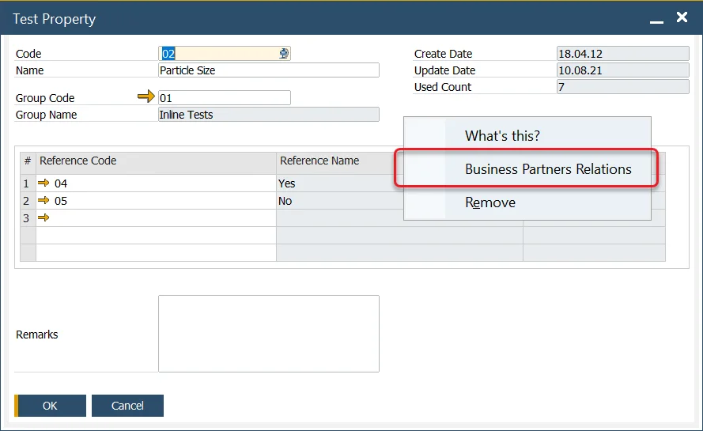
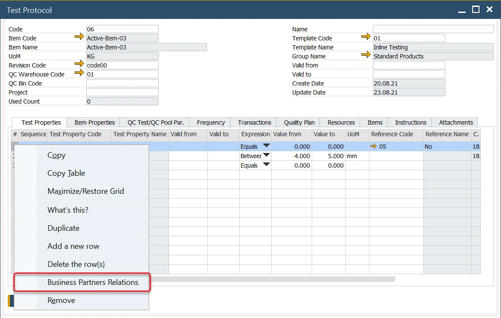
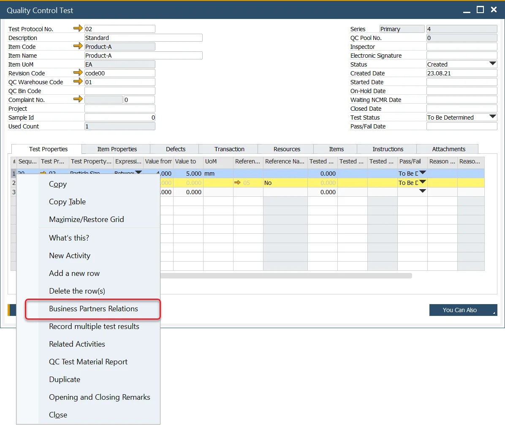
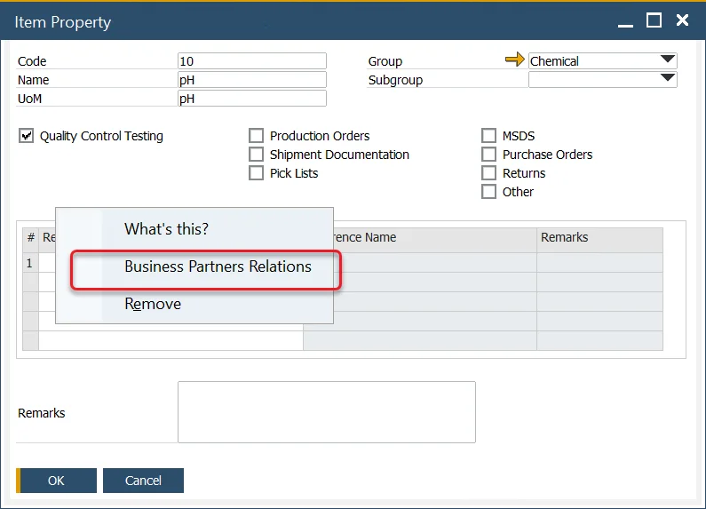
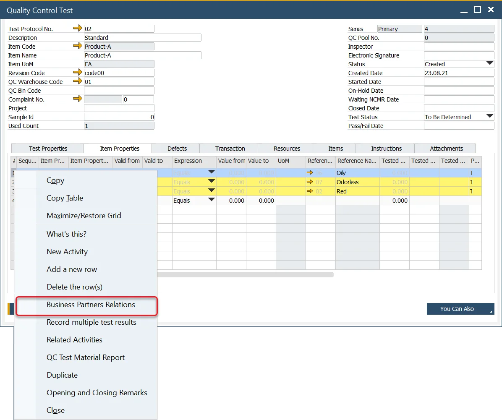
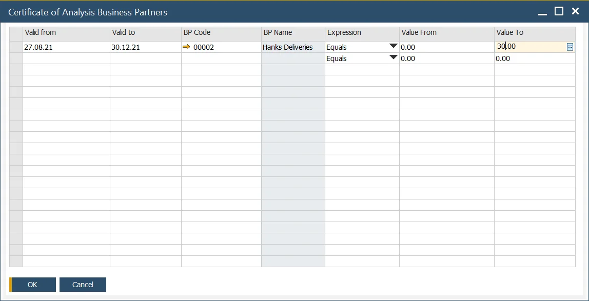

# Certificate of Analysis

A Certificate of Analysis (CoA) is a document that confirms that a product meets its specification.

It usually presents the results of tests performed as a part of the quality control of an individual batch of a product.

CoA is typically (but not only) requested by customers in both food and chemicals industries, and for the same product, different customers might request different information on a document. ProcessForce CoA functions allow marking Test Properties and Item Properties important for a specific Business Partner which is crucial for creating individualized certificate documents.

:::info
    Currently, ProcessForce CoA function allows assigning Business Partners to a specific Test Property or Item Property. The function that generates Crystal Report using this kind of data is planned to be implemented in one of the next ProcessForce releases.
:::

## Test Property assigning

You can assign Business Partner to Test Property by choosing Business Partners Relations option from the context menu on the Test Property form (Business Partner will be assigned to a property displayed on the form):

on Test Protocol form, Test Properties tab (by clicking Test Property row) and Item Properties:

on Test Protocol Template form:

and on Quality Control Test form:

## Item Property assigning

You can assign Business Partner to Item Property by choosing Business Partners Relations option from the context menu on the Item Property form (Business Partner will be assigned to a property displayed on the form):

on Item Details form, Properties tab (by clicking Item Property row):

or on Quality Control Test form:

## Certificate of Analysis Business Partners

After Clicking Business Partners Relations option, the Certificate of Analysis Business Partners form will be displayed:

You can pick Business Partner and a period during which it will be assigned to a specific Property.

You can also choose values for Property:

- Expression: interval expression of interval in which tested value has to be to pass the test, e.g. Greater than, Equals,
- Value From, Value To: numeric values of constraints.
