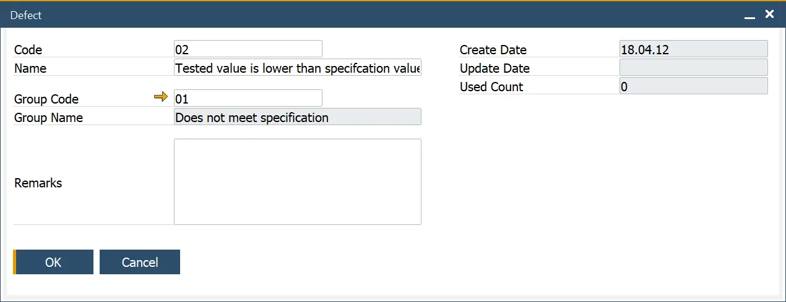
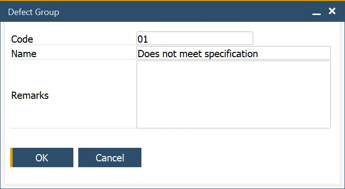

# Defects

Here you can define defects that can be a result of a Quality Test.

---

## Defect

:::info Path
    Administration → Setup → Quality Control → Defects
:::

This form allows the user to define Defect Codes and a specific Group Code for reporting and analysis purposes.

These codes are used within the Quality Control Test Form to record the Defects associated with an Item not passing its tests.

The Used Count field indicates how many times the Defect Code has been used and is used for reporting and analysis purposes.

## Defect Groups

:::info Path
    Administration → Setup → Quality Control → Defect Groups
:::

This form allows the user to define Defect Groups that are used to group Defect Codes into categories for analysis and reporting purposes.

