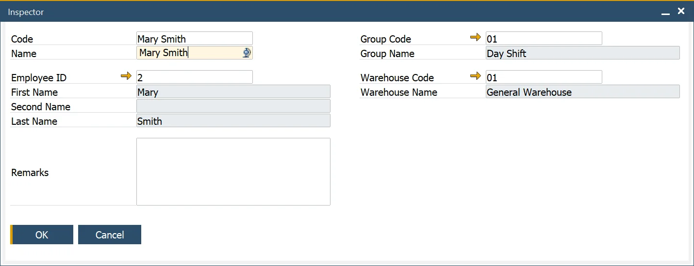
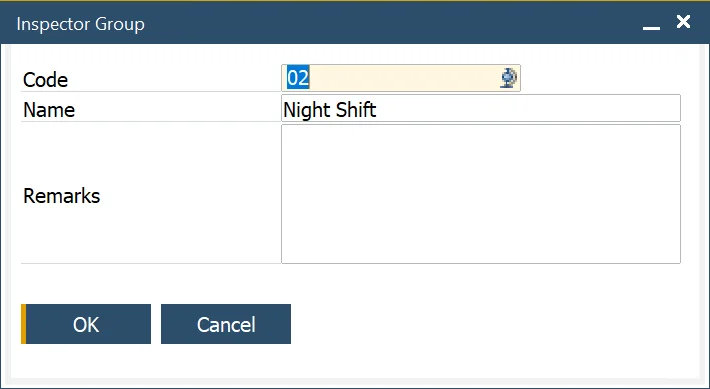

# Inspectors

Here you can define Inspectors who can be assigned to perform a Quality Test and groups of Inspectors.

---

:::info Path
    Administration → Setup → Quality Control → Inspectors
:::

## Inspectors

This form allows the user to define the Inspectors used to conduct the Quality Control Tests and the Warehouse they are allocated to.

This data is used within the Quality Control Test Form.

## Inspector Groups

:::info Path
    Administration → Setup → Quality Control → Inspector Groups
:::

This form allows the user to define Inspector Group codes, to categorize Inspectors, and is used within the Inspector and NCMR Inspector definition forms.

For example, Inspectors could be grouped by warehouse or specialization.

## NCMR Inspector

:::info Path
    Administration → Setup → Quality Control → Inspectors → NCMR Inspectors
:::

This form allows the user to define the NCMR Inspectors used to conduct the NCMR process and the Warehouse they are allocated to.

This data is used within the Quality Control Test > Defect Tab and the NCMR Transaction.

It is possible to define NCMR Inspector Group similarly to Inspector Group.
