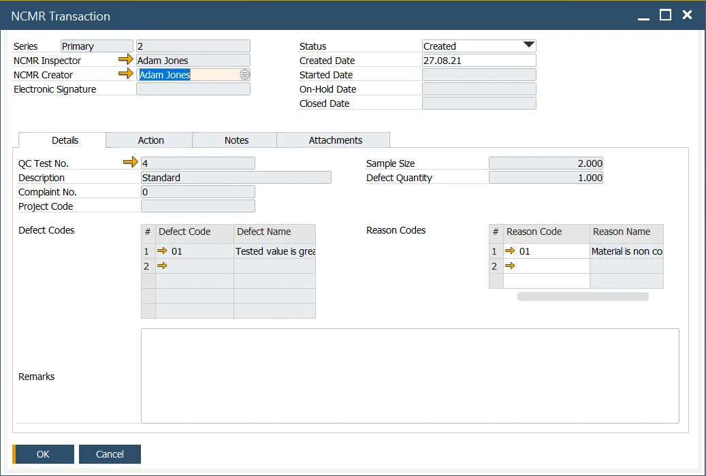
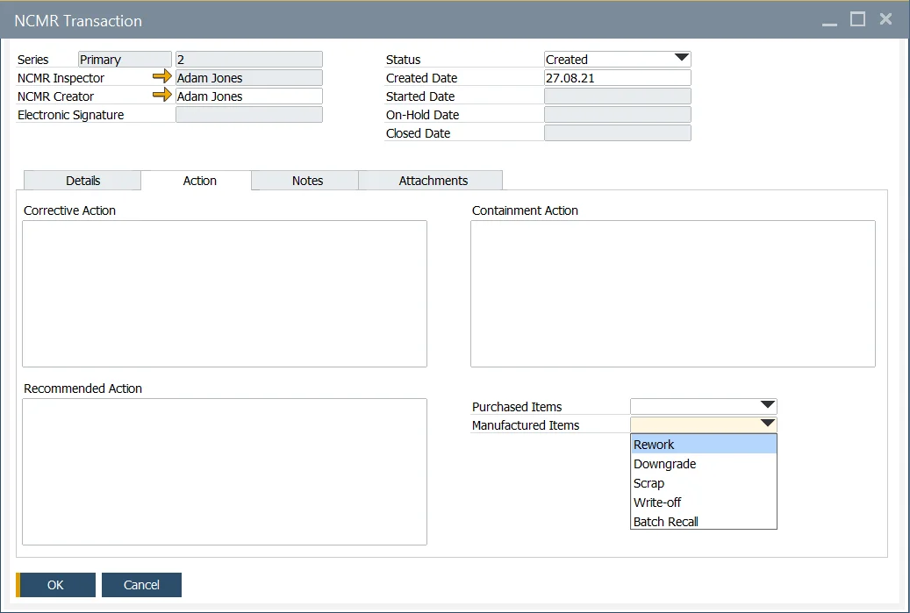
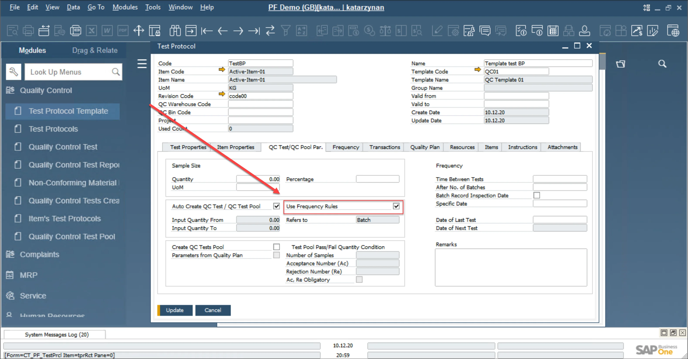
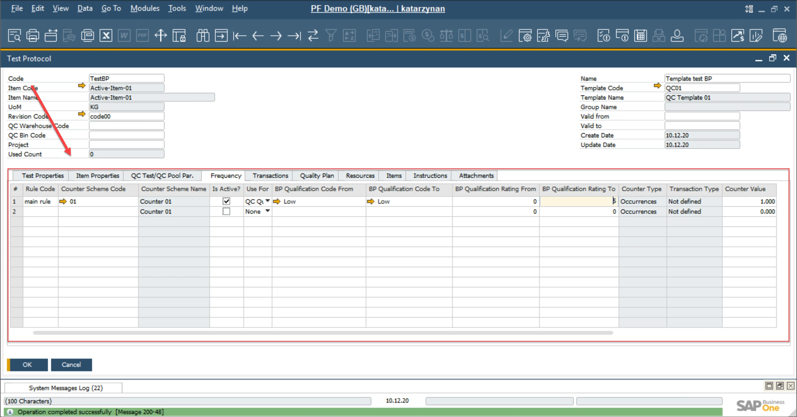

# NCMR - Non-Conforming Materials Report

Non-Conforming Materials Report allows the user to add additional Reason Codes and Action plans to remedy or determine the activity associated with a failed Quality Control Test or non-conforming material.

The NCMR transaction is created from a <!-- TODO: Add Link --> Quality Control Test.

:::note Path
    Quality Control → NCMR Transaction
:::

---

## Header

The Series Number, NCMR Inspector, and Creator are copied into the form from the Quality Control Test.

The user enters the required status and date, to manage the life cycle of the NCMR. (Created, Started, On-Hold, Closed).

## Details

The QC Test number, Description, Complaint Number, Project Code, Sample Size, Defect Quantity and the Defect Codes are copied from the Quality Control Test.

The user reviews the details of the Complaint and the Quality Control Test results and adds additional Reason Codes for the Quality Control Test failure.

## Action

This form allows the user to add a Corrective, Containment and Recommended Action plan for the Item within the Quality Control Test, that is non-conforming. The mentioned fields are text fields

The user can also select the appropriate inventory action and movement.

Based on the selected action from the drop-down fields, an Alert is sent to the appropriate user to perform the inventory action and movement.

## Notes

Notes Tab is a text area that allows to same any text related to the document.

## Attachments

The Attachment tab allows the user to attach additional files related to the document.

## Creation

There are two ways to create this kind of document:

- to choose the option from the main menu. In this case, only Reason Code can be defined on the Details tab
- to choose to Create NCMR Transaction from You Can Also button on Quality Control Test form. The following conditions must be fulfilled:

  - Quality Control Test form has to be in Browse mode (not Add)
  - NCRM checkbox on Defects tab has to be checked
  - NCMR Inspector is chosen on the Defects form.

Then it is needed to configure the Frequency tab:

