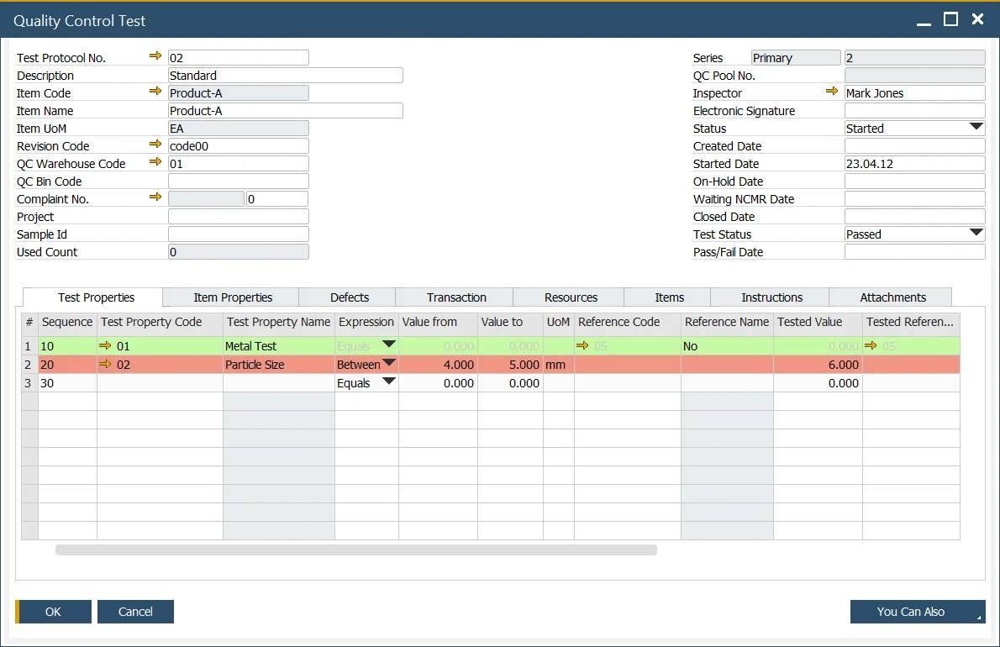

# Overview

## The 4 W's of Quality Control

ProcessForce QC function covers the 4 Ws of Quality Control:

- What – Test and Item Properties to be tested,
- When – The frequency of testing,
- Where – The transaction the test will be performed,
- With – The resources and items that are used within the testing process,

You can use Quality Control to manage the following processes:

- In-bound – Goods Receipt,
- In-process – Manufacturing Order and Manufacturing Order operation,
- Inventory – Inspection, and re-testing.

:::info Path
    Main Menu → Quality Control
:::

