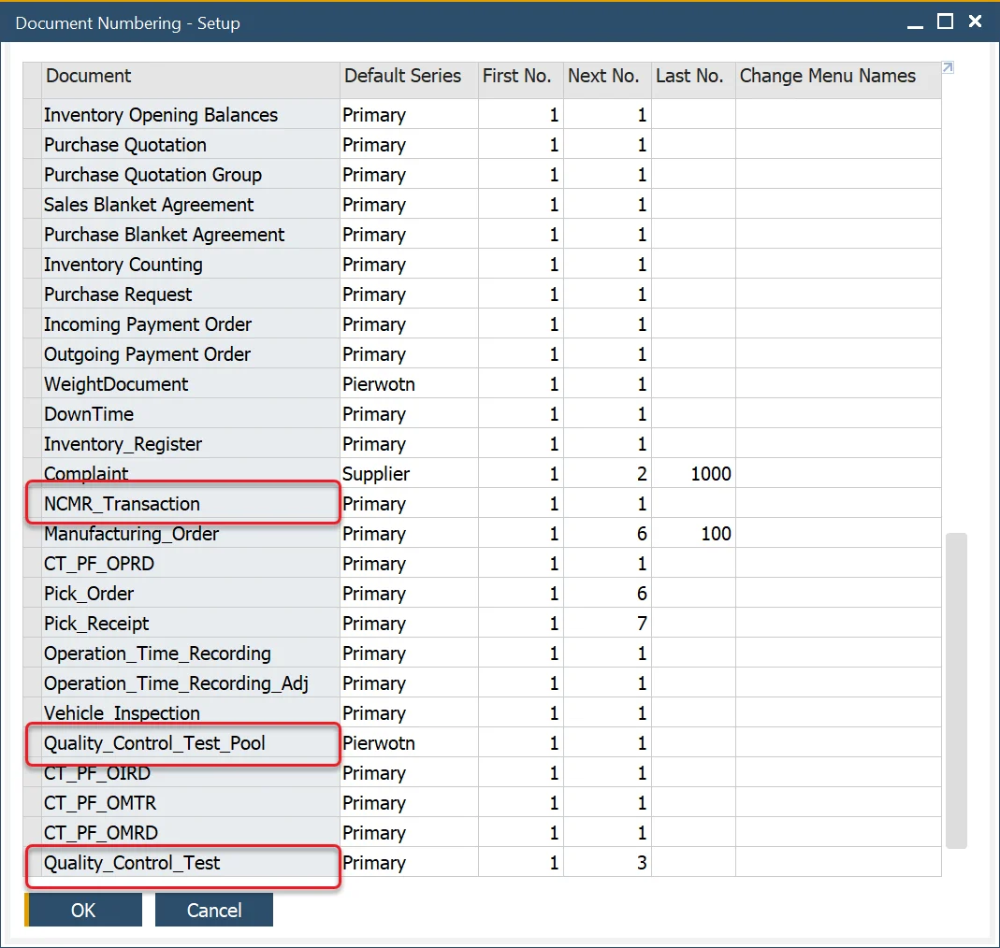
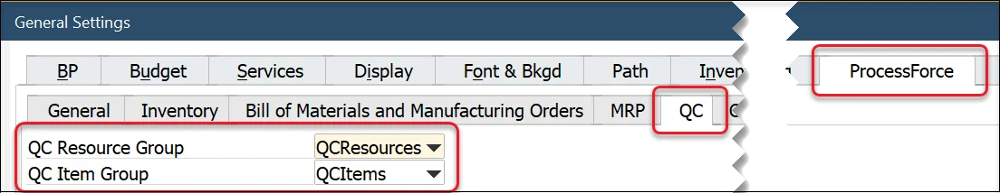
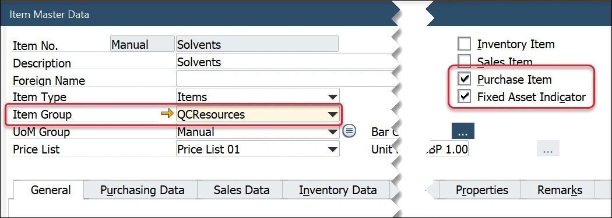
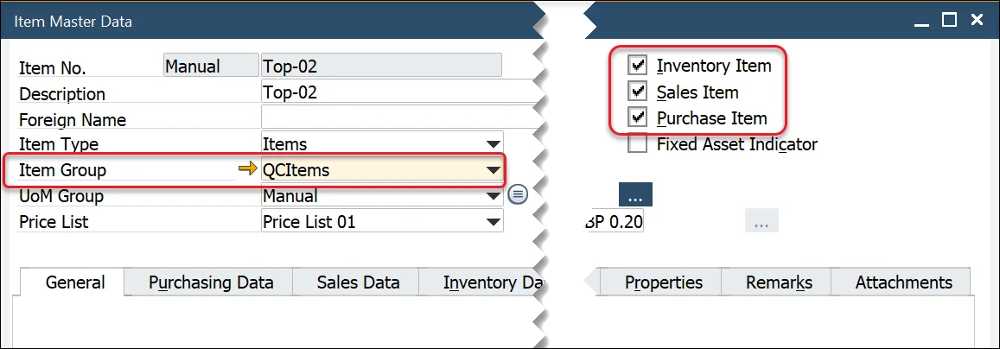

# Quality Control Configuration

Here you can check the general settings required for the Quality Test: Document Series Number, Resources, and Items information.

## General Settings

Click [here](../../user-guide/system-initialzation/general-settings/qc-tab.md) to find out more.

## Document Series Number

The Quality Control Test form and NCMR Transaction and Quality Control Pool forms use the SAP Business One Document Numbering functions.

## Resources

Within the Test Protocol and Quality Control Test forms, the user can define the resources used to conduct and complete the testing activity. For example, X-ray machines, microscopes, tooling, etc.

These forms filter the Item Master Data based on the following criteria:

- The Purchase Item and Fixed Assets fields are checked.
- A specific Item Group is created.
- Select the Item Group within the QC Resource Group, ProcessForce tab, within General Settings.

## Items

Within the Test Protocol and Quality Control Test forms, the user can define the items used to conduct and complete the testing activity. For example, safety glasses, gloves, and special chemicals only relate to the Quality Control process and department.

These forms filter the Item Master Data based on the following criteria:

- The Inventory, Sales, and Purchase Item fields are checked.
- A specific Item Group is created.
- Select the Item Group within the QC Item Group, ProcessForce tab, within General Settings.

