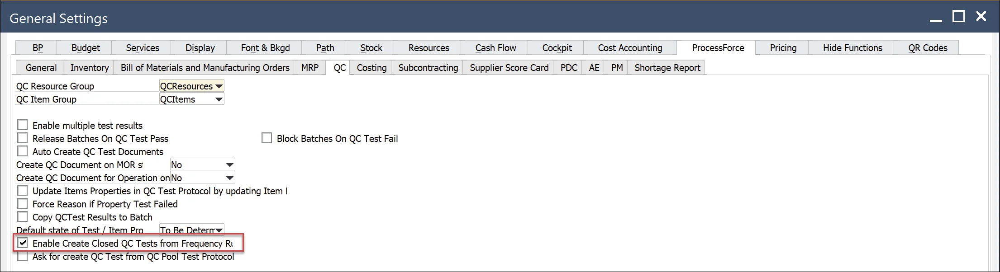
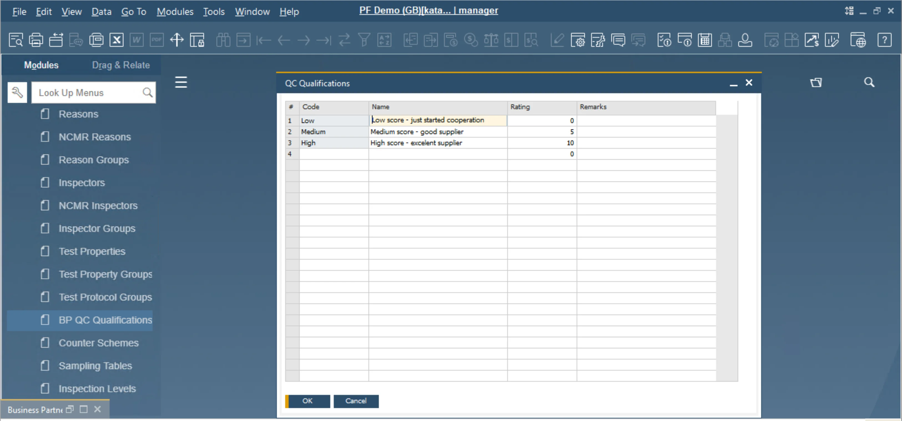
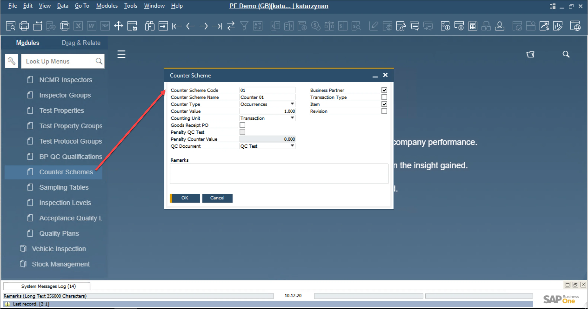

# Quality Control frequency based on Supplier's rating

Here you can find information on the Quality Control process based on the Supplier's rating (an evaluation of the level of trust toward a Supplier based on past collaboration). Quality Control Tests generation can be bound to and defined by the level of trust.

When running a business, we need to cooperate with others. There is not much we can do on our own. Building relationships based on cooperation in business is the key to effective process management in the company. However, one more important principle that gives excellent benefit is 'trust and control.'. Process Force allows you to combine these two great principles into one, optimizing your company's processes simultaneously – by providing a supplier assessment card within the application.

Suppliers' scorecards are used for tracking and measuring a Supplier's performance. They can vary from simple to complex and contain as many or as few criteria deemed effective to accomplish an organization’s goals. Supplier scorecards can strengthen relationships, improve costs, and mitigate errors when used appropriately and consistently. Scorecards also provide an objective lens for measuring vendor performance.

Using Quality Control Supplier Scorecards helps with the following:

Quality issues, errors, and mistakes aligned with certified testing lab Internal, pre-ship inspection system in place.

:::warning
    The current implementation allows using this functionality only for one type of transaction: Goods Receipt PO and Counter Type = Occurrences.

    It works only for "Enable Create Closed QC Tests from Frequency Rules" = Yes (Administration → System Initialization → General Settings → ProcessForce → QC)
:::

:::caution
    Please note that for the correct operation of the function, the following piece of code has to be added to the PostTransactNotification database.

    This procedure is essential to manage at which intervals the Quality Control Test is to be performed based on the predefined Counters.
:::

:::tip
    It is possible to set Auto-Creation of Test Protocol, which can be very useful in this functionality and is recommended to improve daily tasks on a customer's side.
:::

## General Settings

:::info Path
    Administration → System Initialization → General Settings → ProcessForce → QC
:::

"Enable Create Closed QC Tests from Frequency Rules" option must be checked. QC Test, which not fulfills condition defined in Counter Schema (Counter Value), with ll be created with the status Closed. The system will generate QC Test for all transactions.

## BP QC Qualifications

:::info Path
    Administration → Setup → Quality Control → BP QC Qualifications
:::

To start working with Supplier Scorecard, you need to define a dictionary.

The first thing is to fill BP QC Qualification with data – levels that you want to manage suppliers. One next step is assigning QC Qualification to a Business Partner.

Below you have an example of how to use functionality in the company.

## Counter Scheme

:::info Path
    Administration → Setup → Quality Control → Counter Scheme
:::

The next thing is to define the Counter Scheme dictionary.

The defined Counter is designed to control the quality control processes (Quality Control Test) at the appropriate frequency selected by the user.

Milestones for counters are QC Documents: QC Tests, QC Poll.

A particular Counter is created on the definition described in Counter Scheme. All Counters are stored in a separate table.

Fields:

**Counter Scheme Code** – standard, an alphanumeric field that needs to be unique (it’s the key)

**Counter Schema Name** – standard, alphanumeric field to put a bit more information about counter

**Counter Type** – there are three main types of Counters: number of occurrences, amount of time (used to count down a deadline for the next event), and date (specific date, Inspection Date, Expiry Date).

**Occurrences** – refers to the Counting Units: Transaction, Batch, Serial Number, Inventory UoM (in the future, a few more options will be available, e.g., After Time Period, After Specific Date, Before Expiry Date, Before Inspection Date).

**Counter Value** – this value determines the number of UoM Type

**Counting Unit** – Transaction, Batch, Serial Number, Inventory UoM, Day, Week, Month

**Counters counted on Transaction's base**: Next QC Tests/QC Pool will be executed for the transaction when counted value of UoM Type >= Counter Value [UoM Type] after last: QC Test, QC Pool. For Occurrences, UoM Type can be the number of Transactions, Batches, Serial Numbers, Inventory UoM,

~~**Penalty QC Tests** – if the checked number of QC Tests defined in Penalty Counter Value will be executed if QC Test is failed (for Counter Type: Occurrences, Time Period)~~

~~**Penalty Counter Value** – number of penalty QC Tests~~

~~**QC Document** – types of results document (milestones): QC Test,~~

**Business Partner** – if selected, will be included in created Counter ID and will determine the distinction of counters for a given Frequency Rule

~~**Transaction Type** – if specified, will be included in created Counter ID and will determine the distinction of counters for a given Frequency Rule~~

**Item** – if selected, will be included in created Counter ID and will determine the distinction of counters for a given Frequency Rule

**Revision** – if specified, will be included in created Counter ID and will determine the distinction of counters for a given Frequency Rule

Variable part consists of checked: Business Partner (value from the transaction, filtered by range defined in TP's Frequency Rule), ~~Transaction Type (value from the transaction, filtered by setting in TP's Frequency Rule)~~, Item (value from the transaction, filtered by selecting in TP's header), Revision (value from the transaction, filtered by selecting in TP's header), Test Protocol (value from the transaction, filtered by selecting in TP's header), Batch (value from transaction Batch Re-Test), Serial (value from transaction Serial Re-Test)

Examples of selectable criteria combinations:

| Business Partner | Transaction Type | Item  | Revision | Result: Counters will be counted for UoM Type per each: |
| :--------------: | :--------------: | :---: | :------: | :-----------------------------------------------------: |
|        x         |                  |       |          |                    Business Partner                     |
|        x         |        x         |       |          |           Business Partner & Transaction Type           |
|        x         |        x         |   x   |          |       Business Partner & Transaction Type & Item        |
|        x         |        x         |   x   |    x     |  Business Partner & Transaction Type & Item & Revision  |
|                  |                  |   x   |          |                 Business Partner & Item                 |
|                  |                  | ~~x~~ |  ~~x~~   |                  ~~Item & Revision\*~~                  |
|                  |      ~~x~~       | ~~x~~ |  ~~x~~   |        ~~Transaction Type & Item & Revision\*~~         |
|                  |      ~~x~~       |       |          |               ~~Transaction Type & TP\*~~               |

\* – options planned to be implemented in the next phase

## Business Partner Master Data

In Business Partner Master Data, there is a field called QC Qualification. This field needs to be filled when we want to use QC rating. Available ratings are previously defined in Administration -> Setup -> Quality Control -> BP QC Qualification.

## Test Protocol

To use the function, we must also put configuration on Test Protocol.

First, check the use frequency rules in QC Test/QC Test Par.

Then it is needed to configure the Frequency tab:

Frequency tab:

**Rule Code** – an alphanumeric field that can be named to identify why do use counters easily

**Counter Scheme Code** – selected from defined counter schemes

**Counter Schema Name** – from Counter Scheme UDS

**Active** – determines if the frequency rule is active y/n

**Use For** – select from QC Code, QC Rating, None. It determines using of the TP according to the frequency rule for BP based on the BP QC Code range or BP QC Rating range.

**QC Code From, BP QC Code To** – range based on BP QC qualification code

**BP QC Rating From, BP QC Rating To** – range based on BP QC rating

**None** – frequency rule is used without consideration of BP QC qualification

**Counter Type** – from Counter Scheme UDS

~~**Transaction Type** – type selected from transaction checked in TP/Frequency tab UDS~~

**Counter Value** – from Counter Scheme Field

**Counting Unit** – from Counter Scheme UDS

**BP QC Code From, Business Partner Qualification** – Code value

**BP QC Code To - Business Partner Qualification** – Code value

**Close QC Tests** -

    1. If in Protocol Close QC Test = Yes, then tests are generated for all occurrences. Tests that are not a multiple of the Counter Value are closed with Status = Closed and Test Status = Passed.
    2. If in Protocol Close QC Test = No, then tests are generated only for occurrences that are a multiple of the Counter Value.

    Enable Create Closed QC Tests from Frequency Rules in GS switch on/off above functionally globally - it works like in 2.

## ~~Counters grid for selected Rule~~

**Counter ID** – key in counters table

**Current Counter** – calculated number of UoM type

**Current Penalty** – calculated, the canter of penalty QC Tests

**Total Counter** – calculated

**Total Penalty** – calculated number of executed Penalty Tests

**Business Partner** – instance for BP fulfill QC qualification range and Counter Scheme criteria

**Transaction Type** – instance for transaction type fulfill Counter Scheme criteria

**Item** – instance for item meet Counter Scheme criteria

**Revision** – instance for item/revision meets Counter Scheme criteria

**Test Protocol** – instance for test protocol fulfill Counter Scheme criteria

**Planned Execution** – is calculated for Counter Type=Time Period. It is defined by the user for Counter Type=Specific Date. Is imported from Batch or Serial Record for Counter Type=Expiry Date or Inspection Date (Transaction Re-Test)

**Number of Applications** – calculated, number of performed QC Tests (without penalty QC tests)

**First Execution** – estimated date

**Last Execution** – estimated date~~
