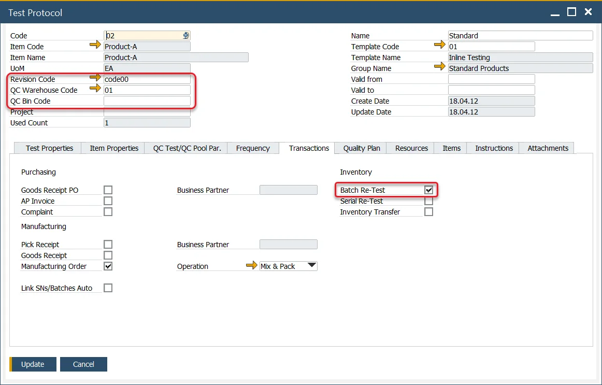
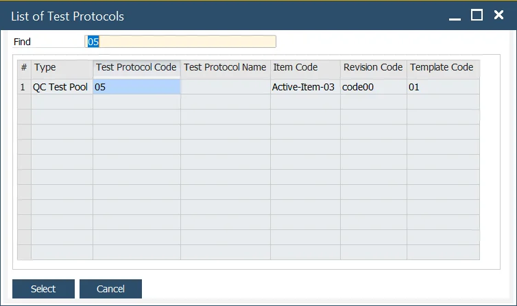
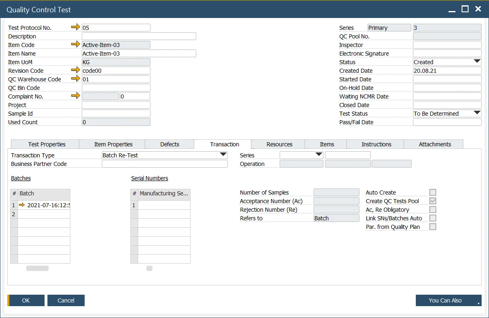

# Creating QC test from Batch Record

A Quality Control test can be created from the Batch Master Data form.

---

## Master Data Setup

Define a Test Protocol with the following parameters:

- Item Code,
- Item Revision,
- Warehouse (and Bin, if applicable),
- Check the Batch Re-Test field within the Transactions tab,
- QC Test/Pool Par. tab → Create QC Tests Pool – choose this option if you want to create a Quality Control Tests Pool instead of a single Quality Control Test.

## Creation

To create a Quality Control Test for a specific Batch, go to Batch Master Data record, and choose to Create Quality Control Test/Pool from the context menu in the header. This will open a list of Test Protocols based on the following: Item Code, Revision Code, and Warehouse.

If the chosen Test Protocol is of <!-- TODO: Add Link --> QC Test Pool type, you can either create a Quality Control Test or a Quality Control Test Pool based on <!-- TODO: Add Link --> the General Settings option.

Select the Test Protocol, and the Quality Control Test / Quality Control Test Pool document will open.

The Batch Number from the Batch Master Data form is automatically added to the Quality Control Test, Transaction Tab.
