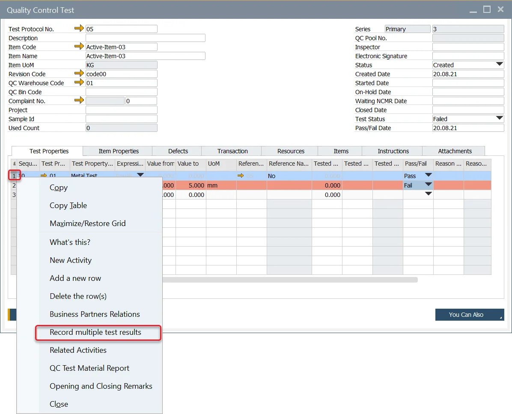
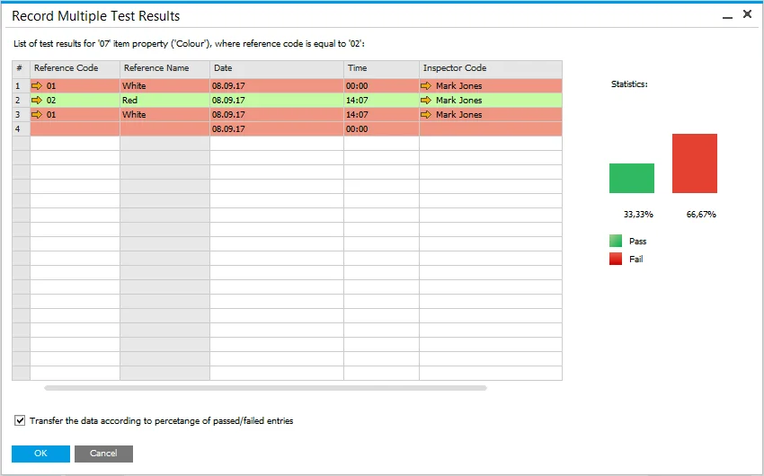
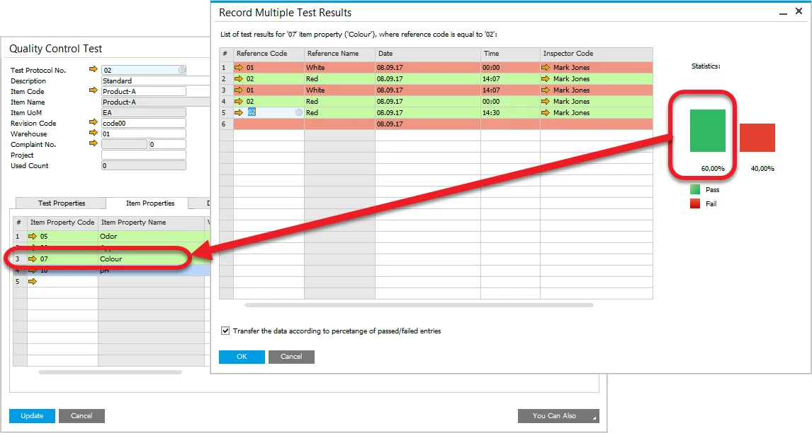

# Multiple Test Result Record

On this page, you can find information on how to set up and record multiple test results for a specific Quality Control Test. This function allows to group and manage many test records for the same Item or Test Property.

---

## Setting Up

- Check to <!-- TODO: Add Link --> Enable Multiple Test Results checkbox in Administration → System Initialization → General Settings → ProcessForce tab → QC tab to allow to perform Multiple QC Test Results. Click here to check how to do that.
- The Quality Control Test form has to be in confirmation or update mode (indicated by the OK or Update button on the lower left corner of the form).

## The quality Control Test form

If the *Enable Multiple Test Results* is checked, a user can define multiple test results for a particular Test Property or Item Property on a Quality Control Test form.

To define multiple test results for a Test Property, right-click on a specific Test Property row on the QC Test form and choose Record Multiple Test Results from the context menu:

To define multiple test results for an Item Property, right-click on a specific Item Property row on the QC Test form and choose Record Multiple Test Results:

## Multiple Test Results form

After one of the activities described in the paragraph above is performed, the Multiple Test Results form displays:

### Header

The header label on the form indicates for which Test Property or Item Property this form has been opened.

### Table

#### Data

The following data can be set:

- the tested value,
- the tested reference code,
- date of the test,
- time of the test,
- the inspector code.

#### Color Marking

The row colors indicate the entered tested value and the expression along with the initial and closing range values of the Quality Control Test's row, for which the Record Multiple Test Results form was opened. The coloring is the same as the row coloring on the Quality Control Test form.

#### Statistics

The form has also its statistics section, which presents the following:

- the percentage of the passed tests,
- the percentage of the failed tests,
- and the bar chart.

This statistics section is refreshed when:

- a new row is added,
- a row is deleted,
- tested value is changed.

#### Checkboxes

##### Reference name property

If the tested property gives reference name results (e.g., color = red), a check box with the following description is presented:

Transfer the data according to the percentage of passed/failed entries:

Checking causes loading to the Property field on Quality Control Test, a result that is presented the most often on the Record Multiple Test Results form. The option is available for properties with dictionary values only.

#### Numeric value property

If the tested property gives a numeric value (e.g., particle size = 5), a check box with the following description is presented:

Transfer the average value from the above test results:

Checking it causes loading to the Property field on Quality Control Test, a result that is an average value calculated from the values recorded on the Record Multiple Test Results form. This option is available for properties with numeric values only.

### Deleting Rows

To delete a row, right-click on it and choose Delete row from the context menu:
