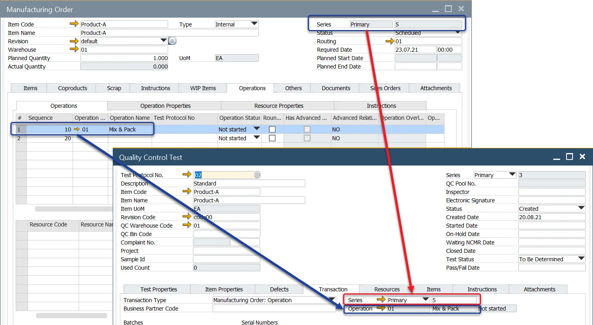

# Overview

## Introduction

The Quality Control Testing process is a fully integrated solution with ProcessForce and SAP Business One data, processes, and technologies.

This function uses business events/triggers and SAP Business One Alert functions to advise users that a Quality Control Test is required to be performed.

The Quality Control Test Form contains all the necessary data to understand the activities that need to take place.

---

:::info Path
    Quality Control → Quality Control Test
:::

## Header

This form allows the user to create a Quality Control Test.

1. Select and add a  [Test Protocol](../test-protocols/test-protocol-for-operation.md) Number. All the data defined within the Test Protocol is copied into the Quality Control Test.
2. Select and add a Document Series Number.
3. Select and add the Inspector performing the testing.
4. Select the required status and date. (Created, Started, On-Hold, Waiting NCMR, Closed).

Note: when moving the life cycle of the Quality Control Test, the system will require adding a date of the status change.

The Used Count field indicates how many times the Quality Control Test has been used and is used for reporting and analysis purposes.

When the Test is complete, the Test Status can be selected (Pass/Failed), and the date entered.

## Test Properties

The Test Properties tab allows the user to record the results of the Tests.

Note: The Test and Item Properties are copied from the Test Protocol. Additional Properties can be added and deleted from both tabs.

Within the Tested Value and Tested Reference Code, the user enters the tested value and selects the Pass/Fail option.

A Pass result will be highlighted in Green and a Fail in Red.

If there is a Fail, the user can add a Reason Code and Remarks.

## Item Properties

The Item Properties tab allows the user to record the results of the Item Properties tested. It works the same way as the Test Properties tab.

## Defects

The Defects tab allows the user to view the sample size and enter the test's Passed and Defect quantity results.

Defect codes can be added to categorize the failure and are used for analysis and reporting purposes.

Note: these codes are copied to the NCMR transaction.

When the Quality Control Test is complete, the user can record the type of Inventory Movement that needs to occur. Based on the selection, an Alert is sent to a specific user to conduct the appropriate inventory transaction.

### Raising Non-Conforming Materials Report - NCMR

If a Quality Control Test has failed, the user can request an NCMR to be created (click [here](../ncmr-non-conforming-materials-report.md) to find out more about NCMR).

To create an NCMR, the user has to check the NCMR checkbox and choose an NCMR Inspector Code in the Defects tab.

Click the You Can Also button and choose the Create NCMRTRansaction option.

## Transaction

The Transaction tab provides the user with the details of the Transaction Type, i.e., 'Where' the testing should occur, and for 'Who,' i.e., the Supplier or the Customer.

The user can also record the Batch and Serial number(s).

It is possible to [automatically change assigned Batches' status on passing Quality Control Test](../../../user-guide/system-initialzation/general-settings/qc-tab.md).

## Creating Quality Control Test for an Operation on Manufacturing Order

It is possible to create a Quality Control Test for a specific Operation. In this case, created Quality Control Test document has a Transaction tab filled with data from a chosen Operation line.

### Prerequisites

- A Test Protocol defined for a specific Operation.
- A Manufacturing Order is in one of the following statuses: Scheduled, Released, Started, Finished.

### Performance

Right-click on a line of an Operation (Manufacturing Order → Operations tab) and choose Quality Control → Create Quality Control for Operation option

Choose a Test Protocol from a list

From the context menu on a line of an Operation, you can also choose Quality Control → Open Existing Quality Control Test for Operation to check already created test.

## Resources

The Resources tab allows users to view and record the resources and quantities used during the Quality Control Testing process. Resources in this situation refer to Items, e.g., tools, used during Quality Control Test.

On the Resources tab, you can add only Items assigned to the Item Group defined for Quality Control Resources, as the default QCResources group is set for this purpose. By default, the QCResources group is set for this purpose. You can check how to set this Item Group here. By default, the QCResources group is set for this purpose.

## Items

The Items tab allows the user to view and record the Items and quantities used during the Quality Control Testing process, e.g., safety gloves.

On the Items tab, you can add only Items assigned to the Item Group defined for Quality Control Items, as the default QCItems group is set for this purpose. You can check here how to set this Item Group. here is how to set this Item Group. By default, the QCItems group is assigned for this purpose.

## Instructions

The Instructions tab allows the user to view instructions on performing the Quality Control Test.

If required, the user can add notes within this section.

## Attachments

The Attachments tab allows the user to view Attachments of how to perform the Quality Control Test.

If required, the user can add additional attachments within this section.

## Inventory Transfer

You can create Inventory Transfer Requests and Inventory Transfers from and to QC Warehouse (defined in the header) from the You Can Also button.

## Duplicate option

This option allows copying the content of a currently open document to another.

The copy procedure covers all the tabs' content and header data. The following information is changed on a copy:

- The electronic signature field is cleared.
- The status field value is set to Created.
- Test Status field value is set to To Be Determined.
- Pass/Fail Date field value is cleared.
- Document Number is changed to the next one in a Series.

The Duplicated document is in adding mode, allowing further changes to its content. Click Add button after setting up all the required data to add the record.
