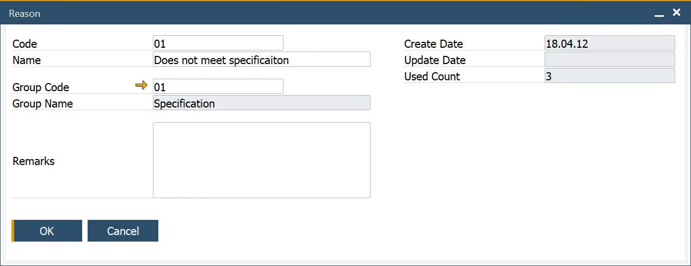
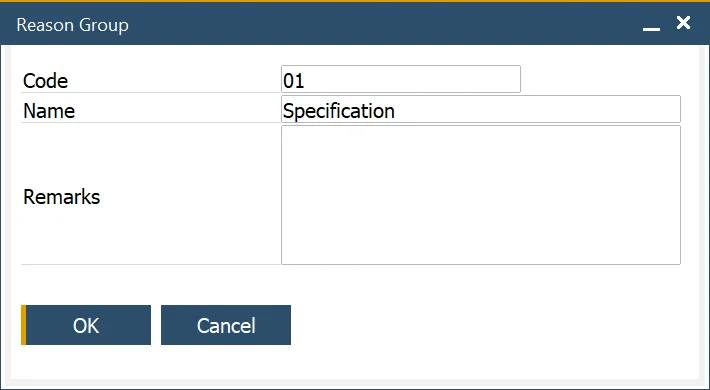
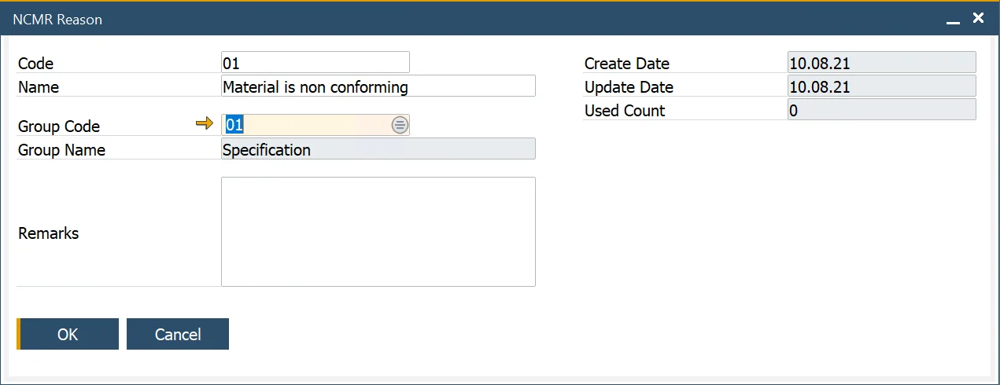

# Reason

You can define the Reason why a specific Test Property and Item Property within the Quality Control Test process failed the test and is used for analysis and reporting purposes.

---

:::info Path
    Administration → Setup → Quality Control → Reasons
:::

This form allows the user to define the Reasons why a specific Test Property and Item Property within the Quality Control Test process failed the test and is used for analysis and reporting purposes.

The Used Count field indicates how many times the Reason Code has been used and is used for reporting and analysis purposes.

## Reason Groups

:::info Path
    Administration → Setup → Quality Control → Reason Groups
:::

This form allows the user to define Reason Groups used to categorize Reasons for analysis and reporting purposes.

This data is used within the Reason Form.

## NCMR Reason

:::info Path
    Quality Control → Reasons → NCMR Reasons
:::

This form allows the user to define the NCMR Reasons why a Quality Control Test has failed and is used for analysis and reporting purposes.

The Used Count field indicates how many times the NCMR Reason Code has been used and is used for reporting and analysis purposes.

NCMR Reason can be assigned to a specific Reason Group.
