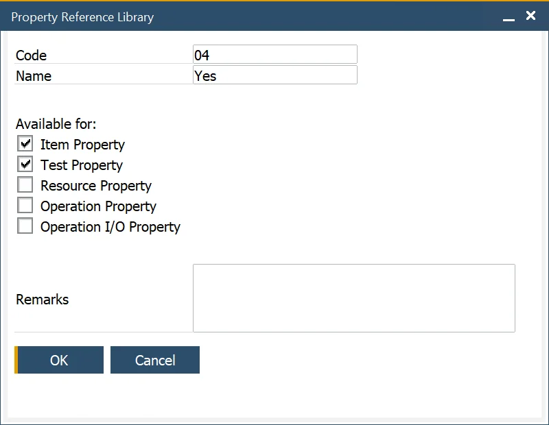

# Test Properties

Test properties – the core of the Quality Control Test – can be defined and grouped into similar properties.

:::info Path
    Administration → Setup → Quality Control → Test Properties
:::

This form allows the user to define Test Properties and is used within the Test Protocol Template, Test Protocol and Quality Control Test forms to determine and record testing results.

The Used Count field indicates how often the Test Property has been used and is used for reporting and analysis purposes.

## Reference

:::info Path
    Setup → Item Details → Property Reference Library
:::

Test Property on Quality Control Test can have numeric or reference values. Numeric values are defined directly on Quality Control Test. A numeric value results from a test of, for example, particle size or the number of objects in a sample. The reference value cannot acquire numeric value, e.g., for a test property Color result can be Yellow, Red, or Green. Possible reference results for a specific Test Property can be chosen in a table on the Test Property form.

Property can be defined in Property Reference Library. By checking a specific checkbox, you can choose for which Property type this reference is available.

## Test Property Group

:::info Path
    Administration → Setup → Quality Control → Test Property Groups
:::

This form allows the user to define Test Property Groups that are used to group Test Properties into categories for analysis and reporting purposes.

