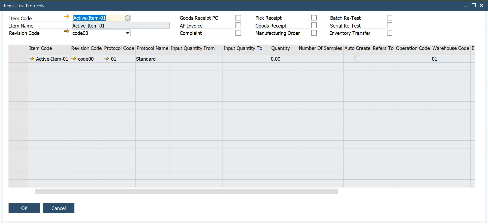

# Item's Test Protocols

Item's Test Protocols form is an informative function that allows one to look up all the Test Protocols related to a chosen Item/Revision.

:::info Path
    Quality Control → Item's Test Protocols
:::

The header holds Test Protocols filtering options. On choosing Item Code, Item Name is filled in automatically. The revision Code field is filled with a default Revision. You can change it then to a different one (if required). The next step is to check the necessary transaction checkboxes. If no checkboxes are checked, all Protocols related to the chosen Item and Revision will be displayed.
