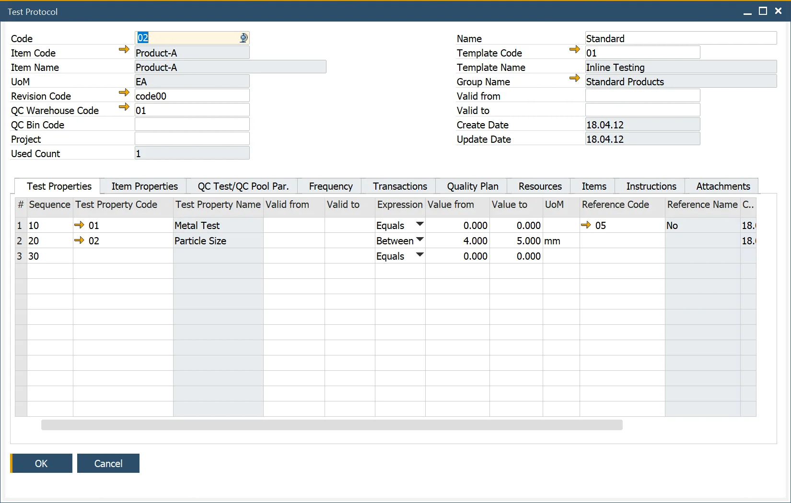
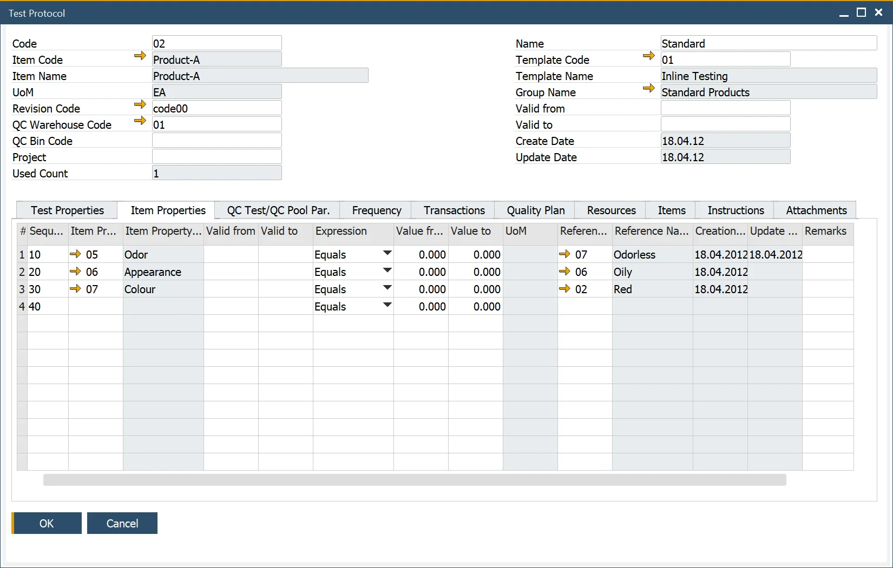
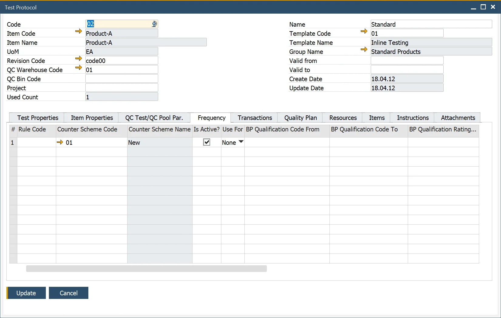

# Overview

A Test Protocol or testing plan is a method for defining all the information required to conduct a test:

- Who – the Business Partner,
- What – is the Item to be tested,
- Where – the transaction,
- When – the frequency.

And contains the following information:

- Header Details – what will be tested,
- Item/Test Properties – the quality and Item related tests,
- Frequency of Testing – when testing will occur,
- Transactions – where testing will occur,
- Resources – the assets required to conduct the testing,
- Items – quality-specific materials,
- Instructions – the documented plan,
- Attachments – related documentation.

---

## Test Protocols

:::info Path
    Quality Control → Test Protocol
:::

### Header

The left side of the header holds information on Test Protocol: Code (related Name is on the right) and Used Count – a value that indicates how many times the Test Protocol has been used (it is used for reporting and analysis purposes only). On the left side, you can also define Item related data: choose an Item, Revision (if required), default Quality Control Test Warehouse and Bin location, and Project.

The right side holds information on the Test Protocol Template used for this Test Protocol (and Test Protocol name on the top). Template Name, Group, Created Date, and Update Date (the date of the last update of a template) are filled automatically upon choosing a Template Code.

Valid from and Valid to dates are defined for a specific Test Protocol. If the current date is outside the specified range, adding a Quality Control Test based on this Test Protocol will not be possible.

### Test Properties

Here you can manage Test Properties: data elements representing the tests to be conducted within the Quality Control Test. Test Properties are copied from a Test Protocol Template chosen in the header. After this, you can add or remove the Properties before saving the Test Protocol.

Note. When the user adds the Item Number to the Header, the Item Properties defined within the Item Details/Properties Tab and have the Quality Control Testing field checked are copied into the Item Property Code (bottom grid).

The user can enter valid from and to date details, the expression, and corresponding values for each Property type.

### Item Properties

In this tab, you can define  Item Properties – physical and chemical characteristics of an Item. When the user adds the Item Number to the Header, the Item Properties that are explained within the Item Details > Properties tab of a related Item and have the Quality Control Testing field checked on  the Item Property form are copied into the Item table. You can now add or remove properties and edit their details.

### QC Test/QC Pool Par

Click [here](./quality-control-tests-pool.md) to find out more.

### Frequency

The Frequency tab allows the user to define 'When' a test will occur.

- **Sample size** – one of the options can be chosen: you can put quantity manually or define a percentage of quantity from a specific document. Only one method can be selected at any one time.
- **Frequency** only one method can be selected at any one time:
- **Time Between Tests** – you can define an interval after which another test will be performed; the field uses 'd' to define the number of days, 'h' for the number of hours, and 'm' for minutes, e.g., '14d', '13d23h', '20d22h15m', '15d40m' and this value will calculate the date of the next test.
- **After No. of Batches** – you can define the number of Batches after the recording of which a test will be performed.
- **Batch Record Inspection Date** – if checked, the Inspection Date in the Batch Master Data form > Date Details tab is taken under consideration.
- **Specific date** – put a specific date manually.
- **Date of Last Test** – date of the last test performed.
- **Date of Next Test** – a date calculated based on the chosen option.
- **Auto Create QC Test / QC Test Pool** – if checked, QC Test will be created automatically based on the conditions set up in this frame (applies to QC Tests Pool instead of QC Test when Create QC Test Pool option is checked).
- **Input Quantity From/To** – range of quantity for which Test Protocol applies.
- **Refers to** – defines the base on which Test Protocol with defined quantity will be created (Lot, Batch, Document Line).
- **Create QC Tests Pool** – click [here](./quality-control-tests-pool.md) here to find out more.

### Transactions

The Transactions form allows users to select 'Where' a Quality Control Test will occur.

A Business Partner can also be selected to define 'Who' the Quality Control Test will be performed against (Supplier) and for (Customer).

Operation and Status (Not Started, Started, Held, Finished) can be selected for in-process testing, provided a Routing has been added to the Bill of Materials/BOM Technology.

It is possible to assign one Test Protocol to many transactions.

### Quality Plan

Click <!-- TODO: Add Link --> here to find out more.

### Resources

This form allows users to add Resources to the Quality Control Test.

The required quantity can also be added.

Valid from and to dates may be entered, but currently, they are for informational purposes.

### Items

This form allows users to add Items used for the Quality Control Test.

The quantity required can also be added.

Valid from and to dates may be entered, but currently, they are for informational purposes.

### Instructions

The Instructions tab can record written instructions and notes related to the Quality Control Test.

### Attachments

This allows the user to add attachments used within the Quality Control Test.

## Test Protocol Groups

:::info Path
    Administration → Setup → Quality Control → Test Protocol Groups
:::

This form allows the user to define Test Protocol Groups that categorize Test Protocols. For Example, Chemicals, Labeling, Packaging, etc.

This data is used within the Test Protocol Template Form.

## Templates for Test Protocols

:::info Path
    Quality Control → Test Protocol Template
:::

This form allows the user to define the number of Test Properties within a template to help with rapid data entry within the Test Protocol form.

For example, the user wants to define a list of 10 tests, so rather than enter all these values manually each time into all the relevant Test Protocols, the user can create a template, and the values are copied into the Test Protocol.

Test Properties can be added and removed.

The user can select from many expressions to record, for example, a specific value, a from/to value-dependent, or a reference code, including the UoM.

The Valid from and to dates can be entered and are currently used for informational purposes.

The Used Count field indicates how many times the Reason Code has been used and is used for reporting and analysis purposes.

The create and update fields record the dates when the data was first created and subsequently changed. This is used for auditing purposes.

### Test Protocol Template duplication

You can duplicate a Test Protocol Template and use it as a base to create a new one. You can choose this option from the context menu on the Test Protocol Template form.

Test Protocol Template is duplicated with all its content, and a Template code changed from `[original]` to `[original]_`, e.g., `02` to `02_`. A duplicate is now in adding mode. All content can be edited (along with the default Template Code). Click Add button after setting up all the required data. A new template is now added.
