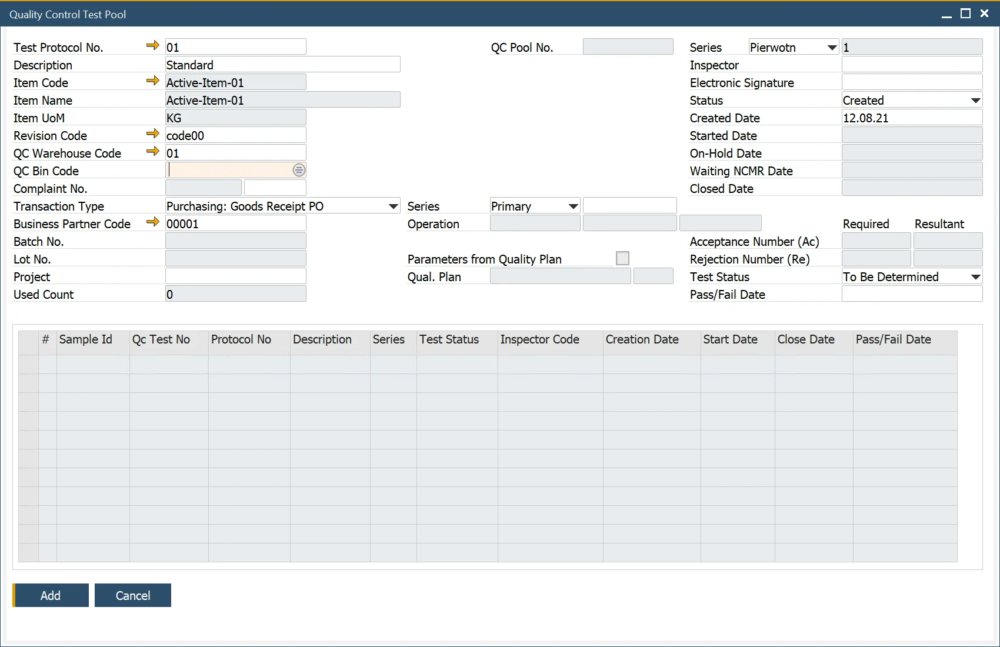

# Quality Control Tests Pool

The pass/Failed status of the Quality Control Tests Pool is based on a predefined relation between passed and failed Quality Tests in a pool. The pass option was designed for quality control based on many samples. The quality Control Tests Pool option automatically creates a series of Quality Control Tests.

---

## Configuration

- **Create QC Tests Pool** – determines whether QC Tests Pool will be created for this Test Protocol.
- **Number of Samples** – the number of individual tests (on different samples) in the QC Tests Pool.
- **Test Pool Pass/Fail Quantity Condition** – conditions on which QC Tests Pool will be passed or failed. Filling one field with a value automatically fills the other one with the rest value (for the field to be summed up to the Number of Samples value.
- **Acceptance Number (Ac)** – the highest number of nonconforming units or defects in the sample that still allows the lot to be accepted.
- **Rejection Number (Re)** – the lowest number of nonconforming units or defects in a sample that leads to the rejection of the lot.
- **Ac. Re Obligatory** – defines if Acceptance number and Rejection number are required to decide about QC order releasing (if not checked, the final result of the test can be changed manually).

Parameters from Quality Plan – click here to find out more about Quality Plan.

## Usage

:::info Path
    Quality Control → Quality Control Test Pool
:::

To use the function, Open Quality Control Test Pool form and choose the previously configured Test Protocol. Choose the required Transaction Type (to mark a moment in inventory flow when the tests are to be performed), then a required document (based on Series and Document Number). Item details and Required Acceptance and Rejection Number fields will be filled in automatically and a list of individual tests will be created (note that tests on the list will be created upon adding Quality Control Test Pool).

Click Add after filling up all the required fields. Now you can open each of the individual Quality Control Tests.
