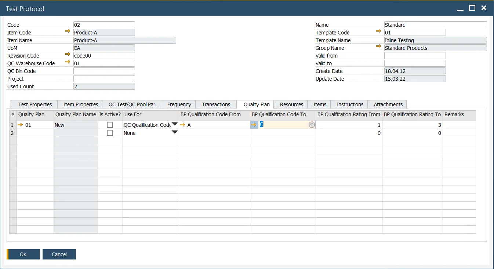

# Quality Plan

The quality Control function reflects the ISO 2859-1 norm (Sampling procedures for inspection by attributes) in ProcessForce and allows to recreate and adjust to the specific business requirements. Therefore, it allows generating Quality Control Test Pool based on the norm's rules (Business Partners' ratings, Pass/Fail rules).

Agreeing to use the Quality Control function based on the ISO 2859-1 norm can be a valuable tool for quality assurance between your company and a business partner delivering Items to you.

---

:::info Path
    Administration → Setup → Quality Control → Quality Plans
:::

## Business Impact

The ISO 2859-1 norm contains tables with statistical data that define several testing samples for a Batch (received from production or bought) based on data like Batch size, inspection severity, or Business Partner rating. E.g., for a Batch of 10000 units, the norm based on statistical data may count ten samples, of which at least eight have to pass the Quality Control Test for the whole Batch to be receipted. The Quality Plan defined in ProcessForce affects Quality Control Test Pools.

## Quality Plan preparation

:::info Path
    You can find a detailed description of the ISO 2859-1 (methodology, terms, etc.) on the [International Organization for Standardization website](https://www.iso.org/obp/ui/#iso:std:iso:2859:-1:ed-2:v1:en).
:::

### Header

**Quality Plan Code / Description** – set your Code and Name

**Type** – now only the Single option is available. Double and Multiple options (and related functions) are planned to be delivered in future releases

**Inspection Severity** – this term is associated with ISO 2859-1. The measure of a sampling plan's performance capability is calculated based on the discrimination ratio and valuation severity (according to the DGQ - German Society for Quality).

This measure identifies a standard, reduced, or tightened inspection. Sampling schemes referred to sampling plans for inspection severity or inspection severity and accepted quality level (AQL).

By varying the inspection severity, the probability of acceptance and the inspection effort can be flexibly adjusted to respond to different quality situations.

**Sampling Table** – a Sampling table defined based on ISO 2859. You can specify a code and name for this field for information purposes.

**Inspection Level** – levels defined in ISO 2859.

**Acceptance Quality Limit** – the maximum fraction of nonconforming units (as a percentage) or the maximum number of defects per 100 units permitted for a lot to be accepted. The AQL (Acceptable Quality Level) is the quality level that represents the upper limit of a satisfactory average quality level for an acceptance sampling inspection.

The five options above point to a specific column in a table from the norm (2-A – Single sampling plans for routine inspection). The content of the column is presented in the table below.

**Ac Re Obligatory** – defines if the Acceptance number and Rejection number from the table are required to decide about QC order releasing (if not checked, the final result of the test can be changed manually).

### Table

The content of this table is a recreation of a specific column (as not often the whole table is needed for particular product inspection needs) in a specific table from the norm (check the Header information on this page), and the user should recreate it accordingly. Of course, the bar suggests model settings that can be changed according to the user's business needs.

**Code Letter** – sampling size based on Table 1 of ISO 2859-1. Values from A to R.

**From Quantity To Quantity** – defines a lot size (Batch) for which Quality Control Tests are to be performed.

**Sample** – this option is related to Type. Other options will be implemented along with related Double and Multiple Types. For now, only the First option is available.

**Number of Samples** – several samples for a specific Batch size

**Cumulative Number of Samples** – this option defines a cumulative number of samples from double or multiple tests. This option is related to Type. Other options will be implemented along with related Double and Multiple Types. For now, a single type is available. Therefore this field is not used yet.

**Acceptance Number** – defines the highest number of nonconforming units or defects in the sample that still allows the lot to be accepted. The acceptance number in an attributive inspection corresponds to the acceptability constant in a variable inspection.

**Rejection Number** – defines the lowest number of nonconforming units or defects in a sample that leads to the rejection of the lot.

## Usage

:::info Path
    Quality Control → Test Protocol
:::

Choose a Quality Plan in the Quality Plan tab.

To use the option, check the Create QC Tests Pool checkbox and then the Parameters from Quality Plan in the Test Protocol form, QC Test/QC Pool Par. Tab (the function can be used along with Auto Create QC Test /QC Test Pool option from the same tab).

Then, choose a Quality Plan in the Quality Plan tab.

You can then choose if the Quality Plan is active.

Use for – defines which value is taken under consideration when choosing Business Partners to be affected by the specific Quality Plan (either QC Qualification Code or QC Rating; values assigned in Business Partner Master Data, General tab)

You can define BP Qualification Code or BP Qualification Rating range. Business Partners within this range are affected by the specific Quality Plan.

The screenshot above shows the configuration, meaning that Quality Plan 01 applies to Item Product-A from Business Partners with BP Qualification Code within the range of A to C. This plan defines how many samples of Item Product-A delivered from this Business Partner are to be tested for a specific Batch size and the ratio of pass/failed tests for a Batch to pass.
