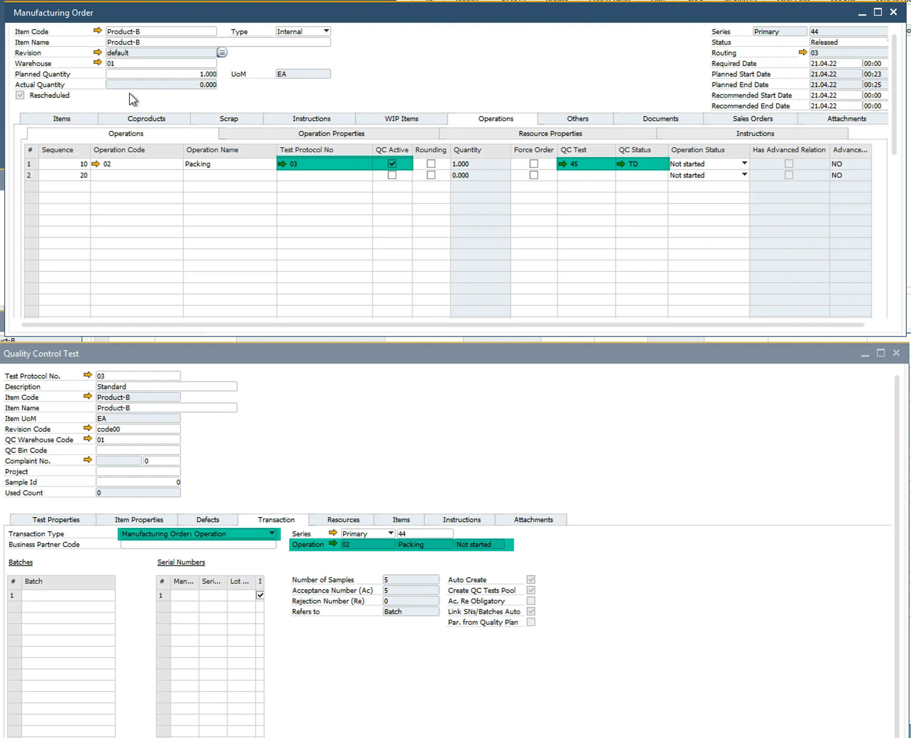

# Test Protocols for Operation

It is possible to mark a Test Protocol as specific for a specific Operation (Test Protocol → Transactions tab → Operation).

You can assign a Test Protocol to an Operation on Production Process/Routing/Manufacturing Order (Operations tab).

Both ways will create a Quality Control Test, but there are some differences:

|              Scenario               | Protocol Defined in Routing Based on Operation | General Settings > PF > QC - Create QC Document on MOR state | General Settings > PF > QC - Create QC Document for Operation on MOR state |                                                         Behavior                                                         |
| ----------------------------------- | :--------------------------------------------: | :----------------------------------------------------------: | :------------------------------------------------------------------------: | ------------------------------------------------------------------------------------------------------------------------ |
|        Create QC Based on MO        |                      :x:                       |                      :heavy_check_mark:                      |                                    :x:                                     | QC will be created based on MO. There won't be a link to Operation even though the operation is checked in test protocol |
|    Create QC Based on Operation     |               :heavy_check_mark:               |                             :x:                              |                             :heavy_check_mark:                             |                   QC will be created based on Operation. There will be a link between function and QC                    |
| Create QC Based on MO and Operation |               :heavy_check_mark:               |                      :heavy_check_mark:                      |                             :heavy_check_mark:                             |                  One for MO, one for operation linked will be created. Be careful with duplicated QCs.                   |

Based on Manufacturing Order:

Based on Manufacturing Order Operation:

## Example

If there is a process, a kind of First Check before starting/completing the operation, Test Protocol should be defined in Routing to relate QC with Operation. There would be some requirements like blocking operation to start via PDC if QC - First check is not Passed.
