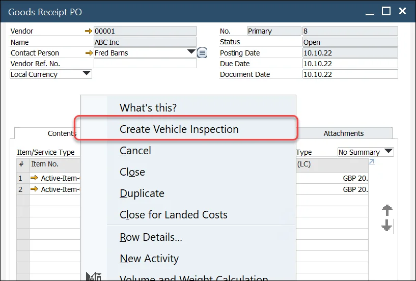

# Overview

This function is designed to capture the results of a truck inspection during the Goods Receipt process (connected to Goods Receipt PO).

When a specific truck comes to the warehouse (with ordered Items), the Customer can record a document regarding the condition of the delivery.

You can reach the function through Main Menu:

:::info Path
    Purchasing - AP → Vehicle Inspection
:::

or from the context menu on Goods Receipt PO (with the already chosen document):

This option is available for Goods Receipt PO in any Status.

---

## Vehicle Inspection document

### Header

Goods Receipt PO to which this document is referring, Inspection series, number, and date

### Truck Details

You can define Truck License Plate, Trailer Number, and Container Number. Values are not predefined – you can only fill up the fields manually.

### Visual Inspection

In this section, you can record values for different categories (e.g., Chemical Spills, Pest Inspection). You can record inspection pass or fail indicators for every category, from 1 to 3 predefined values and remarks. In the Temperature category, additionally, the temperature can be defined.

Values in the drop-down list are predefined. Click here to find out how to define it.

Using a drop-down list does not depend on Pass/Fail checkbox. It allows one to manage the situation when the inspection is passed, but there are some minor defects.

Click OK after setting up all the required values. Note that Truck License Plate and Trailer Number are required to post the document.
