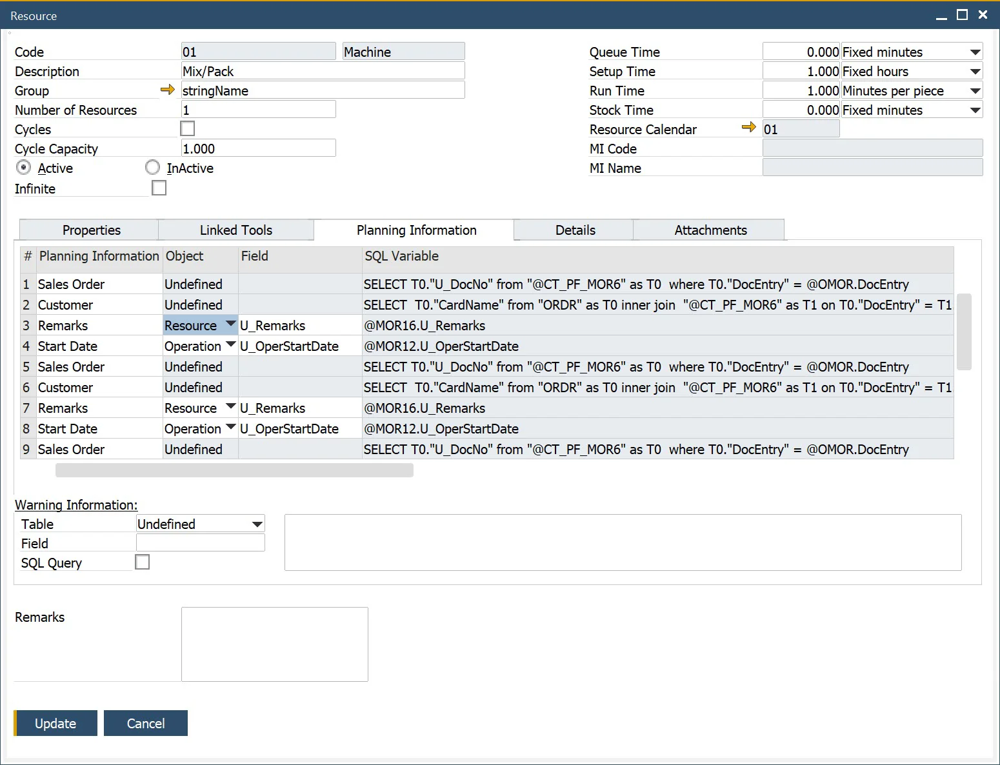
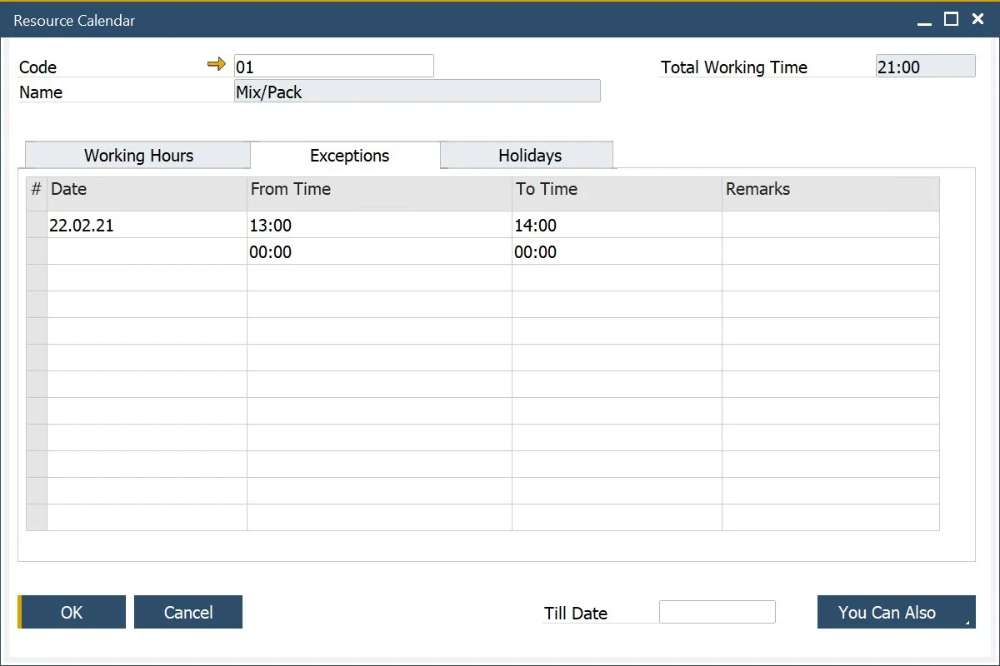
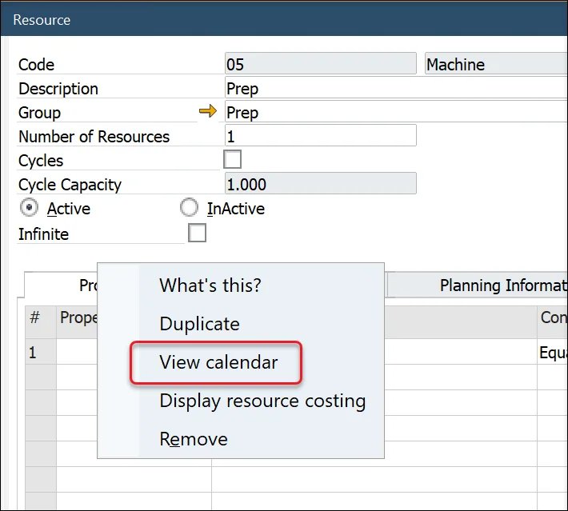

# Resources

These forms allow users to define Resources, Properties, and Groups, that will be used to create Operations.

:::info Path
    Production → Routings → Resources
:::

---

## Resources

### Resource Types

| Type of Resource | Impact on Scheduling |   Calendar usage   | Visible on Gantt chart? |    Hourly rates    | Required to be connected to |    Time Booking    |                    Times (Setup, Run)                     | Number of resources |
| :--------------: | :------------------: | :----------------: | :---------------------: | :----------------: | :-------------------------: | :----------------: | :-------------------------------------------------------: | :-----------------: |
|     Machine      |  :heavy_check_mark:  | :heavy_check_mark: |   :heavy_check_mark:    | :heavy_check_mark: |             N/A             | :heavy_check_mark: |                    :heavy_check_mark:                     |     Changeable      |
|      Labor       |         :x:          |        :x:         | :heavy_check_mark: [^1] | :heavy_check_mark: |             N/A             | :heavy_check_mark: |                    :heavy_check_mark:                     |     Changeable      |
|       Tool       |  :heavy_check_mark:  | :heavy_check_mark: |   :heavy_check_mark:    | :heavy_check_mark: |           Machine           | :heavy_check_mark: | :heavy_check_mark: (copied from the related Machine data) |      Always 1       |
|  Subcontracting  |  :heavy_check_mark:  | :heavy_check_mark: |   :heavy_check_mark:    | :heavy_check_mark: |             N/A             | :heavy_check_mark: |                    :heavy_check_mark:                     |     Changeable      |

[^1]: Labor can be presented on the Gantt chart but Start and Finish dates (on the Manufacturing Orders tab) in some cases may be empty or has a default value (0001-01-01), as this type of Resource does not affect Manufacturing Order Scheduling.

### Header

#### Time and Rates

##### Types of Time

- Queue Time – an initial time before setup. In calculations, it does not have a calendar and does not consume resource
- Setup Time – time for setting up a machine, uses a calendar, and occupies a resource
- Run Time – time of resource run
- Stock Time – the last time, after the run. In calculations, it does not have a calendar and does not consume resource

##### Rates

- For the Queue, Setup, and Stock time, the following rates are available:
  - Fixed hours,
  - Fixed minutes,
  - Fixed seconds.
- For the Run time, the following rates are available:
  - Fixed hours
  - Fixed minutes
  - Fixed seconds
  - Hours per piece
  - Minutes per piece
  - Seconds by piece
  - Pieces per hour
  - Pieces per minute
  - Pieces per second

  When using cycles, only Fixed Rates can be used for Run Time.
- Define the fixed and variable time elements of the resource.
- This also includes the unit of rate for each time element.
- Piece equates to the unit of measure of the item number being produced.
- The valid rates for Queue, Setup and Stock time are fixed seconds, minutes, and hours.
- Run Time can use any of the unit rates.
- Cycles can be checked to define the resource has a cycle capacity.
- Cycle capacity is the number of production units processed per cycle.
- Number Of Resources allows defining the default number of units of resources to work on. Note that setting a Number Of Resources affects run time. E.g., if Run Time is 10 h and Number of Resources 1, Planned Run Time is 10 h. If the Number of Resources changes to 2, the planned time automatically changes to 5 h. Changing a Number of Resources affects the production process, however during cost calculation, only added-up time will be considered - in accordance with the example: 10 h work is done after 5 h using 2 resources, the cost is calculated as a cost of work of 2 resources for 5 h each (10 h).


#### Infinite checkbox

Checking the checkbox results in ignoring the related Resource Calendar (it allows to overload a Resource) – a Resource with this option checked will be available all the time then.

The primary business purpose of this option is to assign it to Subcontracting types of Resources, but it can also be assigned to any Resource (Machine, Tool) that does not have a capacity limit.

#### Resource Status

It is possible to set up either Active or Inactive status for a Resource.

A Resource with Inactive status cannot be added to the Manufacturing Order or Bill of Materials.

**Example usage**: the option can be used to set Inactive status to mark Resources that were used in the company's production processes but currently are not (e.g., were sold or scraped).

### Properties

- This form allows you can add and remove Resource Properties.
- Properties can be used to define additional data relating to the resource, for example, machine set-up details and consumables.
- You can set a numeric value with conditions, e.g., Temperature to be between 10 and 20.
- You can set a Reference Code, e.g., Property Colour = White.
- You can add Remarks.

Click [here](/docs/processforce/user-guide/routings/resources#resource-properties) to find out more about Resource Properties.


### Linked Tools Tab


A Linked Tool is a Resource with a Tool type assigned to the header Resource. The Linked Tools are taken under consideration during production if the parent Resource is included in the related Production Process (as an alternative Resource). The default Resource of the Operation (in the Production Process) is replaced by a Resource with a Linked Tool on Manufacturing Order based on the [Resource Balancing option](/docs/processforce/user-guide/scheduling/resource-balancing/) (it has to be checked).

Linked Tools are also on the Gantt chart (under the parent Resource).

### Planning Information Tab

:::caution
    If you update Planning Information when Scheduling Board is opened, it is required to reopen it to have the changes on it.

    A Resource sets up Planning Information: you can set up different settings for each of the Resources in the system.
:::



Here you can define columns displayed on Scheduling Board → [Resource Planning Board](/docs/processforce/user-guide/scheduling/gantt-chart/resource-planning-board/) on Task rows for a specific Resource.

You can define:

- Name of a column (Planning Information column),
- Type of retrieving method of data to be displayed in a specific column:
  - **Object**: (Enable SQL? checkbox unchecked): choose a field from three kinds of Objects (Manufacturing Order, Operation, Resource - values are taken at the start of Gantt chart) and Dynamic option (times connected to specific Operation or Resources, e.g., Operation Duration - these options are updated dynamically; they change on changes made to Gantt Chart),

    <details>
    <summary>Example of a Label added to a specific Resource</summary>
        <div>
            We want a Revision of a Manufacturing Order displayed on Tasks of Prep Resource.

            Choosing the right option:

            
        </div>
    </details>

  - **Query** (Enable SQL? checkbox checked): you can create a query based on which data for the column will be retrieved.

    Parameter syntax:

        ```sql
        @[Table Name - without fixed prefixes].[Field Name]
        ```

    **Example**

        ```sql
        @OMOR.U_PlannedStartDate
        ```

    <details>
    <summary>Example: a query to calculate how many Employees will be working on the Resource</summary>
    <div>
        Query:

            ```sql
            SELECT
                (SELECT MIN(T0."U_RunTime" * T0."U_NrOfResources") FROM "@CT_PF_MOR16" T0 WHERE T0."DocEntry" = @OMOR.DocEntry AND T0."U_RtgCode" = @MOR16.U_RtgCode AND T0."U_RtgOprCode" = @MOR16.U_RtgOprCode AND  T0."U_RscType" = 'L' )
                /
               (SELECT MIN(T0."U_RunTime") FROM "@CT_PF_MOR16" T0 WHERE T0."DocEntry" = @OMOR.DocEntry  AND T0."U_RtgCode" = @MOR16.U_RtgCode AND T0."U_RtgOprCode" = @MOR16.U_RtgOprCode AND  T0."U_RscType" = 'M' )
            FROM DUMMY
            ```

        Result:

        
    </div>
    </details>

### Warning Information

If the settings here return any result, a warning icon will appear on Scheduling → Resource Planning Board for the specified Resource.

### Resource Details Tab

### Accounting Panel

**Resource Accounting** – choosing the 'No Posting' option means that the related Resource times will not be considered during financial transactions (e.g., while recording a Time Booking). Choosing a predefined Resource Accounting scheme causes recording the financial aspect of recording Resource times to the account defined in the scheme.

**Relevant for Cost Accounting Project and Dimensions** can be set. According to how many cost centers are enabled within SAP Business One General Settings, one or more dimensions fields are displayed

### Additional Details Panel

Issue Whs Code and Receipt Whs Code are CompuTec PDC-related fields. [CompuTec PDC Production Issue/Receipt](/docs/pdc/user-guide/task-activities/overview#resource-properties) options are not available if Issue/Receipt Warehouses are not assigned to a specific Resource. For a Production Issue, a Bin Location is not required (just a Warehouse has to be assigned) but **for a Production Issue, it is mandatory to choose a Bin Location**.

<details>
    <summary>Click here to find out how to enable Bin Locations</summary>
    <div>
        

        Path: `SAP B1 → Administration → Setup → Inventory → Warehouses → General tab`

        
    </div>
</details>

### Resource Calendar

- Resource Calendar is created automatically when Resource is added
- The yellow arrow next to the Resource Calendar field leads to its definition
- Click [here](/docs/processforce/user-guide/scheduling/resource-calendar/) to find out more about Calendars.


## Resource Groups

::: info Path
    Administration → Setup → Production → Resource Groups
:::

This form allows the user to define resource groups, for example mixing vessels, blenders, and ovens.


## Resource Properties

:::info Path
    Administration → Setup → Production → Resource Properties
:::

This form allows the user to define properties for a Resource, for example, pressure, temperature, and machine speed. A Property can have reference values assigned, e.g. White, Red for Colour, or numeric values, e.g. Temperature can be 20. Reference values can be chosen in Resource form, Properties tab from the once set up in Resource Properties form. Numeric values can be set from the Resource form, Properties tab.


### Property Reference Library

:::info Path
    Administration → Setup → Item Details → Property Reference Library
:::

This form allows you to create a library of valid values to be used as Reference values for Properties.

These valid values can be available for a single property type or several property types, relating to items, resources, operations, and operation inputs and outputs.

For value to be available as a reference value for Resource Property, the right checkbox has to be checked (Resource Property

Check the Resource Property checkbox for a value to be available as a reference value for Resource Property:


## Resources Accounting

:::info Path
    Administration → Setup → Financials → Resources Accounting
:::

Resources Accounting allows defining multiple posting accounts for Time Bookings.

You can select accounts for posting for every resource time type:

- Queue Time,
- Setup Time,
- Run Time,
- Stock Time.

Further, for every resource time type, you can select accounts for the type of time:

- Base,
- Fixed Overhead,
- Variable Overhead

:::caution Time Variance Accounts
    Please note that all **Time Variance Accounts** cannot be configured.

    We plan to provide functionality that will leverage them during the posting of Manufacturing Order closure in future versions.
:::

The Work In Progress Account can be added here or is based on the WIP account defined for the Document type – Production Order.


## Resource Calendar

:::info Path
    Production → Routings → Resource Calendar
:::

Resource Calendar is used to define the availability of a Resource for production, which is further used for production planning.

- On the first tab, you can define hours for each day of a week. As you can see in the example, there is an option to define multiple periods per one day.
- On the right upper corner of this form, you can check Total Working Time in a week.

  
- The Exceptions tab is used to mark additional capacity of Resources for a specified date and time.

- The Exceptions tab is used to mark additional capacity of Resources for a specified date and time.

  
  
- In the Holidays tab you can define days on which resource is not available.

  
- You Can Also button let you perform the following tasks automatically:
  - Copying holidays from the holidays defined in SAP,
  - Remove past exceptions – this will remove every exception before the actual date,
  - Create exceptions based on current working days till date. This one adds exceptions from actual date to date defined in the Till Date field for hours and days defined in the Working Hours tab.

  
- At any time you can view Resource Calendar by clicking on View calendar in a context menu of a Resource form.

  
- This will open a graphical presentation of resource availability. At the bottom of the window, you will find a legend for colors on the calendar.

  

## Alternative Resource

A Resource can have assigned a number of other Resources, to which a Manufacturing Order task can be switched, e.g. in case of downtime of an original Resource. Click [here](/docs/processforce/user-guide/scheduling/gantt-chart/alternative-resources/) to find out more.
